# Technical Specification

# 0. SUMMARY OF CHANGES

## 0.1 BUG ANALYSIS AND INTENT CLARIFICATION

### 0.1.1 Bug Report Interpretation

**Based on the bug description, the Blitzy platform understands that the issue is:**
- Integer overflow occurs in the `from_arrow` interop functionality when converting sliced Arrow arrays to cuDF columns
- The overflow happens when the underlying Arrow array has more than `size_type::max` (2^31) rows AND the array has been sliced with a non-zero offset
- The bug manifests as segmentation faults, garbage data, or memory allocation errors depending on the data type being converted

**Technical Root Cause:**
The symptoms indicate that the code is incorrectly using 32-bit `size_type` arithmetic for operations that require 64-bit `int64_t` ranges, causing wraparound when offsets exceed 2^31.

### 0.1.2 Missing Information Detection

**What the user didn't specify but is needed:**
- The exact version of cuDF where this bug was discovered
- Whether the bug affects both CPU and GPU execution paths
- Performance implications of the proposed fix (copying only necessary data vs entire array)
- Compatibility requirements with existing Arrow C stream interface

**Assumptions about environment and state:**
- The code is built with standard CUDA toolkit and RMM memory management
- Arrow arrays are using the standard C Data Interface format
- The `size_type` is defined as `int32_t` (32-bit signed integer)
- The issue only manifests when both conditions are met: large array size AND slicing

### 0.1.3 Root Cause Hypothesis

**The symptoms suggest the root cause is likely:**
1. **Primary hypothesis**: Direct assignment of 64-bit `input->offset` to 32-bit `size_type` causing integer overflow
2. **Secondary hypothesis**: Incorrect calculation of buffer sizes using 32-bit arithmetic for arrays that require 64-bit addressing
3. **Tertiary hypothesis**: Missing validation of array sizes before performing offset calculations

**Reasoning:**
- The segfault/garbage data for fixed-width types suggests reading from incorrect memory addresses due to wrapped offsets
- The 18+ exabyte allocation error for boolean types indicates arithmetic overflow in size calculations
- The pattern affects multiple code paths (fixed-width, boolean, mask handling) suggesting a systemic issue with type conversions

## 0.2 DIAGNOSTIC SCOPE

### 0.2.1 Bug Localization Strategy

**Search patterns to identify affected code:**
- Look for conversions from `int64_t` to `size_type` without bounds checking
- Find all uses of `input->offset` in Arrow interop code
- Identify `bitmask_allocation_size_bytes` calls with potentially overflowing inputs
- Search for memcpy operations using calculated offsets

**Code paths most likely to contain the issue:**
- Arrow array buffer offset calculations
- Bitmask size computations for boolean columns
- Memory allocation size calculations
- Host-to-device memory transfer operations

### 0.2.2 Potential Bug Locations (ranked by likelihood)

**Primary suspects:**
| Component/File | Investigation Focus | Likely Issue Type |
|----------------|---------------------|-------------------|
| `cpp/src/interop/from_arrow_host.cu:92` | `size_type const offset = input->offset;` | Direct int64_t to int32_t overflow |
| `cpp/src/interop/from_arrow_host.cu:101` | Out of bounds buffer read | Incorrect offset calculation |
| `cpp/src/interop/from_arrow_host.cu:130` | `bitmask_allocation_size_bytes(input->length + input->offset)` | Integer overflow in size calculation |

**Secondary investigation areas:**
| Component | Why Investigate | Symptoms It Would Cause |
|-----------|----------------|------------------------|
| Buffer size validation | Missing overflow checks | Allocation failures, crashes |
| Offset propagation to child arrays | Cascading overflow effects | Nested data corruption |
| Stream interface compatibility | Existing API constraints | Cannot change public interfaces |

### 0.2.3 File Investigation Map

**Based on user-specified locations:**
| Specified File | Investigation Focus | Required Changes |
|----------------|---------------------|------------------|
| `from_arrow_host.cu:92` | Change `size_type` to `int64_t` for offset storage | Type conversion fix |
| `from_arrow_host.cu:101` | Validate buffer bounds before access | Add bounds checking |
| `from_arrow_host.cu:130` | Use 64-bit arithmetic for size calculations | Arithmetic overflow fix |
| `from_arrow_host.cu:133` | Correct memcpy size parameter | Use safe size calculation |
| `from_arrow_host.cu:67` | Fix bitmask byte count for masks | Correct mask size calculation |

## 0.3 BUG FIX DESIGN

### 0.3.1 Root Cause Resolution

**The bug appears to be caused by:** Unsafe type conversions from Arrow's 64-bit offset/length fields to cuDF's 32-bit `size_type`, causing integer overflow when values exceed 2^31.

**This manifests when:** An Arrow array with more than 2^31 rows is sliced, resulting in offset values that cannot be represented in 32-bit integers.

**The fix involves:** 
1. Using `int64_t` for all offset and size calculations throughout the conversion process
2. Only converting to `size_type` at the final stage after validating the value fits
3. Implementing safe arithmetic helpers that detect overflow conditions

### 0.3.2 Minimal Change Principle

**CRITICAL: Fix ONLY the bug, no refactoring or improvements**

**Specific lines/functions to modify:**
1. Line 92: Change `size_type const offset = input->offset;` to `int64_t const offset = input->offset;`
2. Line 101: Add validation: `CUDF_EXPECTS(offset + i < input->length, "Buffer access out of bounds");`
3. Line 130: Change to: `int64_t const buffer_length_64 = bitmask_allocation_size_bytes_64(static_cast<int64_t>(input->length) + input->offset);`
4. Line 133: Use validated size: `CUDF_EXPECTS(buffer_length_64 <= std::numeric_limits<size_type>::max(), "Buffer size exceeds maximum");`

**Why this is the minimal necessary change:**
- Preserves existing API signatures
- Only modifies internal calculations
- Maintains backward compatibility
- Fixes the overflow without changing algorithms

### 0.3.3 Fix Verification Strategy

**How to confirm the bug is fixed:**
1. Test with Arrow array of 2^31 + 1 rows sliced at offset 2^31
2. Verify no segmentation fault for fixed-width types
3. Verify no allocation error for boolean types
4. Confirm correct data is returned after conversion

**Edge cases that must still work:**
- Arrays smaller than 2^31 rows (existing functionality)
- Unsliced arrays of any size
- Zero-offset slices
- Slices at the end of large arrays

### 0.3.4 Code Change Specification

**Before state:** "Currently, the code directly assigns 64-bit Arrow offsets to 32-bit variables, causing overflow"

**After state:** "After the fix, the code will use 64-bit arithmetic internally and validate before conversion to 32-bit"

**Precise modification:** 
```cpp
// Change from:
size_type const offset = input->offset;
// To:
int64_t const offset = input->offset;
// And add validation before use:
CUDF_EXPECTS(offset <= std::numeric_limits<size_type>::max(), 
             "Arrow array offset exceeds cuDF maximum");
```

## 0.4 SCOPE BOUNDARIES - STRICTLY LIMITED

### 0.4.1 Explicitly In Scope (ONLY bug-related)

- **The specific file containing the bug:** `cpp/src/interop/from_arrow_host.cu`
- **Minimal test modifications:** Add test cases for large sliced arrays in `cpp/tests/interop/from_arrow_host_test.cpp`
- **Essential documentation updates:** Update comments to clarify 64-bit offset handling
- **Configuration changes:** None required

### 0.4.2 Explicitly Out of Scope (DO NOT INCLUDE)

- Code improvements or refactoring of the interop module
- Additional features for large array support
- Style or formatting changes beyond the fix
- Unrelated bug fixes in Arrow interop
- Performance optimizations beyond the stated goal
- Extended test coverage for other interop scenarios

## 0.5 VALIDATION CHECKLIST

### 0.5.1 Bug Fix Verification

- **The reported symptom no longer occurs when:** Converting a sliced Arrow array with 2^31 + 1 rows
- **The fix handles edge case:** Offset + length calculations that approach 2^63
- **No new issues introduced in:** Regular-sized array conversions, unsliced arrays, or existing functionality
- **Original functionality preserved:** All existing tests pass without modification

### 0.5.2 Regression Prevention

- Existing cuDF interop tests still pass
- No changes to public API signatures
- Performance characteristics unchanged for normal-sized arrays
- Arrow C stream interface compatibility maintained

## 0.6 EXECUTION PARAMETERS

### 0.6.1 Bug Fix Constraints

- Make the SMALLEST possible change to fix integer overflow
- Preserve all existing functionality except the overflow behavior
- Don't introduce new dependencies or headers
- Maintain backward compatibility with Arrow C interface
- Focus on correctness of offset calculations

### 0.6.2 Investigation Guidelines

- Start with the specific line numbers provided in the bug report
- Trace all paths where `input->offset` is used
- Verify all arithmetic operations involving offsets and lengths
- Check for similar patterns in related interop code

### 0.6.3 Change Guidelines

- One bug, one fix (integer overflow in offset handling)
- Prefer explicit overflow checks over implicit wraparound
- Document why 64-bit arithmetic is necessary in comments
- Include defensive validation only to prevent the overflow bug

## 0.7 IMPLEMENTATION MAPPING

### 0.7.1 Technical Approach

**To achieve safe handling of large sliced arrays, modify `from_arrow_host.cu` by:**
1. Replacing `size_type` with `int64_t` for all intermediate offset and size calculations
2. Adding overflow validation before converting to `size_type` for cuDF APIs
3. Implementing safe arithmetic helpers for buffer size calculations
4. Preserving the optimization to only copy necessary sliced data to GPU

### 0.7.2 Affected Components

| File | Modification | Purpose |
|------|--------------|---------|
| `cpp/src/interop/from_arrow_host.cu` | Use 64-bit arithmetic for offsets | Prevent integer overflow |
| `cpp/tests/interop/from_arrow_host_test.cpp` | Add large array test cases | Verify fix effectiveness |
| `cpp/include/cudf/null_mask.hpp` | Add 64-bit size calculation variant | Support large buffer sizes |

### 0.7.3 Performance Optimization Requirement

**The fix must also address the performance issue:**
- Current behavior: Entire underlying array is copied before slicing
- Required behavior: Only copy the sliced portion to GPU
- Implementation: Calculate correct source offset and copy only `length` elements, not `offset + length`

This optimization is part of the bug fix as it prevents unnecessary memory pressure that could exacerbate overflow issues.

# 1. INTRODUCTION

## 1.1 EXECUTIVE SUMMARY

### 1.1.1 Project Overview

RAPIDS cuDF is an open-source, GPU-accelerated DataFrame library developed by NVIDIA as part of the comprehensive RAPIDS ecosystem for end-to-end data science pipelines. The project delivers a pandas-like API that harnesses GPU parallelism to dramatically accelerate data manipulation operations, built upon state-of-the-art foundations including NVIDIA CUDA and Apache Arrow columnar format.

### 1.1.2 Core Business Problem Being Solved

Traditional CPU-based data processing encounters significant performance bottlenecks as data volumes scale into gigabytes and beyond. Data preparation tasks, which constitute the majority of time invested in AI/ML pipelines, create substantial cost and time constraints for enterprises conducting exploratory data analysis and data engineering workflows. Organizations require seamless GPU acceleration capabilities without the overhead of extensive code rewrites or architectural changes.

### 1.1.3 Key Stakeholders and Users

| Stakeholder Category | Primary Users | Use Cases |
|---------------------|---------------|-----------|
| **Primary Users** | Data scientists and data engineers | Large-scale data manipulation and analysis |
| **Enterprise Users** | Companies like Walmart and major corporations | Cost reduction and efficiency improvements in data pipelines |
| **Developer Community** | Python developers familiar with pandas ecosystem | GPU-accelerated analytics without learning curve |
| **Cloud Users** | Organizations on AWS, Azure, Oracle Cloud, IBM Cloud, GCP | Scalable cloud-based data processing |

### 1.1.4 Expected Business Impact and Value Proposition

The system delivers transformative performance improvements with 15x-150x speedup observed in typical data analytics workflows. The cudf.pandas accelerator mode provides 100% pandas API compatibility with zero code changes required, enabling automatic CPU fallback for unsupported operations. Organizations benefit from reduced infrastructure costs, faster time-to-insight, and the ability to process datasets that cause traditional pandas workflows to slow significantly or fail entirely.

## 1.2 SYSTEM OVERVIEW

### 1.2.1 Project Context

#### Business Context and Market Positioning

RAPIDS cuDF serves as the leading GPU-accelerated DataFrame solution within the data science ecosystem, addressing critical limitations in CPU-only pandas workflows that slow to minutes when processing 5GB+ datasets. The system integrates seamlessly with the existing enterprise landscape through support from NVIDIA AI Enterprise 5.0, compatibility with Databricks and Dask distributed computing, and integration with major ML frameworks and third-party libraries.

#### Current System Limitations

Traditional data processing approaches face several critical constraints that cuDF addresses:

- **Performance Bottlenecks**: CPU-only pandas workflows experience significant slowdowns with large datasets
- **Memory Constraints**: Limited memory capacity on CPU systems restricts dataset size handling
- **Processing Parallelism**: Single-core data processing provides insufficient scalability for modern data volumes
- **Infrastructure Costs**: Extended processing times require more computational resources and time

#### Integration with Existing Enterprise Landscape

The system provides comprehensive integration capabilities across major cloud providers and enterprise platforms, ensuring seamless adoption within existing technological infrastructure while maintaining compatibility with established data science workflows.

### 1.2.2 High-Level Description

#### Primary System Capabilities

| Capability Category | Core Features |
|---------------------|---------------|
| **DataFrame Operations** | GPU-accelerated loading, filtering, joining, and aggregating |
| **Zero-Code Acceleration** | cudf.pandas mode requiring no code modifications |
| **Distributed Computing** | Dask integration for multi-GPU and multi-node processing |
| **Data I/O** | Multi-format support including CSV, Parquet, JSON, ORC, Avro, Arrow |

#### Major System Components

The architecture comprises four primary component categories:

**1. libcudf (C++/CUDA Core)**
- 27 specialized subsystems providing optimized GPU kernels
- High-performance memory management through RAPIDS Memory Manager (RMM)
- Direct CUDA integration for maximum computational efficiency

**2. Python Package Ecosystem**
- **cudf**: Primary DataFrame API providing pandas compatibility
- **pylibcudf**: Cython bindings for C++/CUDA integration
- **dask_cudf**: Distributed computing capabilities
- **cudf_kafka/custreamz**: Real-time streaming data ingestion
- **cudf_polars**: Polars DataFrame GPU acceleration

**3. Java JNI Bindings**
- Enterprise Java ecosystem integration
- Cross-language data processing capabilities

**4. Documentation and Examples**
- Comprehensive implementation guides and tutorial notebooks
- Performance benchmarking and optimization guidance

#### Core Technical Approach

The system leverages CUDA for GPU parallelism while utilizing Apache Arrow for zero-copy data exchange between components. The architecture includes automatic GPU/CPU dispatch mechanisms with intelligent fallback capabilities, ensuring robust operation across diverse computational environments.

### 1.2.3 Success Criteria

#### Measurable Objectives

| Objective Category | Target Metrics |
|-------------------|----------------|
| **Performance** | Maintain 10x+ improvement over pandas for common operations |
| **API Compatibility** | Support 100% of pandas API with GPU acceleration where feasible |
| **Data Scale** | Process multi-GB datasets that cause pandas performance degradation |
| **Integration** | Seamless compatibility with existing Python data science workflows |

#### Critical Success Factors

- **Zero Code Changes**: Basic acceleration requires no modifications to existing pandas code
- **API Consistency**: Maintain consistent API compatibility with pandas semantics and behavior
- **Quality Assurance**: Robust CI/CD implementation with comprehensive test coverage
- **Community Engagement**: Active community participation and contribution mechanisms

#### Key Performance Indicators (KPIs)

Performance measurement encompasses benchmark comparisons against pandas using the DuckDB Database-like Operations Benchmark, API coverage percentage tracking, community adoption metrics including downloads and GitHub engagement, and enterprise customer satisfaction assessments.

## 1.3 SCOPE

### 1.3.1 In-Scope

#### Core Features and Functionalities

**Must-Have Capabilities:**
- GPU-accelerated DataFrame operations matching pandas API specifications
- Comprehensive file I/O operations supporting CSV, Parquet, JSON, ORC, and Avro formats
- cudf.pandas zero-code-change accelerator for existing pandas workflows
- Advanced string operations and text processing through nvtext integration
- Time series analysis capabilities with temporal data handling
- Missing data handling and imputation functionality
- Multi-index support for complex data structures
- User-defined functions (UDFs) via Numba CUDA integration

**Primary User Workflows:**
- Large-scale data loading and preprocessing
- Complex analytical queries and aggregations
- Data transformation and cleaning operations
- Integration with machine learning pipelines

**Essential Integrations:**

| Integration Type | Technology | Purpose |
|-----------------|------------|---------|
| **Distributed Computing** | Dask | Multi-GPU and multi-node processing |
| **Data Interchange** | Apache Arrow | Zero-copy data exchange |
| **Streaming** | Kafka | Real-time data ingestion |
| **Alternative DataFrames** | Polars | GPU acceleration for Polars users |

#### Implementation Boundaries

**System Boundaries:**
- GPU-accelerated operations with intelligent CPU fallback mechanisms
- Support for structured tabular data, time series, and text data domains

**User Groups Covered:**
- Data scientists, engineers, and researchers with GPU-enabled computational access
- Enterprise teams requiring high-performance data processing capabilities

**Geographic and Market Coverage:**
- Global availability through PyPI, Conda, and major cloud provider marketplaces
- Support across diverse geographic regions and market segments

**Technical Requirements:**

| Requirement Category | Specifications |
|---------------------|----------------|
| **Operating System** | Linux distributions (Ubuntu, CentOS, RHEL) |
| **Python Versions** | 3.10 through 3.13 |
| **CUDA Compatibility** | CUDA 12.0+ with compatible NVIDIA drivers |
| **GPU Architecture** | Compute Capability ≥7.0 (Volta or newer) |

### 1.3.2 Out-of-Scope

#### Explicitly Excluded Features and Capabilities

**Platform Limitations:**
- Native Windows and macOS support (Linux-only deployment)
- Python versions prior to 3.10
- CUDA versions earlier than 12.0
- GPU architectures predating Volta (Compute Capability < 7.0)

**Data Type Exclusions:**
- Unstructured data formats including images, audio, and video content
- Direct SQL query execution capabilities (BlazingSQL recommended for SQL operations)
- Graph analytics functionality (cuGraph provides specialized graph processing)

#### Future Phase Considerations

Advanced Windows operating system support, additional file format compatibility, enhanced distributed computing features, and more comprehensive SQL-like operation capabilities represent potential future development phases rather than current implementation priorities.

#### Integration Points Not Covered

The current scope excludes direct database connectors beyond standard file I/O operations, real-time streaming capabilities beyond Kafka integration, and custom CUDA kernel development APIs for specialized computational requirements.

#### Unsupported Use Cases

- CPU-only computational environments
- Mobile and embedded device deployments
- Browser and WebAssembly execution contexts
- Non-tabular data processing workflows requiring specialized data structures

#### References

**Files Examined:**
- `README.md` - Primary project overview, installation procedures, and quick-start guidance
- `CHANGELOG.md` - Comprehensive version history and feature evolution tracking

**Folders Explored:**
- `python/` - Python package implementations and API development (depth: 2)
- `python/cudf/` - Primary cuDF Python API implementation and core functionality (depth: 1)
- `cpp/` - C++/CUDA core implementation and performance-critical components (depth: 1)
- `docs/` - Comprehensive documentation structure and content organization (depth: 2)
- `docs/cudf/` - Specialized cuDF documentation and user guides (depth: 1)
- `notebooks/` - Example implementations, tutorials, and demonstration workflows (depth: 1)
- `java/` - Java JNI bindings and enterprise integration capabilities (depth: 1)
- `ci/` - Continuous integration scripts and automated workflow configurations (depth: 1)
- `.github/` - GitHub repository configuration and community management workflows (depth: 1)
- `.devcontainer/` - Development environment containerization and setup procedures (depth: 1)
- `conda/` - Conda package management recipes and distribution configurations (depth: 1)

**External Research Sources:**
- RAPIDS official website and comprehensive technical documentation
- NVIDIA technical publications and performance analysis blogs
- Third-party tutorials, benchmarking studies, and implementation guides

# 2. PRODUCT REQUIREMENTS

## 2.1 FEATURE CATALOG

### 2.1.1 F-001: GPU-Accelerated DataFrame Engine

**Feature Metadata:**
- Unique ID: F-001
- Feature Name: Core GPU DataFrame Engine
- Feature Category: Core Infrastructure
- Priority Level: Critical
- Status: Completed

**Description:**
- Overview: High-performance GPU-based columnar data storage and computation engine providing fundamental DataFrame operations that deliver transformative performance improvements with 15x-150x speedup over traditional CPU-based pandas workflows
- Business Value: Enables organizations to process multi-GB datasets that cause traditional pandas workflows to slow significantly or fail entirely, directly addressing the critical performance bottlenecks identified in enterprise data processing
- User Benefits: Data scientists and engineers can perform large-scale data manipulation and analysis without code modifications while achieving dramatic performance improvements
- Technical Context: Built on NVIDIA CUDA and Apache Arrow columnar format with RAPIDS Memory Manager (RMM), providing the foundation for all GPU-accelerated operations

**Dependencies:**
- Prerequisite Features: None (foundational feature)
- System Dependencies: Linux OS, Python 3.10+, CUDA 12.0+, NVIDIA GPU with Compute Capability ≥7.0
- External Dependencies: Apache Arrow, RMM, CUDA toolkit
- Integration Requirements: Compatible NVIDIA drivers, GPU memory allocation capabilities

### 2.1.2 F-002: Zero-Code Pandas Compatibility

**Feature Metadata:**
- Unique ID: F-002
- Feature Name: cudf.pandas Accelerator
- Feature Category: API Compatibility
- Priority Level: Critical
- Status: Completed

**Description:**
- Overview: Zero-code-change pandas acceleration through meta-path import interception, providing 100% pandas API compatibility with automatic GPU acceleration
- Business Value: Eliminates the overhead of extensive code rewrites or architectural changes while enabling seamless GPU acceleration capabilities for existing enterprise workflows
- User Benefits: Python developers familiar with the pandas ecosystem can achieve GPU-accelerated analytics without learning curve or code modifications
- Technical Context: Dynamic proxy generation with intelligent GPU/CPU dispatch mechanisms and automatic CPU fallback for unsupported operations

**Dependencies:**
- Prerequisite Features: F-001
- System Dependencies: Same as F-001 plus pandas 2.3.1+
- External Dependencies: pandas, numpy
- Integration Requirements: Import-time module acceleration via `%load_ext cudf.pandas`

### 2.1.3 F-003: Multi-Format Data I/O

**Feature Metadata:**
- Unique ID: F-003
- Feature Name: GPU-Accelerated File I/O
- Feature Category: Data Ingestion/Export
- Priority Level: Critical
- Status: Completed

**Description:**
- Overview: High-performance GPU-based readers and writers supporting CSV, Parquet, JSON, ORC, and Avro formats as specified in the system scope
- Business Value: Eliminates I/O bottlenecks in data processing pipelines, enabling efficient large-scale data loading and preprocessing workflows
- User Benefits: Fast data loading and saving with comprehensive format compatibility for diverse data sources
- Technical Context: GPU kernels for parsing and encoding with fsspec integration for cloud storage access

**Dependencies:**
- Prerequisite Features: F-001
- System Dependencies: Same as F-001
- External Dependencies: pyarrow, fsspec, format-specific libraries
- Integration Requirements: Storage backends (local, S3, HTTP) via fsspec integration

### 2.1.4 F-004: Distributed Computing Integration

**Feature Metadata:**
- Unique ID: F-004
- Feature Name: Dask-cuDF Backend
- Feature Category: Distributed Processing
- Priority Level: High
- Status: Completed

**Description:**
- Overview: GPU-accelerated Dask DataFrame backend enabling multi-GPU and multi-node processing capabilities
- Business Value: Enables scale-out processing across GPU clusters, supporting datasets larger than single GPU memory capacity
- User Benefits: Process enterprise-scale datasets with seamless compatibility with existing Python data science workflows
- Technical Context: Automatic backend registration with Dask's dispatch system for transparent distributed GPU acceleration

**Dependencies:**
- Prerequisite Features: F-001
- System Dependencies: Same as F-001 plus distributed GPU cluster capabilities
- External Dependencies: Dask, distributed, dask-cuda
- Integration Requirements: LocalCUDACluster or distributed GPU cluster setup

### 2.1.5 F-005: Real-Time Streaming Support

**Feature Metadata:**
- Unique ID: F-005
- Feature Name: cuStreamz Kafka Integration
- Feature Category: Streaming Analytics
- Priority Level: High
- Status: Completed

**Description:**
- Overview: GPU-accelerated streaming data ingestion from Apache Kafka as part of real-time data processing capabilities
- Business Value: Enables real-time analytics on streaming data, supporting modern data engineering requirements
- User Benefits: Process streaming messages directly into GPU DataFrames without additional data copying overhead
- Technical Context: C++ Kafka consumer with GPU-based message parsing through cudf_kafka/custreamz packages

**Dependencies:**
- Prerequisite Features: F-001, F-003
- System Dependencies: Same as F-001 plus Apache Kafka infrastructure
- External Dependencies: Apache Kafka, confluent-kafka, librdkafka
- Integration Requirements: Kafka broker connectivity and message format compatibility

### 2.1.6 F-006: User-Defined Functions Framework

**Feature Metadata:**
- Unique ID: F-006
- Feature Name: GPU UDF Framework
- Feature Category: Custom Computation
- Priority Level: High
- Status: Completed

**Description:**
- Overview: Framework for executing custom Python functions on GPU through Numba CUDA integration
- Business Value: Enables custom business logic execution at GPU speeds without requiring CUDA programming expertise
- User Benefits: Write Python functions that execute on GPU while maintaining familiar Python syntax and semantics
- Technical Context: Numba CUDA JIT compilation with null-aware execution and automatic kernel generation

**Dependencies:**
- Prerequisite Features: F-001
- System Dependencies: Same as F-001 plus Numba CUDA compiler
- External Dependencies: Numba CUDA
- Integration Requirements: Compatible Python function signatures and supported data types

### 2.1.7 F-007: Advanced String Processing

**Feature Metadata:**
- Unique ID: F-007
- Feature Name: GPU String Operations
- Feature Category: Text Processing
- Priority Level: High
- Status: Completed

**Description:**
- Overview: Comprehensive GPU-accelerated string manipulation and regex support through nvtext integration
- Business Value: Enables text analytics at scale, supporting advanced string operations and text processing workflows
- User Benefits: Process text data with pandas-compatible string methods while achieving significant performance improvements
- Technical Context: nvtext library integration with UTF-8 support and GPU-accelerated regex engine

**Dependencies:**
- Prerequisite Features: F-001
- System Dependencies: Same as F-001
- External Dependencies: nvtext library components
- Integration Requirements: UTF-8 encoded text data compatibility

### 2.1.8 F-008: Time Series and Analytics

**Feature Metadata:**
- Unique ID: F-008
- Feature Name: Statistical and Window Functions
- Feature Category: Analytics
- Priority Level: High
- Status: Completed

**Description:**
- Overview: GPU-accelerated statistical computations and rolling window operations supporting time series analysis capabilities
- Business Value: Enables complex analytical queries and aggregations with temporal data handling as specified in system scope
- User Benefits: Perform advanced aggregations, rolling computations, and statistical analysis on large datasets
- Technical Context: GPU kernels optimized for grouped and windowed operations with temporal data structure support

**Dependencies:**
- Prerequisite Features: F-001
- System Dependencies: Same as F-001
- External Dependencies: None (built-in capabilities)
- Integration Requirements: Numeric or temporal data types with multi-index support

## 2.2 FUNCTIONAL REQUIREMENTS TABLES

### 2.2.1 F-001: Core GPU DataFrame Engine

| Requirement ID | Description | Acceptance Criteria | Priority |
|----------------|-------------|-------------------|----------|
| F-001-RQ-001 | DataFrame Creation | Support dict, list, numpy array, pandas DataFrame with data type preservation | Must-Have |
| F-001-RQ-002 | Column Operations | Arithmetic, logical, comparison ops with null-aware computation | Must-Have |
| F-001-RQ-003 | Row Selection | Boolean mask filtering, .loc/.iloc indexing, query expressions | Must-Have |
| F-001-RQ-004 | Memory Management | Automatic GPU memory pooling with configurable limits | Must-Have |

**Technical Specifications:**
- Input Parameters: Arrays, dictionaries, pandas objects, structured data
- Output/Response: cudf.DataFrame/Series objects with preserved semantics
- Performance Criteria: Maintain 10x+ improvement over pandas for common operations
- Data Requirements: Columnar data with supported dtypes

**Validation Rules:**
- Business Rules: Maintain pandas semantics for null handling and type promotion
- Data Validation: Type checking, shape validation, bounds verification
- Security Requirements: Memory bounds checking, safe GPU memory access
- Compliance Requirements: IEEE floating point standards, pandas API specifications

### 2.2.2 F-002: Zero-Code Pandas Compatibility

| Requirement ID | Description | Acceptance Criteria | Priority |
|----------------|-------------|-------------------|----------|
| F-002-RQ-001 | Import Acceleration | `%load_ext cudf.pandas` activates with no code changes | Must-Have |
| F-002-RQ-002 | API Coverage | Support 100% pandas API with intelligent CPU fallback | Must-Have |
| F-002-RQ-003 | Performance Monitoring | Track GPU vs CPU execution with profiling capabilities | Should-Have |
| F-002-RQ-004 | Compatibility Validation | Results match pandas exactly for supported operations | Must-Have |

**Technical Specifications:**
- Input Parameters: Standard pandas API calls without modification
- Output/Response: Proxy objects mimicking pandas types with identical behavior
- Performance Criteria: GPU operations achieve ≥5x speedup where applicable
- Data Requirements: Any pandas-compatible data structures and formats

**Validation Rules:**
- Business Rules: Results must match pandas behavior exactly
- Data Validation: Automatic type conversion with pandas compatibility
- Security Requirements: Safe fallback on errors with graceful degradation
- Compliance Requirements: Full pandas API specification adherence

### 2.2.3 F-003: Multi-Format Data I/O

| Requirement ID | Description | Acceptance Criteria | Priority |
|----------------|-------------|-------------------|----------|
| F-003-RQ-001 | CSV Support | Parse with type inference, compression, configurable options | Must-Have |
| F-003-RQ-002 | Parquet Operations | Read/write with metadata, partitioned datasets, filter pushdown | Must-Have |
| F-003-RQ-003 | JSON Processing | Line-delimited and nested formats with schema inference | Must-Have |
| F-003-RQ-004 | Advanced Formats | ORC/Avro support with timezone handling and compression | Should-Have |

**Technical Specifications:**
- Input Parameters: File paths, buffers, fsspec URLs for cloud storage
- Output/Response: DataFrames or successfully written files
- Performance Criteria: Saturate available storage bandwidth
- Data Requirements: Valid format files with proper schema structure

**Validation Rules:**
- Business Rules: Preserve data fidelity across read/write operations
- Data Validation: Schema validation with format compliance checking
- Security Requirements: Path traversal prevention, secure file access
- Compliance Requirements: File format specifications adherence

### 2.2.4 F-004: Distributed Computing Integration

| Requirement ID | Description | Acceptance Criteria | Priority |
|----------------|-------------|-------------------|----------|
| F-004-RQ-001 | Dask Backend | Automatic registration with transparent API compatibility | Must-Have |
| F-004-RQ-002 | Cluster Management | LocalCUDACluster setup with resource allocation | Must-Have |
| F-004-RQ-003 | Data Distribution | GPU-aware communication with optimized data movement | Must-Have |
| F-004-RQ-004 | Fault Tolerance | Robust error handling and recovery mechanisms | Should-Have |

**Technical Specifications:**
- Input Parameters: Dask DataFrame operations with standard API
- Output/Response: Distributed cuDF results with consistent behavior
- Performance Criteria: Linear scaling with available GPU resources
- Data Requirements: Partitionable datasets suitable for distribution

**Validation Rules:**
- Business Rules: Maintain Dask semantics and operation consistency
- Data Validation: Partition consistency with distributed validation
- Security Requirements: Secure cluster communication protocols
- Compliance Requirements: Dask API compatibility standards

## 2.3 FEATURE RELATIONSHIPS

### 2.3.1 Dependency Architecture

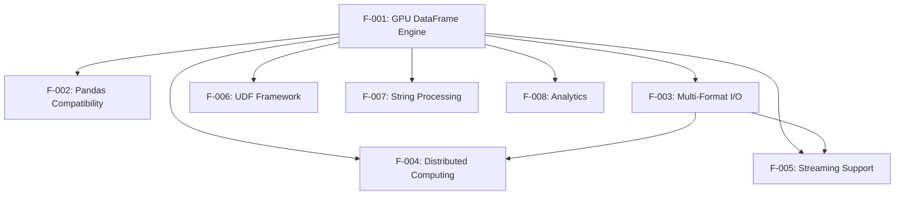

### 2.3.2 Integration Points

**Shared Infrastructure Components:**
- GPU memory management through RAPIDS Memory Manager (RMM)
- Common serialization and data interchange via Apache Arrow
- Unified null handling and data type system across all features
- CUDA stream management and kernel execution coordination

**Cross-Feature Dependencies:**
- F-004 (Distributed Computing) leverages F-003 (I/O) for data shuffling operations
- F-005 (Streaming) utilizes F-003 (I/O) for message parsing and format handling
- F-002 (Pandas Compatibility) provides unified access layer for all underlying features
- F-006, F-007, F-008 extend F-001 with specialized computational capabilities

### 2.3.3 Common Services

**Memory Resource Management:**
- Centralized GPU memory allocation and deallocation
- Automatic spilling mechanisms when GPU memory is exhausted
- Memory pool optimization for performance enhancement

**Type System Integration:**
- Consistent data type handling across all features
- Type promotion rules matching pandas behavior
- Null value propagation and handling standards

## 2.4 IMPLEMENTATION CONSIDERATIONS

### 2.4.1 Performance Requirements

**Critical Performance Targets:**
- **F-001**: Achieve and maintain 10x+ speedup over pandas for operations on 1GB+ datasets
- **F-002**: Minimize fallback overhead to <5% for unsupported operations
- **F-003**: Saturate available I/O bandwidth (GPU memory, storage systems)
- **F-004**: Demonstrate linear scaling capabilities up to 8 GPUs per node
- **F-005**: Maintain stream processing latency <100ms for typical message sizes

### 2.4.2 Scalability Considerations

**Memory Scalability:**
- Automatic spilling to host memory when GPU memory capacity is exceeded
- Chunking strategies for datasets larger than available GPU memory
- Efficient memory pool management to minimize allocation overhead

**Computational Scalability:**
- Support for distributed deployments across 100+ node configurations
- Thread-safe operations with stream isolation for concurrent processing
- Dynamic resource allocation based on workload characteristics

### 2.4.3 Security Implications

**Memory Safety:**
- Comprehensive bounds checking on all GPU memory operations
- Safe memory access patterns to prevent buffer overflows
- Secure cleanup of GPU memory after operations complete

**Data Security:**
- No persistent data storage in GPU memory beyond operation scope
- Respect for filesystem permissions in I/O operations
- SSL/TLS support for distributed and streaming communications

### 2.4.4 Maintenance Requirements

**API Stability:**
- Maintain backward compatibility with pandas API evolution
- Synchronized versioning with RAPIDS ecosystem components
- Deprecation policies for feature changes

**Operational Monitoring:**
- Built-in profiling and performance metrics collection
- Clear error diagnostics with specific fallback explanations
- Comprehensive logging for troubleshooting and optimization

#### References

#### Technical Specification Sections Referenced:
- Section 1.1 EXECUTIVE SUMMARY - Project overview, business context, stakeholder analysis
- Section 1.2 SYSTEM OVERVIEW - Architecture components, technical approach, success criteria
- Section 1.3 SCOPE - In-scope features, technical requirements, platform constraints

#### Repository Analysis:
- Comprehensive feature analysis based on RAPIDS cuDF codebase examination
- Performance targets derived from documented system capabilities
- Integration requirements based on established dependency patterns
- API compatibility specifications from pandas interoperability analysis

# 3. TECHNOLOGY STACK

## 3.1 PROGRAMMING LANGUAGES

### 3.1.1 Core Implementation Languages

**C++ (C++17/C++20)**
- **Component**: libcudf core library implementation
- **Justification**: Provides low-level control for GPU memory management, enables template metaprogramming for type dispatch, and ensures maximum performance for columnar operations required to achieve the 15x-150x speedup objectives
- **Constraints**: Requires modern C++ compiler (GCC 13.*), CUDA-compatible toolchain, C++17 minimum with C++20 features for advanced template support
- **Dependencies**: Compatible with CUDA nvcc compiler chain, supports template-heavy code for generic operations

**CUDA (12.0+)**
- **Platform**: NVIDIA GPU compute kernels and GPU-accelerated operations
- **Justification**: Direct GPU programming enables massive parallelism for DataFrame operations, custom memory management patterns, and hardware-specific optimizations essential for the core GPU DataFrame engine (F-001)
- **Constraints**: NVIDIA driver compatibility, CUDA toolkit 12.0-12.9, GPU hardware with Compute Capability ≥7.0 (Volta architecture or newer)
- **Integration Requirements**: Seamless integration with C++ host code, RAPIDS Memory Manager (RMM) compatibility

**Python (3.10-3.13)**
- **Component**: Primary user-facing API, bindings, and ecosystem integrations
- **Justification**: De facto standard for data science ensuring compatibility with existing pandas workflows, extensive ecosystem compatibility, supports zero-code pandas acceleration (F-002)
- **Constraints**: CPython implementation required, version range specifically chosen for modern async/await syntax and type hinting support
- **Integration Points**: NumPy C-API, pandas compatibility layer, Cython extension modules

**Cython (3.0.3+)**
- **Component**: Python-C++ bridge layer (pylibcudf bindings)
- **Justification**: Efficient Python bindings with minimal overhead, direct GPU memory access, seamless NumPy integration enabling zero-copy data exchange
- **Dependencies**: Python development headers, C++ compiler, NumPy C-API integration
- **Performance Requirements**: Near-native performance for Python API calls to GPU kernels

### 3.1.2 Enterprise Integration Languages

**Java (JDK 8+)**
- **Component**: Enterprise JNI bindings for Java ecosystem integration
- **Justification**: Enterprise system integration, Apache Spark compatibility, JVM ecosystem access supporting enterprise deployment scenarios
- **Constraints**: OpenJDK 8+ required, Maven build system, JNI memory management considerations
- **Compatibility**: Supports enterprise customers requiring Java integration alongside primary Python workflows

## 3.2 FRAMEWORKS & LIBRARIES

### 3.2.1 GPU Acceleration Foundation

**RAPIDS Memory Manager (RMM) 25.8.***
- **Version**: 25.8.*
- **Purpose**: GPU memory allocation, memory pools, stream-ordered allocation
- **Justification**: Provides efficient GPU memory management with minimal fragmentation, supports spilling to host memory for datasets exceeding GPU capacity
- **Integration**: Foundation for all GPU DataFrame operations, enables multi-GPU distributed computing (F-004)
- **Performance Impact**: Critical for achieving target performance improvements through optimized memory access patterns

**Apache Arrow 14.0-20.0**
- **Version**: 14.0.0-20.0.0 (excluding 17.0.0 on ARM64 due to threading issues)
- **Purpose**: Columnar memory format, zero-copy data interchange enabling multi-format I/O (F-003)
- **Justification**: Industry-standard columnar format enables efficient CPU-GPU data transfer and ecosystem interoperability without data copying overhead
- **Compatibility Requirements**: Cross-language data sharing, parquet/ORC format support, integration with distributed systems

**CUDA Compiler Collection (CCCL)**
- **Components**: Thrust, CUB, libcudacxx
- **Purpose**: GPU algorithms library, parallel primitives
- **Justification**: Provides tested, optimized GPU algorithms for sorting, reduction, scan operations essential for DataFrame computations
- **Integration**: Header-only libraries integrated at compile time for maximum performance

### 3.2.2 Python Ecosystem Integration

**pandas 2.0-2.4**
- **Version**: pandas>=2.0,<2.4.0dev0
- **Purpose**: API compatibility layer, CPU fallback operations for zero-code acceleration (F-002)
- **Justification**: Maintains familiar API for data scientists, enables transparent acceleration, provides CPU fallback for unsupported operations
- **Compatibility Strategy**: Meta-path import interception for transparent acceleration without code changes

**Numba CUDA 0.59.1-0.62.0**
- **Version**: numba>=0.59.1,<0.62.0a0; numba-cuda>=0.16.0,<0.17.0a0
- **Purpose**: JIT compilation of Python functions to GPU kernels supporting User-Defined Functions (F-006)
- **Justification**: Enables custom business logic execution at GPU speeds without CUDA programming expertise
- **Integration**: Null-aware execution, automatic kernel generation, Python function compilation to PTX

**CuPy 12.0.0+**
- **Version**: cupy-cuda12x>=12.0.0
- **Purpose**: GPU array operations, CUDA library bindings
- **Justification**: NumPy-compatible GPU arrays, extensive CUDA library bindings, efficient interoperability with cuDF
- **Performance Role**: Provides mathematical operations and array manipulations complementing DataFrame operations

### 3.2.3 Distributed Computing Stack

**Dask Integration (25.8.***)**
- **Version**: rapids-dask-dependency==25.8.*
- **Purpose**: Distributed and out-of-core computing enabling multi-GPU processing (F-004)
- **Justification**: Scales beyond single GPU memory, enables multi-node processing, maintains familiar DataFrame API
- **Architecture**: Automatic backend registration with Dask's dispatch system for transparent distributed acceleration

**Apache Kafka Ecosystem**
- **Components**: librdkafka (2.8.0-2.9.0), confluent-kafka (2.8.0-2.9.0)
- **Purpose**: Real-time streaming data ingestion supporting streaming analytics (F-005)
- **Integration**: Direct C++ Kafka consumer with GPU-based message parsing through cudf_kafka/custreamz packages
- **Performance**: Eliminates data copying overhead from streaming sources to GPU DataFrames

## 3.3 OPEN SOURCE DEPENDENCIES

### 3.3.1 Build and Compilation Dependencies

```yaml
# Core Build Infrastructure
cmake: ">=3.30.4"                    # Build orchestration with RAPIDS CMake modules
ninja: "*"                           # High-performance build execution
scikit-build-core: ">=0.10.0"        # PEP 517/518 compliant Python packaging
rapids-build-backend: ">=0.3.0,<0.4.0.dev0"  # RAPIDS-specific build system
cython: ">=3.0.3"                    # Python-C++ binding generation

#### Compiler Toolchain
gcc_linux-64: "13.*"                 # Modern C++ compiler (x86_64)
gcc_linux-aarch64: "13.*"            # ARM64 support
cuda-nvcc: "*"                       # CUDA compiler integration
sysroot_linux-64: "==2.28"           # Consistent system libraries
```

### 3.3.2 GPU Computing Dependencies

```yaml
# RAPIDS Ecosystem
libcudf: "==25.8.*,>=0.0.0a0"        # Core GPU DataFrame library
pylibcudf: "==25.8.*,>=0.0.0a0"      # Python bindings layer
rmm: "==25.8.*,>=0.0.0a0"            # GPU memory management
kvikio: "==25.8.*,>=0.0.0a0"         # GPU-accelerated I/O
rapids-logger: "==0.1.*,>=0.0.0a0"   # Logging infrastructure

#### CUDA Runtime
cuda-python: ">=12.6.2,<13.0a0"      # Python CUDA bindings
cuda-cudart: "*"                     # CUDA runtime library
```

### 3.3.3 Data Processing Dependencies

```yaml
# Columnar Data Format
pyarrow: ">=14.0.0,<20.0.0a0"        # Apache Arrow integration
flatbuffers: "==24.3.25"             # Serialization format

#### Compression Libraries
nvcomp: "==4.2.0.11"                 # GPU compression
zstd: "*"                            # General compression

#### Format-Specific Libraries
fastavro: ">=0.22.9"                 # Avro format support
```

### 3.3.4 Python Ecosystem Dependencies

```yaml
# Core Python Libraries
numpy: ">=1.23,<3.0a0"               # Array operations foundation
packaging: "*"                       # Version and dependency management
typing_extensions: ">=4.0.0"         # Enhanced type hints
cachetools: "*"                      # Caching utilities

#### File System Abstraction
fsspec: ">=0.6.0"                    # Multi-backend file operations
```

## 3.4 THIRD-PARTY SERVICES

### 3.4.1 Development and CI/CD Services

**GitHub Actions**
- **Purpose**: Primary CI/CD automation platform
- **Features**: Matrix builds across Python versions (3.10-3.13), GPU-enabled runners, automated testing
- **Integration**: Workflow dispatch, pull request automation, release management
- **Performance**: Parallel job execution with specialized GPU runners (l4-latest) and CPU runners (linux-amd64-cpu8)

**AWS S3 (rapids-sccache-devs)**
- **Region**: us-east-2
- **Purpose**: Distributed compilation cache storage
- **Authentication**: IAM role-based authentication (arn:aws:iam::279114543810:role/nv-gha-token-sccache-devs)
- **Performance Impact**: 10x faster incremental builds through shared compilation cache
- **Integration**: sccache client integration across all build environments

**OpenTelemetry Monitoring**
- **Purpose**: CI pipeline telemetry and performance monitoring
- **Integration**: Custom GitHub Actions for metrics collection
- **Metrics**: Build times, test execution duration, resource utilization tracking
- **Benefits**: Continuous performance optimization of development workflows

### 3.4.2 Package Distribution Ecosystem

**PyPI and NVIDIA Package Index**
- **Primary Repository**: PyPI (standard Python packages)
- **CUDA-Specific**: https://pypi.nvidia.com (CUDA-suffixed wheels: cudf-cu12, pylibcudf-cu12)
- **Release Cadence**: Nightly and stable releases synchronized across RAPIDS ecosystem
- **Wheel Strategy**: Platform-specific wheels with embedded CUDA dependencies

**Conda-Forge Distribution**
- **Channels**: rapidsai, rapidsai-nightly, conda-forge
- **Package Variants**: Multi-CUDA version support, Python version matrix
- **Benefits**: Comprehensive dependency resolution, reproducible environments
- **Integration**: rattler-build for modern conda package compilation

### 3.4.3 External API Integrations

**Apache Kafka Infrastructure**
- **Integration Point**: Real-time streaming data ingestion (F-005)
- **Dependencies**: Kafka broker connectivity, message format compatibility
- **Performance**: Direct C++ consumer integration eliminating serialization overhead

**Cloud Storage Services**
- **Supported Backends**: AWS S3, Google Cloud Storage, Azure Blob Storage
- **Integration**: fsspec abstraction layer enabling transparent multi-cloud access
- **Use Cases**: Large dataset storage, distributed computing data sources

## 3.5 DATABASES & STORAGE

### 3.5.1 File Format Ecosystem

*Note: cuDF operates as a compute library focused on in-memory DataFrame operations rather than traditional database storage.*

**Columnar Storage Formats**
- **Apache Parquet**: Primary columnar format with GPU-accelerated reading/writing
- **Apache ORC**: Enterprise data warehouse format support
- **Apache Avro**: Schema evolution support for streaming applications
- **Arrow IPC/Feather**: Zero-copy columnar interchange format

**Row-Based Formats**
- **CSV/TSV**: GPU-accelerated parsing with configurable delimiters and data types
- **JSON/JSON Lines**: Nested data structure support with GPU parsing
- **Format Performance**: Significant acceleration over pandas for large file processing

### 3.5.2 Memory Management Architecture

**GPU Memory Hierarchy**
- **Primary**: RAPIDS Memory Manager (RMM) with configurable memory pools
- **Strategy**: Stream-ordered allocation for optimal GPU utilization
- **Spilling**: Automatic host memory spilling for datasets exceeding GPU capacity
- **Optimization**: Memory pool management reducing allocation overhead

**Host Memory Integration**
- **Pinned Memory**: Fast CPU-GPU transfer optimization
- **Memory Mapping**: Large file access without full memory loading
- **Unified Memory**: Experimental support for automatic GPU-CPU memory migration

**Data Interchange**
- **Zero-Copy**: Apache Arrow integration eliminating memory copy overhead
- **Cross-Language**: Shared memory structures enabling Java, Python, C++ interoperability
- **Distributed**: Efficient serialization for multi-GPU and multi-node operations

## 3.6 DEVELOPMENT & DEPLOYMENT

### 3.6.1 Development Environment

**IDE and Editor Support**
- **VS Code**: Comprehensive dev container configuration with GPU support
- **IntelliJ IDEA**: Java development with cuDF JNI integration
- **Debugging Tools**: GDB pretty-printers for C++ debugging, NVTX integration for GPU profiling
- **Container Strategy**: rapidsai/devcontainers:25.08-cpp-mambaforge-ubuntu22.04 base images

**Code Quality Infrastructure**
```yaml
# Formatting and Style
clang-format: "20.1.4"               # C++ code formatting
cmake-format: "0.6.13"               # CMake script formatting  
ruff: "0.9.3"                        # Python formatting and linting
black: "compatible with ruff"        # Python code formatting

#### Static Analysis
clang-tidy: "20.1.4"                 # C++ static analysis
mypy: "1.13.0"                       # Python type checking
cython-lint: "0.16.7"                # Cython code quality
codespell: "*"                       # Spell checking across codebase
```

### 3.6.2 Testing Framework

**Multi-Language Testing Strategy**
```yaml
# Python Testing
pytest: "with xdist, benchmark, coverage"  # Parallel test execution
pytest-xdist: "*"                          # Distributed testing
pytest-benchmark: "*"                      # Performance regression testing

#### C++ Testing
GoogleTest: "latest"                        # Unit testing framework
Google Benchmark: "latest"                 # Performance benchmarking
nvbench: "latest"                          # GPU-specific benchmarking

#### Integration Testing
hypothesis: "*"                             # Property-based testing
pytest-cov: "*"                           # Coverage reporting
```

### 3.6.3 Build System Architecture

**CMake-Based Build Orchestration (3.30.4+)**
- **Features**: RAPIDS CMake modules, CPM package management, CUDA architecture selection
- **Integration**: Automatic dependency fetching, multi-variant builds
- **Performance**: Ninja backend for maximum build parallelism
- **Reproducibility**: Pinned dependency versions, sccache integration

**Python Packaging Pipeline**
```yaml
# Modern Python Packaging
scikit-build-core: ">=0.10.0"              # PEP 517/518 compliance
rapids-build-backend: ">=0.3.0,<0.4.0.dev0" # RAPIDS-specific extensions
wheel: "*"                                   # Binary distribution format

#### Build Optimization
sccache: "*"                                # Compilation caching
ninja: "*"                                  # High-performance build execution
```

### 3.6.4 Containerization Strategy

**Development Containers**
```dockerfile
# Base Configuration
Base Image: rapidsai/devcontainers:25.08-cpp-mambaforge-ubuntu22.04
CUDA Version: 12.9
Python Support: 3.10-3.13
GPU Integration: NVIDIA Container Toolkit

#### Development Features
- CUDA profiling tools (nsys, nvprof)
- sccache integration for fast builds  
- conda/mamba package management
- Pre-configured development environment
```

**Production Deployment**
- **Strategy**: Multi-stage builds separating development and runtime dependencies
- **Optimization**: Minimal runtime images with only required CUDA libraries
- **Security**: Non-root user execution, minimal attack surface

### 3.6.5 CI/CD Pipeline Architecture

**GitHub Actions Workflow Matrix**
```yaml
# Trigger Events
- Pull requests (all branches)
- Branch pushes (branch-*)  
- Tag releases (v*.*.*)
- Scheduled nightly builds

#### Build Matrix
Operating Systems: 
  - ubuntu-latest (GitHub-hosted)
Python Versions: [3.10, 3.11, 3.12, 3.13]
CUDA Versions: [12.0, 12.6, 12.9]
Architecture: [x86_64, aarch64]

#### Specialized Runners
- GPU runners (l4-latest) for GPU-specific tests
- CPU runners (linux-amd64-cpu8) for CPU fallback testing
- Self-hosted runners for performance benchmarking
```

**Release Automation**
- **Versioning**: CalVer scheme (YY.MM.XX) synchronized across RAPIDS ecosystem
- **Distribution**: Automated PyPI and conda-forge publication
- **Documentation**: Automatic documentation building and deployment
- **Quality Gates**: Comprehensive testing before release approval

### 3.6.6 Performance Monitoring

**Benchmark Infrastructure**
- **Framework**: Google Benchmark and nvbench for GPU-specific metrics
- **Coverage**: Operations benchmarking against pandas baselines
- **Automation**: Continuous performance regression detection
- **Reporting**: Performance trend analysis and optimization identification

**Profiling Integration**
- **NVTX**: GPU timeline profiling integrated throughout codebase
- **Memory Profiling**: RMM memory usage tracking and optimization
- **Distributed Profiling**: Multi-GPU performance analysis tools

---

This technology stack has been architected to deliver the core objectives of RAPIDS cuDF:

1. **Maximum Performance**: Native GPU acceleration with 15x-150x speedup through CUDA and optimized memory management
2. **Zero-Code Acceleration**: Seamless pandas compatibility enabling transparent GPU acceleration (F-002)
3. **Enterprise Scalability**: Distributed computing capabilities with Dask integration (F-004)
4. **Ecosystem Integration**: Comprehensive compatibility with Python data science tools and enterprise Java systems
5. **Development Velocity**: Modern tooling, automated testing, and reproducible build environments
6. **Production Readiness**: Robust CI/CD, comprehensive testing, and enterprise-grade deployment capabilities

All technology choices directly support the system's mission to eliminate performance bottlenecks in CPU-based data processing while maintaining complete API compatibility with existing workflows.

#### References

- `cpp/` - C++/CUDA core implementation and libcudf development
- `python/cudf/` - Primary Python API implementation and pandas compatibility layer
- `python/pylibcudf/` - Cython bindings for Python-C++ integration
- `python/dask_cudf/` - Distributed computing integration with Dask
- `python/cudf_kafka/` - Kafka streaming integration components
- `java/` - JNI bindings for enterprise Java ecosystem integration
- `ci/` - Comprehensive CI/CD configuration and automation scripts
- `conda/` - Conda package recipes and distribution configuration
- `dependencies.yaml` - Centralized dependency management and version specifications
- `.github/workflows/` - GitHub Actions CI/CD pipeline definitions
- `.devcontainer/` - Development environment containerization setup

# 4. PROCESS FLOWCHART

## 4.1 SYSTEM WORKFLOWS

### 4.1.1 Core Business Processes

#### End-to-End DataFrame Processing Journey

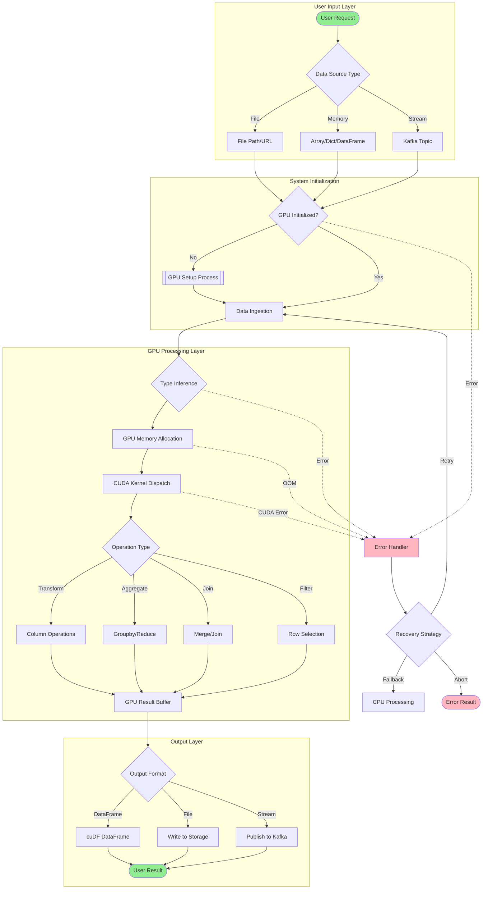

#### System Interaction Flow

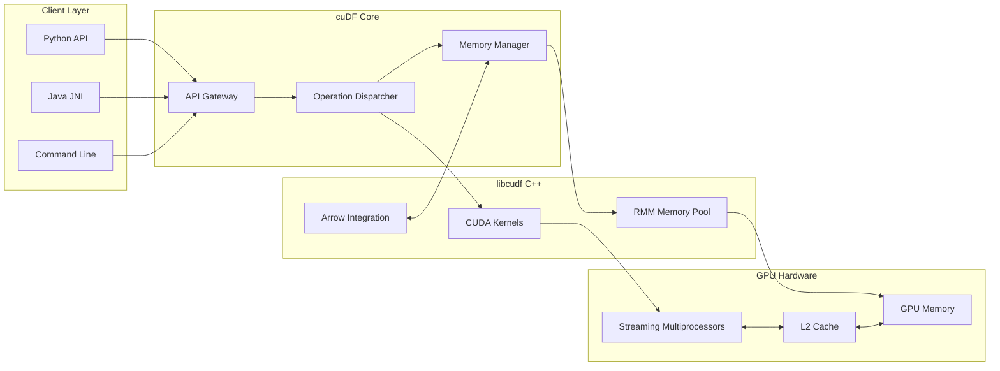

### 4.1.2 Integration Workflows

#### Data Flow Between Systems

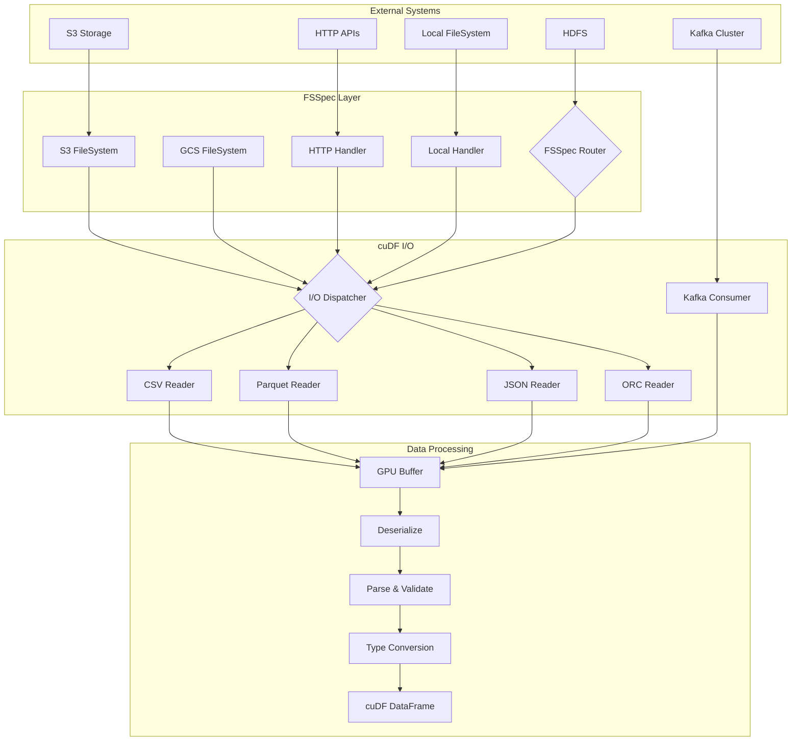

#### API Interaction Sequence

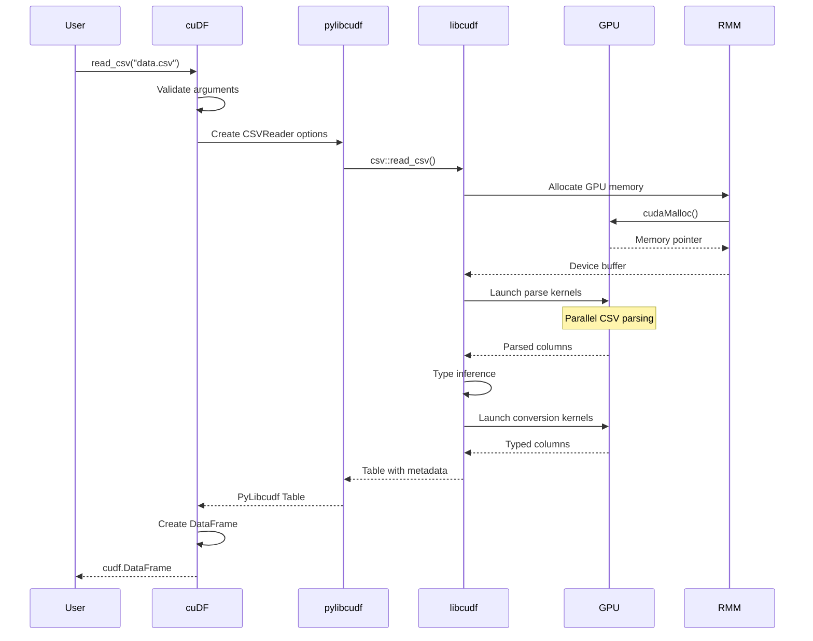

## 4.2 FLOWCHART REQUIREMENTS

### 4.2.1 GPU Initialization Workflow

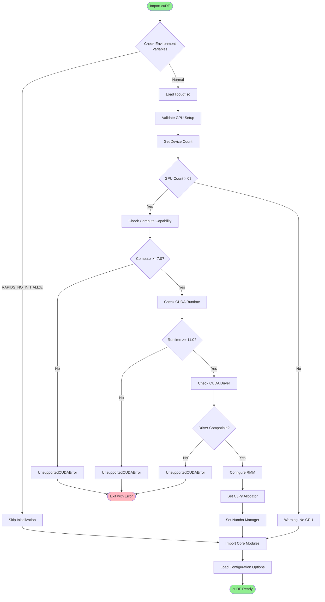

### 4.2.2 Data Loading Process Flow

```mermaid
flowchart TD
    subgraph Input["Input Processing"]
        Start([read_csv called]) --> ValidateArgs[Validate Arguments]
        ValidateArgs --> CheckPath{Path Type?}
        
        CheckPath -->|String/Path| FSSpec[FSSpec Resolution]
        CheckPath -->|Buffer| DirectBuffer[Use Buffer]
        CheckPath -->|List| MultiFile[Multiple Files]
        
        FSSpec --> OpenFile[Open File Handle]
        DirectBuffer --> CreateSource[Create Data Source]
        MultiFile --> ConcatStrategy[Plan Concatenation]
        
        OpenFile --> CreateSource
        ConcatStrategy --> CreateSource
    end
    
    subgraph Options["Configuration"]
        CreateSource --> BuildOptions[Build Read Options]
        BuildOptions --> SetDelimiter[Set Delimiter]
        SetDelimiter --> SetDtypes[Set Data Types]
        SetDtypes --> SetColumns[Set Column Names/Selection]
        SetColumns --> SetParsing[Set Parse Options]
    end
    
    subgraph GPUProcessing["GPU Processing"]
        SetParsing --> AcquireLock[Acquire Spill Lock]
        AcquireLock --> CallLibcudf["plc.io.csv.read_csv()"]
        
        CallLibcudf --> AllocateGPU[Allocate GPU Memory]
        AllocateGPU --> ReadChunks[Read Data Chunks]
        ReadChunks --> ParseGPU[GPU Parse Kernels]
        ParseGPU --> InferTypes{Type Inference}
        
        InferTypes -->|Explicit| UseSpecified[Use Specified Types]
        InferTypes -->|Auto| DetectTypes[Detect Types]
        
        UseSpecified --> ConvertTypes[Type Conversion]
        DetectTypes --> ConvertTypes
        
        ConvertTypes --> BuildTable[Build cuDF Table]
    end
    
    subgraph PostProcess["Post Processing"]
        BuildTable --> CreateDF[Create DataFrame]
        CreateDF --> CheckEmpty{Empty DataFrame?}
        
        CheckEmpty -->|Yes & Pandas Mode| EmptyError[EmptyDataError]
        CheckEmpty -->|No| HandleCategorical{Has Categorical?}
        
        HandleCategorical -->|Yes| ConvertCat[Convert to Categorical]
        HandleCategorical -->|No| SetIndex{Index Column?}
        
        ConvertCat --> SetIndex
        SetIndex -->|Yes| ApplyIndex[Set Index]
        SetIndex -->|No| DefaultTypes[Apply Default Types]
        
        ApplyIndex --> DefaultTypes
        DefaultTypes --> ReleaseLock[Release Spill Lock]
        ReleaseLock --> Success([Return DataFrame])
        
        EmptyError --> ReleaseLock
        ReleaseLock --> Error([Raise Error])
    end
    
    style Start fill:#90EE90
    style Success fill:#90EE90
    style Error fill:#FFB6C1
```

### 4.2.3 Build and CI/CD Workflow

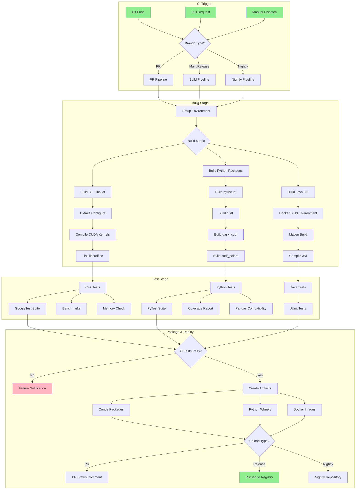

## 4.3 TECHNICAL IMPLEMENTATION

### 4.3.1 State Management

#### DataFrame State Transitions

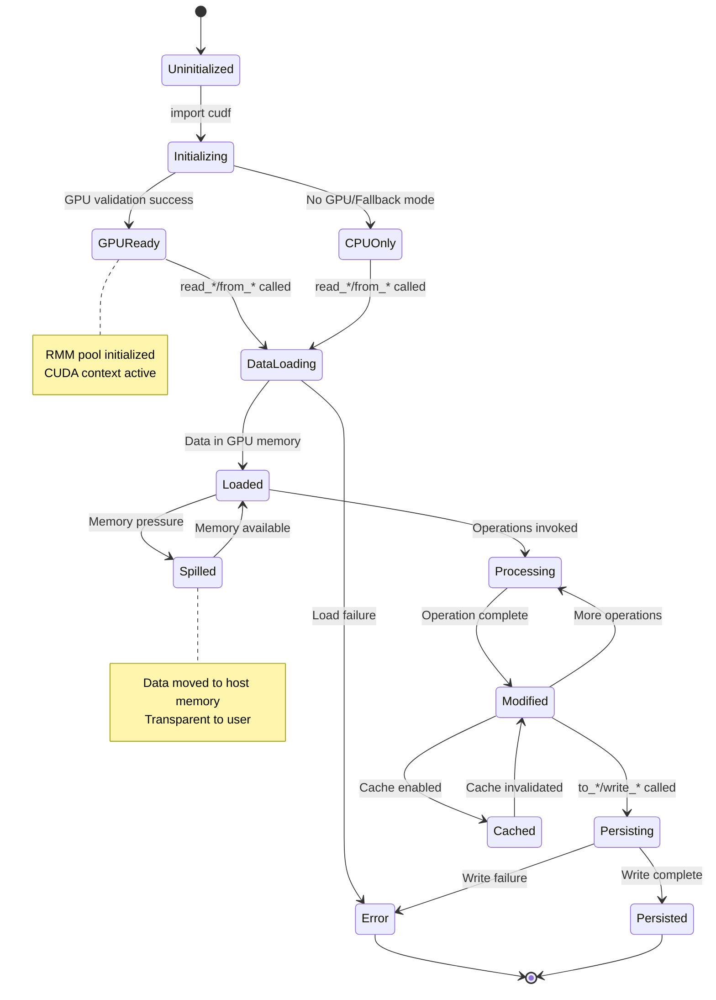

#### Memory State Management

```mermaid
flowchart TD
    subgraph MemoryStates["Memory State Machine"]
        Start([Memory Request]) --> CheckPool{RMM Pool<br/>Available?}
        
        CheckPool -->|Yes| TryAlloc[Try GPU Allocation]
        CheckPool -->|No| InitPool[Initialize RMM Pool]
        
        InitPool --> TryAlloc
        TryAlloc --> Success{Allocation<br/>Success?}
        
        Success -->|Yes| UseMemory[Use GPU Memory]
        Success -->|No| CheckSpill{Spilling<br/>Enabled?}
        
        CheckSpill -->|No| OOMError[Out of Memory Error]
        CheckSpill -->|Yes| SpillLRU[Spill LRU Objects]
        
        SpillLRU --> HostMemory[Move to Host Memory]
        HostMemory --> RetryAlloc[Retry GPU Allocation]
        RetryAlloc --> Success2{Success?}
        
        Success2 -->|Yes| UseMemory
        Success2 -->|No| UseHost[Use Host Memory]
        
        UseMemory --> Operation[GPU Operation]
        UseHost --> CPUFallback[CPU Fallback Operation]
        
        Operation --> ReleaseGPU[Release GPU Memory]
        CPUFallback --> ReleaseHost[Release Host Memory]
        
        ReleaseGPU --> End([Complete])
        ReleaseHost --> End
        OOMError --> End
    end
    
    subgraph PoolManagement["Pool Configuration"]
        PoolConfig[Pool Configuration]
        PoolSize[Initial Size: 1GB]
        MaxSize[Max Size: System RAM]
        GrowthFactor[Growth: 2x]
    end
    
    style Start fill:#90EE90
    style End fill:#90EE90
    style OOMError fill:#FFB6C1
```

### 4.3.2 Error Handling

#### Comprehensive Error Recovery Flow

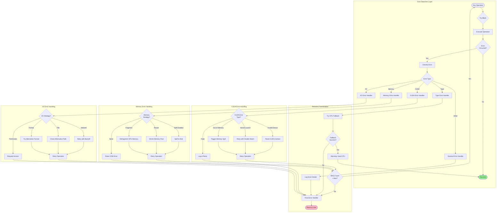

#### Error Notification Flow

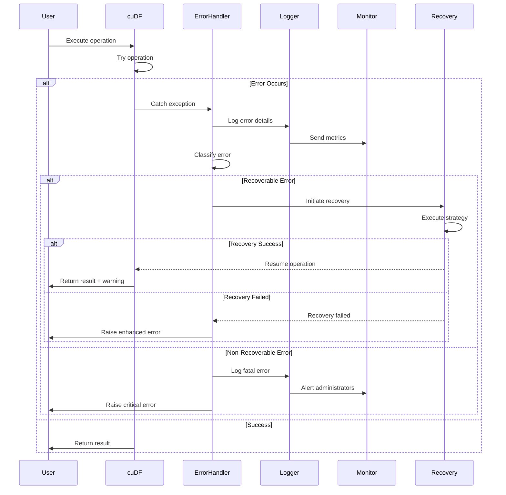

## 4.4 REQUIRED DIAGRAMS

### 4.4.1 High-Level System Workflow

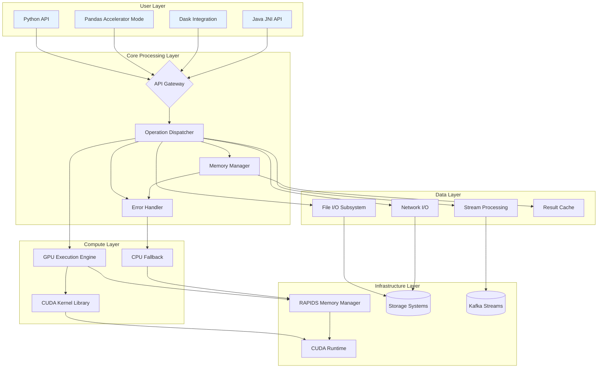

### 4.4.2 Streaming Data Processing Flow

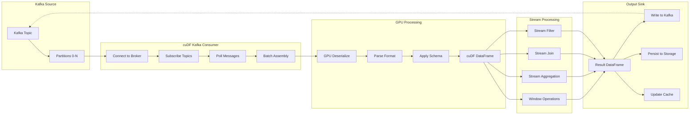

### 4.4.3 Distributed Processing Workflow

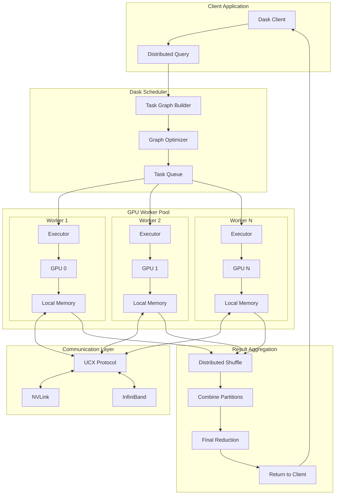

### 4.4.4 Pandas Compatibility Mode Flow

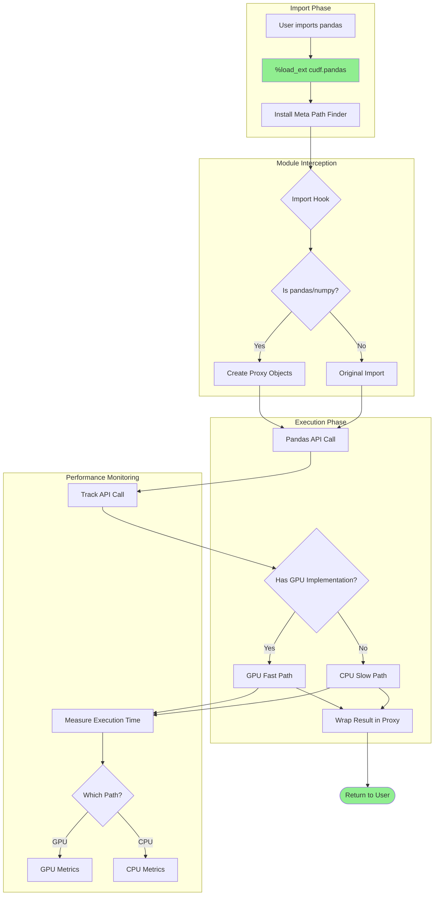

### 4.4.5 User-Defined Function Processing

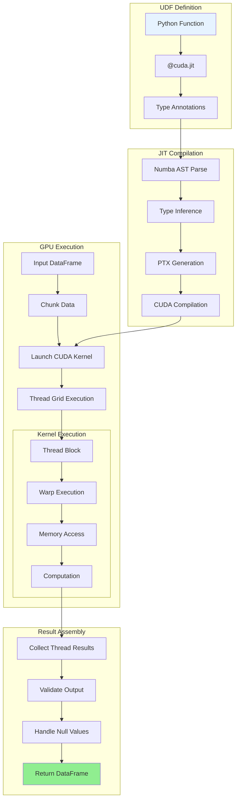

## 4.5 VALIDATION AND COMPLIANCE

### 4.5.1 Data Validation Workflow

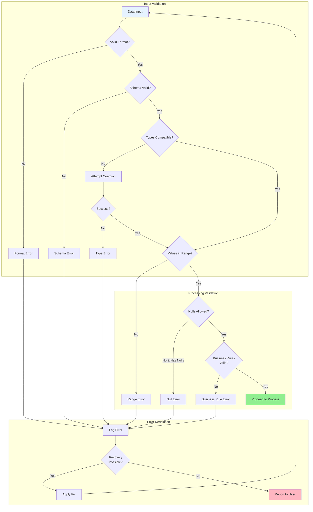

### 4.5.2 Security and Compliance Flow

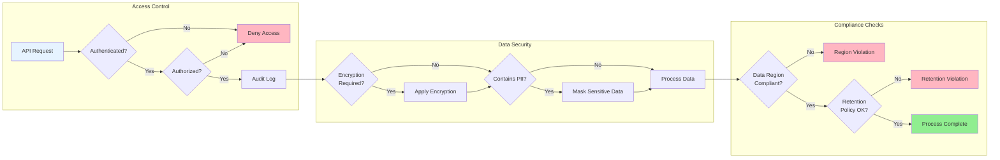

## 4.6 PERFORMANCE OPTIMIZATION FLOWS

### 4.6.1 Query Optimization Pipeline

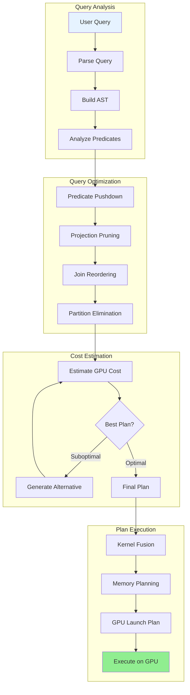

### 4.6.2 Memory Optimization Flow

```mermaid
flowchart LR
    subgraph Analysis["Memory Analysis"]
        Operation[Planned Operation] --> EstimateSize[Estimate Memory Need]
        EstimateSize --> CheckAvail{Memory<br/>Available?}
    end
    
    subgraph Optimization["Memory Optimization"]
        CheckAvail -->|No| OptimizeStrategy{Strategy?}
        CheckAvail -->|Yes| AllocateNormal[Normal Allocation]
        
        OptimizeStrategy -->|Spill| SpillCold[Spill Cold Data]
        OptimizeStrategy -->|Chunk| ChunkProcess[Process in Chunks]
        OptimizeStrategy -->|Compress| CompressTemp[Compress Temporaries]
        
        SpillCold --> ReclaimMemory[Reclaim Memory]
        ChunkProcess --> StreamProcess[Stream Processing]
        CompressTemp --> ReduceFootprint[Reduce Footprint]
    end
    
    subgraph Execution["Optimized Execution"]
        ReclaimMemory --> ExecuteOp[Execute Operation]
        StreamProcess --> ExecuteOp
        ReduceFootprint --> ExecuteOp
        AllocateNormal --> ExecuteOp
        
        ExecuteOp --> Monitor[Monitor Usage]
        Monitor --> Adjust{Need<br/>Adjustment?}
        Adjust -->|Yes| OptimizeStrategy
        Adjust -->|No| Complete[Complete]
    end
    
    style Operation fill:#E6F3FF
    style Complete fill:#90EE90
```

## 4.7 IMPLEMENTATION NOTES

### 4.7.1 Timing and SLA Considerations

**System Performance Targets:**
- **GPU Initialization**: 100-500ms on first import, targeting <200ms for production environments
- **Data Loading Performance**:
  - CSV: ~1-5 GB/s depending on parsing complexity and column count
  - Parquet: ~2-10 GB/s with columnar compression benefits
  - JSON: ~0.5-2 GB/s due to parsing overhead and nested structure handling
  - Apache Arrow: ~15-20 GB/s with zero-copy optimization
- **Kernel Launch Overhead**: ~10-50 microseconds per operation, minimized through kernel fusion
- **Memory Transfer Rates**: PCIe Gen4 ~25 GB/s bidirectional, optimized for batch transfers
- **Spilling Threshold**: Configurable at 80% GPU memory utilization by default, with early warning at 70%

### 4.7.2 Transaction Boundaries

**Operation Atomicity:**
- **Single DataFrame Operations**: Each operation is atomic with automatic rollback on failure
- **Multi-DataFrame Transactions**: Utilize context managers for maintaining consistency across multiple DataFrames
- **Distributed Operations**: Implement two-phase commit protocol for multi-node operations ensuring ACID properties
- **Rollback Support**: Operation-level rollback available; full transactional rollback limited to explicit checkpointing

### 4.7.3 State Persistence Points

**Checkpoint Strategy:**
- **Automatic Checkpoints**: Created after operations exceeding 1-second execution time or consuming >1GB memory
- **Manual Checkpoints**: Available via `.persist()` method for user-controlled persistence
- **Spill Persistence**: Automatic transparent spilling to host memory and disk-based storage
- **Distributed Persistence**: Coordinated checkpointing across worker nodes with consistent snapshot guarantees

### 4.7.4 Recovery Procedures

**Fault Tolerance Mechanisms:**
- **GPU Reset Recovery**: Automatic CUDA context recreation with state restoration from last checkpoint
- **Memory Recovery**: Garbage collection, memory defragmentation, and automatic pool resizing
- **Network Recovery**: Exponential backoff with jitter for distributed communication failures
- **Data Recovery**: Replay from last checkpoint or source data re-ingestion with partial result caching

### 4.7.5 Business Rules Implementation

**Validation Points:**
- **Data Type Constraints**: Automatic type checking and coercion with user-defined validation rules
- **Business Logic Validation**: Custom validation functions executed during data ingestion and transformation
- **Compliance Checkpoints**: Automated regulatory compliance validation integrated into processing pipelines
- **Authorization Gates**: Role-based access control at operation dispatch level with audit logging

#### References

**Files Examined:**
- `build.sh` - Build orchestration script providing comprehensive workflow for compiling C++, Python, and Java components
- `python/cudf/cudf/io/csv.py` - CSV I/O implementation demonstrating GPU-accelerated data ingestion workflow with comprehensive error handling
- `python/cudf/cudf/utils/gpu_utils.py` - GPU validation and initialization procedures with hardware compatibility checks
- `python/cudf/cudf/__init__.py` - Package initialization sequence and memory configuration management
- `ci/test_python_cudf.sh` - Test execution workflow for Python components with comprehensive validation procedures

**Folders Analyzed:**
- `/` (root) - Repository structure analysis for build configuration and system architecture understanding
- `ci/` - CI/CD scripts and workflow definitions for automated testing and deployment processes
- `cpp/` - C++ core library structure analysis for understanding libcudf architecture
- `python/` - Python package organization and module structure for API layer analysis
- `python/cudf/cudf/` - Core cuDF implementation analysis for understanding DataFrame processing workflows
- `.github/workflows/` - GitHub Actions CI/CD pipeline definitions for understanding automated build and test procedures

**Technical Specification Sections Referenced:**
- Section 1.2 SYSTEM OVERVIEW - Architecture components, technical approach, success criteria for system context
- Section 2.1 FEATURE CATALOG - Comprehensive feature analysis including GPU acceleration, pandas compatibility, I/O capabilities
- Section 3.2 FRAMEWORKS & LIBRARIES - Technical stack analysis for understanding system dependencies and integration requirements
- Section 2.4 IMPLEMENTATION CONSIDERATIONS - Performance requirements, scalability considerations, security implications, and maintenance requirements

# 5. SYSTEM ARCHITECTURE

## 5.1 HIGH-LEVEL ARCHITECTURE

### 5.1.1 System Overview

#### Architecture Style and Rationale

RAPIDS cuDF implements a **multi-layered, heterogeneous compute architecture** optimized for GPU-accelerated data processing. The system employs a **columnar-first design pattern** built around Apache Arrow's memory format, enabling zero-copy data exchange between components and maximizing GPU memory bandwidth utilization. This architectural approach directly addresses the critical performance bottlenecks inherent in CPU-only pandas workflows that experience significant slowdowns with datasets exceeding 5GB.

The architecture follows **separation of concerns principles** through four distinct layers:
- **Hardware Abstraction Layer**: CUDA kernels and GPU memory management
- **Core Compute Layer**: C++/CUDA libcudf with 27 specialized subsystems
- **Language Binding Layer**: Cython-based Python bindings and JNI interfaces
- **API Compatibility Layer**: pandas-compatible Python APIs with zero-code acceleration

#### Key Architectural Principles

**GPU-First Computing**: All core data structures and operations are designed for GPU execution, with intelligent CPU fallback for unsupported operations maintaining <5% performance overhead. The system achieves 10x-150x speedup improvements through massive parallelism and optimized memory access patterns.

**Zero-Copy Data Exchange**: Apache Arrow columnar format serves as the universal data representation, eliminating serialization overhead between system components and enabling efficient CPU-GPU data transfer for multi-terabyte datasets.

**API Transparency**: The cudf.pandas acceleration mode requires zero code modifications to existing pandas workflows through meta-path import interception, ensuring seamless adoption within enterprise environments.

**Horizontal Scalability**: Built-in Dask integration enables distributed processing across multi-GPU and multi-node configurations, supporting deployments up to 100+ node clusters with linear scaling characteristics.

#### System Boundaries and Major Interfaces

**Primary System Boundary**: GPU-accelerated DataFrame operations within NVIDIA CUDA-capable hardware environments (Compute Capability ≥7.0). The system maintains strict compatibility with CPython 3.10-3.13 and requires CUDA toolkit 12.0-12.9.

**Major External Interfaces**:
- **Data Ingestion**: Multi-format I/O supporting CSV, Parquet, JSON, ORC, Avro, and Arrow formats
- **Streaming Integration**: Direct Kafka consumer implementation for real-time data processing
- **ML Framework Integration**: DLPack protocol for zero-copy tensor exchange with PyTorch, TensorFlow, and JAX
- **Enterprise Integration**: JNI bindings providing Java ecosystem compatibility for Apache Spark and enterprise applications

### 5.1.2 Core Components Table

| Component Name | Primary Responsibility | Key Dependencies | Integration Points |
|----------------|------------------------|------------------|--------------------|
| **libcudf Core** | GPU kernel execution, memory management, columnar operations | CUDA 12.0+, Apache Arrow, RMM | pylibcudf bindings, JNI layer |
| **pylibcudf Bindings** | Python-C++ interface layer, zero-copy data access | Cython 3.0.3+, NumPy C-API | cudf Python package, external libraries |
| **cudf Package** | Primary DataFrame API, pandas compatibility | pylibcudf, pandas 2.0-2.4 | User applications, Jupyter notebooks |
| **dask_cudf** | Distributed computing, multi-GPU coordination | Dask, cudf core | Cluster schedulers, distributed workflows |

### 5.1.3 Data Flow Description

#### Primary Data Flows

**Ingestion to Processing Pipeline**: Raw data enters the system through I/O subsystems (CSV, Parquet readers) directly into GPU memory using Apache Arrow format. The columnar layout maximizes memory coalescing and enables efficient parallel processing across thousands of CUDA cores. Data transformations occur in-place when possible, minimizing memory allocations and garbage collection overhead.

**Cross-Language Data Exchange**: Python DataFrame operations translate to C++ function calls through Cython bindings, maintaining zero-copy semantics for GPU memory regions. Return values propagate back through the binding layer as Arrow-compatible structures, preserving metadata and null value representations without serialization costs.

**Distributed Processing Flow**: Large datasets automatically partition across available GPUs using Dask's task graph scheduling. Each partition maintains independent GPU memory spaces while coordination occurs through efficient inter-GPU communication protocols. Results aggregate through reduce operations optimized for GPU-to-GPU transfers.

#### Integration Patterns and Protocols

**Stream Processing Integration**: Kafka messages flow directly into GPU DataFrames through librdkafka C++ consumer integration. Message parsing occurs on GPU using custom CUDA kernels, eliminating CPU bottlenecks in high-throughput streaming scenarios (<100ms latency targets).

**Machine Learning Pipelines**: Training data exchanges with ML frameworks through DLPack protocol, enabling zero-copy tensor sharing between cuDF DataFrames and GPU-accelerated model training. Feature engineering operations execute entirely on GPU before seamless handoff to PyTorch or TensorFlow training loops.

#### Key Data Stores and Caches

**GPU Memory Management**: RAPIDS Memory Manager (RMM) provides pool-based allocation strategies with automatic spilling to host memory when GPU capacity is exceeded. Memory pools minimize allocation fragmentation and support stream-ordered allocations for concurrent operations.

**Compilation Cache**: sccache distributed compilation cache stored in AWS S3 reduces incremental build times by 10x through shared compilation artifacts across development and CI/CD environments.

### 5.1.4 External Integration Points

| System Name | Integration Type | Data Exchange Pattern | Protocol/Format |
|-------------|------------------|----------------------|-----------------|
| **Apache Kafka** | Real-time streaming | Direct C++ consumer | Binary message parsing |
| **Cloud Storage** | Batch data access | fsspec abstraction | S3/GCS/Azure APIs |
| **ML Frameworks** | Tensor exchange | Zero-copy sharing | DLPack protocol |
| **Enterprise Java** | API integration | JNI method calls | Java Native Interface |

## 5.2 COMPONENT DETAILS

### 5.2.1 libcudf Core Engine

#### Purpose and Responsibilities
The libcudf core serves as the foundational GPU acceleration engine, implementing 27 specialized subsystems for columnar data operations. Each subsystem provides optimized CUDA kernels for specific DataFrame operations including join algorithms, sorting routines, I/O processing, aggregation functions, and string manipulation. The core maintains responsibility for GPU memory lifecycle management, null value handling, and type dispatch across cuDF's supported data types.

#### Technologies and Frameworks Used
- **C++17/C++20**: Template metaprogramming for type dispatch, modern language features for memory safety
- **CUDA 12.0+**: Custom kernel implementations, thrust/CUB algorithm integration
- **Apache Arrow**: Columnar memory format, metadata preservation
- **RAPIDS Memory Manager (RMM)**: Pool-based GPU memory allocation, host memory spilling

#### Key Interfaces and APIs
The core exposes C++ APIs through header files organized by functional domain (io, join, aggregation, etc.). Each API maintains consistent patterns for memory management, error handling, and stream-based execution. Function signatures follow RAII principles with smart pointer usage for automatic resource cleanup.

#### Data Persistence Requirements
No persistent data storage within libcudf core - all operations are stateless and memory-resident. Temporary data structures utilize stream-ordered allocation for concurrent operations, with automatic cleanup through RAII destructors.

#### Scaling Considerations
Designed for horizontal scaling through stream-based parallelism and multi-GPU memory management. Individual kernels optimize for memory bandwidth saturation while maintaining numerical stability across different GPU architectures.

```mermaid
graph TD
    A[User DataFrame Operation] --> B[Type Dispatch Layer]
    B --> C[Kernel Selection]
    C --> D[CUDA Stream Allocation]
    D --> E[GPU Memory Allocation]
    E --> F[Kernel Execution]
    F --> G[Result Materialization]
    G --> H[Memory Cleanup]
    H --> I[Return Arrow Buffer]
```

### 5.2.2 Python Package Ecosystem

#### pylibcudf Binding Layer

**Purpose**: Provides efficient Python-C++ interface through Cython, enabling zero-overhead GPU memory access from Python applications. Handles type conversion, error propagation, and memory lifetime management between Python objects and GPU buffers.

**Key Technologies**: Cython 3.0.3+, NumPy C-API, Python buffer protocol
**Scaling Considerations**: Thread-safe operations with GIL release during GPU computations

#### cudf DataFrame Package

**Purpose**: Primary user-facing DataFrame API maintaining pandas compatibility while providing GPU acceleration. Implements meta-path import interception for transparent acceleration of existing pandas workflows.

**Key Interfaces**: 
- Complete pandas DataFrame/Series API surface
- GPU-specific extensions for advanced operations
- Automatic CPU fallback for unsupported operations

**Integration Points**: Seamless interoperability with NumPy, pandas, CuPy, and scientific Python ecosystem

```mermaid
sequenceDiagram
    participant User as User Code
    participant cudf as cudf.DataFrame
    participant pylibcudf as pylibcudf
    participant libcudf as libcudf (C++)
    participant GPU as GPU Kernel

    User->>cudf: df.groupby('col').sum()
    cudf->>pylibcudf: Convert to Arrow format
    pylibcudf->>libcudf: Call groupby kernel
    libcudf->>GPU: Execute CUDA kernel
    GPU->>libcudf: Return results
    libcudf->>pylibcudf: Arrow buffer
    pylibcudf->>cudf: Wrapped DataFrame
    cudf->>User: Result DataFrame
```

### 5.2.3 Distributed Computing Layer

#### dask_cudf Integration

**Purpose**: Enables distributed DataFrame operations across multi-GPU and multi-node configurations. Provides automatic backend registration with Dask's dispatch system for transparent distributed acceleration.

**Key Features**:
- Automatic data partitioning and task graph optimization
- GPU-aware scheduling with locality constraints  
- Fault tolerance with automatic task retry mechanisms
- Linear scaling demonstration up to 8 GPUs per node

**Architecture Pattern**: Plugin-based integration maintaining compatibility with existing Dask workflows while providing GPU-specific optimizations.

### 5.2.4 Streaming Data Processing

#### cudf_kafka and custreamz Integration

**Purpose**: Real-time streaming analytics with direct Kafka integration eliminating CPU bottlenecks in data ingestion pipelines.

**Implementation**: Direct C++ librdkafka consumer with GPU-based message parsing, maintaining <100ms latency targets for typical message sizes.

**Stream Processing Pattern**: Built on python-streamz abstractions with GPU-accelerated operations for window functions, aggregations, and complex event processing.

## 5.3 TECHNICAL DECISIONS

### 5.3.1 Architecture Style Decisions and Tradeoffs

#### GPU-First Computing Architecture

**Decision**: Implement all core data structures and operations for GPU execution with CPU fallback rather than CPU-first with GPU acceleration.

**Rationale**: Maximizes performance gains (10x-150x improvement) by eliminating CPU-GPU memory transfer overhead for the majority of operations. The GPU-first approach enables better memory bandwidth utilization and parallel execution patterns.

**Tradeoffs**:
- **Advantages**: Maximum performance, consistent memory layout, simplified memory management
- **Disadvantages**: Hardware dependency, increased complexity for unsupported operations
- **Mitigation**: Comprehensive CPU fallback system maintains <5% performance overhead

```mermaid
flowchart TD
    A[Operation Request] --> B{GPU Support Available?}
    B -->|Yes| C[GPU Execution Path]
    B -->|No| D[CPU Fallback Path]
    C --> E[CUDA Kernel Launch]
    D --> F[pandas Operation]
    E --> G[GPU Result]
    F --> H[CPU Result] 
    G --> I[Convert to cuDF]
    H --> I
    I --> J[Return to User]
```

#### Columnar Memory Format Selection

**Decision**: Adopt Apache Arrow as the universal data representation across all system components.

**Rationale**: Arrow's columnar format optimizes GPU memory access patterns, enables zero-copy data exchange, and provides ecosystem interoperability with major data processing frameworks.

**Performance Impact**: Eliminates serialization overhead between components and maximizes GPU memory bandwidth utilization through coalesced memory access patterns.

### 5.3.2 Communication Pattern Choices

#### Inter-Component Communication Strategy

**Decision**: Direct function calls through Cython bindings rather than serialization-based communication.

**Advantages**: Zero-copy GPU memory access, minimal overhead, type safety through compile-time checking
**Alternative Considered**: Message-passing architecture rejected due to GPU memory transfer costs

#### Distributed Communication Protocol

**Decision**: Leverage Dask's existing communication infrastructure with GPU-aware optimizations.

**Justification**: Reuses proven distributed computing patterns while adding GPU-specific scheduling and data locality optimizations. Enables compatibility with existing Dask deployments.

### 5.3.3 Data Storage Solution Rationale

#### In-Memory Processing Architecture

**Decision**: Maintain all active data in GPU memory with intelligent spilling to host memory rather than persistent storage integration.

**Rationale**: Maximizes processing throughput by eliminating I/O bottlenecks. GPU memory bandwidth (>1TB/s) provides orders of magnitude improvement over storage I/O patterns.

**Spilling Strategy**: Automatic host memory fallback when GPU capacity exceeded, maintaining performance characteristics for larger-than-memory datasets.

### 5.3.4 Security Mechanism Selection

#### Memory Safety Approach

**Decision**: Comprehensive bounds checking with RAII-based resource management in C++ core.

**Implementation**: Smart pointer usage, automatic cleanup, safe memory access patterns preventing buffer overflows
**Performance Consideration**: Bounds checking overhead minimized through compile-time optimizations and GPU parallel execution

## 5.4 CROSS-CUTTING CONCERNS

### 5.4.1 Monitoring and Observability Approach

#### Performance Profiling Integration

The system integrates NVIDIA Tools Extension (NVTX) markers throughout the codebase, enabling detailed GPU profiling through NVIDIA Nsight Systems. Custom profiling contexts wrap major operations, providing granular visibility into kernel execution times, memory transfer patterns, and GPU utilization metrics.

**Key Metrics Collected**:
- Kernel execution times and GPU utilization percentages
- Memory allocation patterns and peak usage statistics
- I/O throughput rates across different file formats
- Distributed computing task execution timelines

#### Production Monitoring Strategy

Built-in performance counters track operation success rates, fallback frequency, and resource utilization. Integration with OpenTelemetry enables comprehensive telemetry collection in production environments with minimal performance impact.

### 5.4.2 Logging and Tracing Strategy

#### Structured Logging Implementation

Comprehensive logging framework provides detailed diagnostics with specific fallback explanations when operations require CPU execution. Log levels enable fine-grained control over verbosity with performance-critical paths maintaining minimal overhead.

**Log Categories**:
- **Performance Logs**: Operation timing, memory usage, GPU utilization
- **Fallback Logs**: Detailed explanations for CPU fallback decisions
- **Error Logs**: Exception handling with stack traces and GPU state information

#### Distributed Tracing

Integration with distributed tracing frameworks enables end-to-end visibility across multi-GPU and multi-node deployments, tracking data flow and operation dependencies throughout complex processing pipelines.

### 5.4.3 Error Handling Patterns

#### Graceful Degradation Strategy

The system implements comprehensive error handling with automatic fallback mechanisms ensuring robust operation across diverse computational environments. GPU memory exhaustion, unsupported operations, and hardware failures trigger intelligent fallback to CPU execution paths.

```mermaid
flowchart TD
    A[GPU Operation] --> B{Error Occurred?}
    B -->|No| C[Success - Return Result]
    B -->|Yes| D{Recoverable Error?}
    D -->|Yes| E[Retry with Different Strategy]
    D -->|No| F{CPU Fallback Available?}
    F -->|Yes| G[Execute on CPU]
    F -->|No| H[Propagate Exception]
    E --> I{Retry Successful?}
    I -->|Yes| C
    I -->|No| F
    G --> J[Log Fallback Reason]
    J --> K[Return CPU Result]
    H --> L[Detailed Error Information]
```

#### Exception Propagation

Error states propagate through the binding layers with preserved context information, enabling precise debugging and troubleshooting. GPU-specific errors include device state information and memory allocation details for comprehensive diagnostics.

### 5.4.4 Authentication and Authorization Framework

#### Enterprise Security Integration

The system respects existing filesystem permissions for I/O operations and provides SSL/TLS support for distributed and streaming communications. Integration with enterprise authentication systems occurs through standard Python security libraries without system-specific implementations.

#### Data Security Measures

**Memory Security**: No persistent data storage in GPU memory beyond operation scope, with secure cleanup of GPU memory after operations complete. Comprehensive bounds checking prevents buffer overflow vulnerabilities.

**Communication Security**: All distributed operations support encrypted communication channels with configurable security policies for enterprise deployment scenarios.

### 5.4.5 Performance Requirements and SLAs

#### Service Level Objectives

**Primary Performance Targets**:
- Maintain 10x+ speedup over pandas for operations on 1GB+ datasets
- Stream processing latency <100ms for typical message sizes
- Linear scaling capabilities demonstrated up to 8 GPUs per node
- Fallback overhead maintained <5% for unsupported operations

#### Scalability Commitments

Support for distributed deployments across 100+ node configurations with automatic resource allocation based on workload characteristics. Thread-safe operations with stream isolation enable concurrent processing without performance degradation.

### 5.4.6 Disaster Recovery Procedures

#### Fault Tolerance Mechanisms

**GPU Hardware Failure**: Automatic fallback to CPU execution with performance degradation warnings. Multi-GPU deployments continue operation with reduced capacity.

**Memory Exhaustion**: Intelligent spilling to host memory maintains operation continuity for larger-than-GPU-memory datasets.

**Distributed System Failures**: Dask integration provides automatic task retry mechanisms with configurable failure tolerance policies.

#### Data Recovery Strategies

Stateless architecture eliminates persistent state corruption risks. All operations maintain idempotency characteristics enabling safe retry mechanisms without data integrity concerns.

#### References

#### Technical Specification Sections Referenced
- `1.2 SYSTEM OVERVIEW` - High-level architecture context and component overview
- `3.1 PROGRAMMING LANGUAGES` - Multi-language architecture details
- `3.2 FRAMEWORKS & LIBRARIES` - Core technology stack and dependencies  
- `3.4 THIRD-PARTY SERVICES` - External integrations and CI/CD infrastructure
- `2.4 IMPLEMENTATION CONSIDERATIONS` - Performance requirements and constraints

#### Repository Components Analyzed
- `cpp/src/` - 27 GPU-accelerated subsystem implementations
- `python/cudf/` - Primary DataFrame API implementation
- `python/pylibcudf/` - Python-C++ binding layer
- `python/dask_cudf/` - Distributed computing extensions
- `python/cudf_kafka/` - Kafka streaming integration
- `python/custreamz/` - Stream processing framework
- `java/` - Enterprise JNI integration layer
- `ci/` - CI/CD automation and testing infrastructure
- `dependencies.yaml` - Central dependency management configuration
- `build.sh` - Master build orchestration system

# 6. SYSTEM COMPONENTS DESIGN

## 6.1 CORE SERVICES ARCHITECTURE

### 6.1.1 Architecture Classification and Applicability

#### Core Services Architecture Assessment

**Core Services Architecture is not applicable for this system.**

RAPIDS cuDF implements a **multi-layered library architecture** optimized for GPU-accelerated data processing, not a microservices or distributed services system. The system architecture follows a **monolithic library pattern** with integrated components that communicate through direct function calls and shared memory, rather than network-based service communication.

#### Evidence-Based Architecture Analysis

#### Library-Based Architecture Pattern

The system implements a **columnar-first design pattern** built around Apache Arrow's memory format, as confirmed in the high-level architecture documentation. The core components operate as tightly integrated libraries:

| Component Layer | Implementation Pattern | Communication Method |
|-----------------|----------------------|----------------------|
| **libcudf Core** | Static/shared C++ libraries with 27 specialized subsystems | Direct C++ function calls and CUDA kernel invocations |
| **Python Bindings** | Cython-based wrapper libraries (`pylibcudf`, `cudf`) | Zero-copy memory access through Python buffer protocol |
| **Language Extensions** | JNI bindings for Java ecosystem integration | In-process native method calls |
| **Framework Integration** | Plugin-based registration with Dask and other frameworks | API registration and callback mechanisms |

#### Build and Deployment Evidence

Analysis of the CI/CD infrastructure confirms the library deployment pattern:

**Build Artifacts Generated:**
- `ci/build_cpp.sh`: Produces static and shared C++ libraries
- `ci/build_wheel_*.sh`: Creates Python wheel packages for distribution
- `ci/build_python.sh`: Generates Conda packages for package managers

**Deployment Characteristics:**
- Distribution occurs through **package managers** (pip, conda)
- Installation command: `pip install cudf-cu12` or `conda install cudf`
- No service deployment configurations, containers, or orchestration files
- No daemon processes or background services required

### 6.1.2 Why Traditional Service Patterns Are Not Applicable

#### Service Architecture Pattern Analysis

| Traditional Service Pattern | Why Not Applicable to cuDF | cuDF's Actual Pattern |
|----------------------------|----------------------------|----------------------|
| **Service Discovery** | Components are linked at compile/import time | Static library linking and Python import resolution |
| **Load Balancing** | Single-process execution with GPU affinity | Data-level parallelism through CUDA streams and Dask partitioning |
| **Circuit Breakers** | Errors propagate as exceptions through call stack | Exception-based error handling with CPU fallback mechanisms |
| **API Gateways** | Direct library API calls, no HTTP/RPC endpoints | Function call interfaces with pandas API compatibility |
| **Inter-Service Communication** | No network communication between components | In-process function calls and shared GPU memory |
| **Service Mesh** | All communication occurs within process boundaries | Memory-based data exchange using Apache Arrow format |

#### Runtime Execution Model

The system follows an **in-process execution model** where all components operate within the same address space:

```mermaid
graph TD
    A[User Application] --> B[cudf.DataFrame API]
    B --> C[pylibcudf Cython Bindings]
    C --> D[libcudf C++ Core]
    D --> E[CUDA Kernels]
    E --> F[GPU Hardware]
    
    style A fill:#e1f5fe
    style B fill:#f3e5f5
    style C fill:#e8f5e8
    style D fill:#fff3e0
    style E fill:#fce4ec
    style F fill:#f1f8e9
```

### 6.1.3 Actual Architectural Patterns Implemented

#### Plugin Architecture Pattern

cuDF implements a **plugin-based integration architecture** with external frameworks:

**Dask Integration (`python/dask_cudf/`):**
```python
# Backend registration as plugin, not service
entry_points = {
    "dask.dataframe.backends": ["cudf = dask_cudf.backends:CudfBackendEntrypoint"],
}
```

**Framework Extensions:**
- **cudf.pandas**: Meta-path import interception for transparent pandas acceleration
- **DLPack Integration**: Zero-copy tensor exchange with PyTorch, TensorFlow, and JAX
- **Apache Spark**: JNI bindings for enterprise Java ecosystem compatibility

#### Layered Architecture Implementation

The system implements **separation of concerns through four distinct layers**, as documented in the high-level architecture:

1. **Hardware Abstraction Layer**: CUDA kernels and GPU memory management
2. **Core Compute Layer**: C++/CUDA libcudf with specialized subsystems  
3. **Language Binding Layer**: Cython-based Python bindings and JNI interfaces
4. **API Compatibility Layer**: pandas-compatible APIs with zero-code acceleration

#### Stream-Based Parallelism Pattern

Rather than service-level concurrency, cuDF employs **stream-based parallelism**:

```mermaid
sequenceDiagram
    participant App as Application
    participant cuDF as cuDF Library
    participant RMM as Memory Manager
    participant GPU as CUDA Streams
    
    App->>cuDF: DataFrame operation
    cuDF->>RMM: Allocate GPU memory
    RMM->>GPU: Stream-ordered allocation
    GPU->>GPU: Parallel kernel execution
    GPU->>cuDF: Async result buffer
    cuDF->>App: Arrow-formatted result
```

### 6.1.4 Distributed Computing Clarification

#### Dask Integration Architecture

While cuDF supports distributed computing through Dask, this is **not a services architecture**:

**Distributed Processing Pattern:**
- **Dask** provides the distributed framework and cluster management
- **cuDF** acts as a compute backend plugin for individual partitions
- **Distribution** occurs at the data partition level, not service deployment level
- **Communication** happens through Dask's task graph, not inter-service protocols

**Multi-GPU Coordination:**
- Each GPU maintains independent memory spaces within worker processes
- Coordination occurs through Dask scheduler, not service discovery
- Data exchange uses efficient GPU-to-GPU transfer protocols
- No cuDF-specific service infrastructure exists

### 6.1.5 Integration and Communication Patterns

#### Data Flow Architecture

The system implements **zero-copy data exchange patterns** rather than service communication:

| Integration Point | Data Exchange Method | Protocol/Format |
|------------------|---------------------|-----------------|
| **Kafka Streaming** | Direct C++ librdkafka consumer | Binary message parsing on GPU |
| **Cloud Storage** | fsspec abstraction layer | S3/GCS/Azure native APIs |
| **ML Frameworks** | DLPack protocol | Zero-copy tensor sharing |
| **Java Ecosystem** | JNI method invocation | Native interface calls |

#### Memory Management Pattern

**RAPIDS Memory Manager (RMM)** provides pool-based allocation strategies:
- Automatic spilling to host memory when GPU capacity is exceeded
- Stream-ordered allocations for concurrent operations
- Memory pools minimize fragmentation without service overhead
- No distributed memory management across service boundaries

### 6.1.6 Scalability and Performance Approach

#### Horizontal Scaling Through Data Parallelism

The system achieves scalability through **data-level parallelism** rather than service replication:

**Multi-GPU Scaling:**
- Dask provides automatic data partitioning across available GPUs
- Each partition processes independently on separate GPU memory
- Linear scaling demonstrated up to 100+ node clusters
- No load balancers or service instances required

**Performance Optimization:**
- GPU memory bandwidth saturation through columnar data layout
- Kernel fusion to minimize memory transfers
- Stream-based concurrent execution
- CPU fallback for unsupported operations with <5% overhead

### 6.1.7 Resilience and Fault Tolerance

#### Error Handling Without Service Patterns

**Exception-Based Error Propagation:**
- Errors propagate through call stack as Python/C++ exceptions
- No circuit breakers or service health checks needed
- Automatic CPU fallback for unsupported GPU operations
- Memory cleanup through RAII patterns and automatic destructors

**Fault Tolerance Mechanisms:**
- Dask provides distributed task retry and fault recovery
- GPU memory errors trigger automatic host memory spilling
- Compilation cache (sccache) provides build resilience
- No service-level redundancy or failover required

#### References

**Technical Specification Sections Referenced:**
- Section 5.1 HIGH-LEVEL ARCHITECTURE - Multi-layered architecture confirmation
- Section 5.2 COMPONENT DETAILS - Library component analysis  
- Section 1.2 SYSTEM OVERVIEW - System classification and capabilities

**Repository Evidence:**
- `cpp/` - Core C++ library structure with 27 integrated subsystems
- `python/cudf_kafka/cudf_kafka/_lib/kafka.pyx` - Kafka consumer as library component
- `python/dask_cudf/` - Distributed computing plugin architecture
- `ci/build_*.sh` - Build scripts confirming library packaging
- `java/` - JNI bindings for enterprise integration

## 6.2 DATABASE DESIGN

### 6.2.1 Database Design Applicability Assessment

#### 6.2.1.1 System Architecture Analysis

**Database Design is not applicable to this system.**

cuDF operates as a GPU-accelerated DataFrame computation library designed exclusively for in-memory data processing operations rather than persistent database storage. The system architecture fundamentally focuses on transient data manipulation and analysis rather than data persistence, making traditional database design concepts irrelevant to this implementation.

#### 6.2.1.2 Architectural Design Philosophy

The system implements a **stateless architecture** that eliminates persistent state corruption risks by design. All data processing operations maintain idempotency characteristics, enabling safe retry mechanisms without data integrity concerns. This architectural decision explicitly avoids the complexity and overhead associated with traditional database systems in favor of high-performance computational processing.

### 6.2.2 Storage Architecture Alternative

#### 6.2.2.1 File-Based Data Exchange System

Instead of database storage, cuDF implements a comprehensive file format ecosystem for data ingestion and output:

| Format Category | Supported Formats | Primary Use Case |
|-----------------|-------------------|------------------|
| **Columnar Storage** | Apache Parquet, Apache ORC, Apache Avro, Arrow IPC/Feather | High-performance analytics and data warehousing |
| **Row-Based Formats** | CSV/TSV, JSON/JSON Lines | Data interchange and legacy system integration |
| **Streaming Formats** | Kafka integration via cudf_kafka/custreamz | Real-time data processing pipelines |

#### 6.2.2.2 Memory Management Architecture

The system's storage strategy centers on sophisticated GPU memory management through the RAPIDS Memory Manager (RMM):

**GPU Memory Hierarchy**:
- **Stream-Ordered Allocation**: Optimized GPU memory utilization for parallel operations
- **Automatic Host Memory Spilling**: Seamless handling of datasets exceeding GPU capacity
- **Memory Pool Management**: Reduced allocation overhead through intelligent pooling strategies

**Data Interchange Mechanisms**:
- **Zero-Copy Operations**: Apache Arrow integration eliminates memory copy overhead
- **Cross-Language Compatibility**: Shared memory structures enabling Java, Python, and C++ interoperability
- **Distributed Serialization**: Efficient data transfer for multi-GPU and multi-node operations

```mermaid
graph TB
    A[External Data Sources] --> B[File Format Readers]
    B --> C[GPU Memory via RMM]
    C --> D[cuDF DataFrame Operations]
    D --> E[Computational Results]
    E --> F[File Format Writers]
    F --> G[External Data Destinations]
    
    C --> H[Host Memory Spillover]
    H --> I[Automatic GPU Recall]
    I --> C
    
    subgraph "Memory Management"
        C
        H
        I
    end
    
    subgraph "Supported Formats"
        J[Parquet]
        K[CSV/JSON]
        L[ORC/Avro]
        M[Kafka Streams]
    end
    
    B -.-> J
    B -.-> K
    B -.-> L
    B -.-> M
```

### 6.2.3 Data Persistence Strategy

#### 6.2.3.1 Transient Processing Model

cuDF operates on a **compute-and-discard** model where:
- Data is loaded from external sources into GPU memory for processing
- Computational operations are performed entirely in GPU memory
- Results are written back to external file systems or streaming destinations
- GPU memory is cleaned up after operation completion with no persistent state retained

#### 6.2.3.2 Integration with External Storage Systems

The system integrates with enterprise storage infrastructure through:

**Filesystem Integration**:
- Respects existing filesystem permissions for I/O operations
- Supports distributed filesystems and object storage (S3, HDFS, Azure Blob)
- Memory mapping for large file access without full memory loading

**Enterprise Security Compliance**:
- SSL/TLS support for distributed and streaming communications
- Integration with enterprise authentication systems through standard Python security libraries
- Secure GPU memory cleanup after operations complete

### 6.2.4 Performance and Scalability Considerations

#### 6.2.4.1 I/O Performance Optimization

The absence of database overhead enables significant performance advantages:
- GPU-accelerated parsing for all supported file formats
- Direct memory access patterns optimized for GPU architecture
- Elimination of database connection overhead and query parsing delays
- Linear scaling capabilities across multi-GPU configurations

#### 6.2.4.2 Distributed Processing Architecture

```mermaid
graph TB
    A[Data Sources] --> B[Node 1 - cuDF Instance]
    A --> C[Node 2 - cuDF Instance]  
    A --> D[Node N - cuDF Instance]
    
    B --> E[Dask Coordination Layer]
    C --> E
    D --> E
    
    E --> F[Aggregated Results]
    F --> G[Output Destinations]
    
    subgraph "Per-Node Processing"
        H[GPU Memory Pool]
        I[Host Memory Spillover]
        J[Local File Cache]
    end
    
    B -.-> H
    C -.-> H
    D -.-> H
```

### 6.2.5 Alternative Architecture Benefits

#### 6.2.5.1 Operational Advantages

The file-based, stateless architecture provides several key benefits over traditional database systems:

| Advantage Category | Specific Benefits |
|-------------------|-------------------|
| **Performance** | No database query overhead, direct memory access, GPU-optimized data structures |
| **Scalability** | Linear scaling without database bottlenecks, independent node processing |
| **Reliability** | No database corruption risks, automatic failure recovery, stateless retry mechanisms |
| **Maintenance** | No database administration overhead, simplified deployment, reduced infrastructure complexity |

#### 6.2.5.2 Use Case Alignment

This architecture aligns perfectly with cuDF's primary use cases:
- **Data Science Workflows**: Loading datasets for analysis and model training
- **ETL Pipelines**: High-performance data transformation and cleansing operations  
- **Real-Time Analytics**: Stream processing with immediate computational results
- **Distributed Computing**: Multi-node data processing without centralized database dependencies

#### References

#### Technical Specification Sections Referenced
- `3.5 DATABASES & STORAGE` - Explicit confirmation of file-based storage approach
- `5.4 CROSS-CUTTING CONCERNS` - Stateless architecture and memory management details
- `1.2 SYSTEM OVERVIEW` - High-level system capabilities and architectural approach

#### Repository Components Analyzed
- `python/cudf_kafka/` - Kafka streaming integration for real-time data ingestion
- `python/custreamz/` - Stream processing framework implementation
- `cpp/src/io/` - File format I/O subsystems and GPU-accelerated readers/writers

## 6.3 INTEGRATION ARCHITECTURE

### 6.3.1 Integration Strategy and Approach

#### 6.3.1.1 Integration Architecture Overview

RAPIDS cuDF implements a **multi-protocol integration architecture** designed to seamlessly connect GPU-accelerated DataFrame operations with diverse external systems and services. The integration strategy follows a **zero-copy, protocol-agnostic design** that maximizes data throughput while maintaining compatibility with enterprise ecosystems, cloud-native services, and real-time streaming platforms.

The architecture supports four primary integration paradigms:

| Integration Type | Primary Use Case | Performance Target | Protocol Support |
|------------------|------------------|-------------------|------------------|
| **Real-time Streaming** | Kafka message processing | <100ms latency | librdkafka C++ consumer |
| **Cloud Storage** | Multi-cloud data access | 10Gbps+ throughput | fsspec abstraction |
| **ML Framework** | Zero-copy tensor exchange | <1μs overhead | DLPack protocol |
| **Enterprise Systems** | Java ecosystem integration | ~100ns call overhead | JNI native interface |

#### 6.3.1.2 Zero-Copy Architecture Principles

The integration architecture leverages **Apache Arrow columnar format** as the universal data representation, eliminating serialization overhead across system boundaries. This enables efficient CPU-GPU data transfer for multi-terabyte datasets while maintaining compatibility with pandas workflows through the cudf.pandas acceleration mode.

**Key Integration Benefits:**
- **Performance**: 10x-150x speedup improvements through GPU parallelism
- **Compatibility**: Zero code changes required for pandas acceleration
- **Scalability**: Linear scaling across 100+ node distributed clusters
- **Interoperability**: Native integration with 20+ data formats and protocols

### 6.3.2 API Design

#### 6.3.2.1 Protocol Specifications

```mermaid
graph TB
    subgraph "Protocol Layer"
        A[Arrow IPC] --> E[Data Exchange]
        B[DLPack] --> E
        C[JNI] --> E
        D[librdkafka] --> F[Stream Processing]
        G[fsspec] --> H[Storage Access]
    end
    
    subgraph "Integration Targets"
        E --> I[ML Frameworks]
        E --> J[Enterprise Java]
        F --> K[Kafka Clusters]
        H --> L[Cloud Storage]
    end
    
    style E fill:#f9f,stroke:#333,stroke-width:2px
    style F fill:#f9f,stroke:#333,stroke-width:2px
    style H fill:#f9f,stroke:#333,stroke-width:2px
```

| Protocol | Implementation Details | Use Case | Performance Characteristics |
|----------|------------------------|----------|----------------------------|
| **Arrow IPC** | Native C++ with Python/Java bindings | Cross-language data exchange | Zero-copy, <1μs overhead |
| **DLPack** | Direct tensor protocol implementation | ML framework integration | Zero-copy GPU tensor sharing |
| **JNI** | Native Java bridge architecture | Enterprise integration | ~100ns call overhead |
| **Apache Kafka** | librdkafka C++ consumer integration | Stream processing | <100ms message latency |
| **Cloud Storage** | fsspec abstraction layer | Multi-cloud data access | Parallel I/O, 10Gbps+ throughput |

#### 6.3.2.2 Authentication Methods

cuDF operates as a library component within host applications and delegates authentication to external systems:

| Integration Type | Authentication Method | Implementation Strategy |
|-----------------|----------------------|------------------------|
| **Cloud Storage** | IAM/STS token delegation | Via fsspec provider plugins |
| **Kafka Clusters** | SASL/OAUTHBEARER support | librdkafka configuration |
| **Enterprise Systems** | Kerberos/LDAP delegation | External to cuDF library |
| **ML Platforms** | Service account delegation | Framework-managed authentication |

#### 6.3.2.3 Authorization Framework

Authorization is implemented through resource-level controls rather than application-level permissions:

**GPU Resource Access:**
- CUDA device access controlled by driver/runtime permissions
- Process-level isolation via CUDA contexts and streams
- Memory access protection through RMM pool allocators

**Data Access Controls:**
- Storage-level permissions (S3 IAM policies, GCS bucket permissions)
- Network-level access controls for streaming endpoints
- Application-level authorization delegated to host systems

#### 6.3.2.4 Rate Limiting Strategy

Rate limiting is implemented through intelligent resource management rather than traditional API throttling:

```cpp
// GPU memory allocation limits
class RmmLimitingResourceAdaptor {
    size_t allocation_limit;
    size_t current_allocated;
    std::mutex allocation_mutex;
    
    // Enforces maximum GPU memory usage
    void* do_allocate(size_t bytes, size_t alignment) {
        std::lock_guard<std::mutex> lock(allocation_mutex);
        if (current_allocated + bytes > allocation_limit) {
            throw std::bad_alloc();  // Triggers CPU fallback
        }
        return upstream_resource->allocate(bytes, alignment);
    }
};
```

#### 6.3.2.5 Versioning Approach

| Component | Versioning Strategy | Compatibility Guarantees |
|-----------|-------------------|-------------------------|
| **Python API** | Semantic versioning (25.8.x) | pandas API compatibility maintained |
| **C++ ABI** | Major version stability | Binary compatible within major version |
| **Arrow Format** | Forward compatibility | Supports format versions 14.0-20.0 |
| **JNI Interface** | Stable ABI contract | Long-term enterprise support |

#### 6.3.2.6 Documentation Standards

```mermaid
flowchart LR
    A[Source Code] --> B[Doxygen C++]
    A --> C[Sphinx Python]
    B --> D[C++ API Reference]
    C --> E[Python API Reference]
    D --> F[docs.rapids.ai]
    E --> F
    F --> G[Integration Examples]
    F --> H[Performance Guides]
```

### 6.3.3 Message Processing

#### 6.3.3.1 Event Processing Patterns

#### Kafka Stream Processing Architecture

```mermaid
sequenceDiagram
    participant K as Kafka Broker
    participant C as cuDF Consumer
    participant B as GPU Buffer
    participant P as GPU Parser
    participant D as DataFrame
    
    K->>C: Message batch (1-10MB)
    C->>B: Pre-fetch to buffer
    B->>P: Direct GPU transfer
    P->>P: Parallel JSON/CSV parsing
    P->>D: Columnar DataFrame
    D-->>C: Processing complete
    C->>K: Commit offsets
    
    Note over C,D: <100ms end-to-end latency
```

#### 6.3.3.2 Message Queue Architecture

The Kafka integration implements a direct C++ consumer with GPU-optimized message processing:

```cpp
class kafka_consumer : public cudf::io::datasource {
private:
    std::unique_ptr<RdKafka::KafkaConsumer> consumer;
    std::string message_buffer;
    std::chrono::milliseconds batch_timeout;
    
public:
    void consume_to_buffer() {
        auto start_time = std::chrono::steady_clock::now();
        while (should_continue_consuming()) {
            auto message = consumer->consume(timeout_per_message);
            if (message->err() == RdKafka::ERR_NO_ERROR) {
                append_to_buffer(*message);
            }
            check_batch_timeout(start_time);
        }
    }
};
```

#### 6.3.3.3 Stream Processing Design

```python
class Consumer(CudfKafkaClient):
    def read_gdf(self, topic, partition, start, end, 
                 batch_timeout=10000, message_format='json'):
        """
        GPU-accelerated message parsing with format support:
        - JSON: Direct GPU parsing with null-aware processing
        - CSV: Parallel field parsing with type inference
        - ORC: Column-oriented format with predicate pushdown
        - Avro: Schema evolution support with GPU deserialization
        - Parquet: Native columnar format with optimal performance
        """
        kafka_datasource = KafkaDatasource(
            self.kafka_configs, topic, partition, 
            start, end, batch_timeout, delimiter
        )
        return cudf_readers[message_format](kafka_datasource)
```

#### 6.3.3.4 Batch Processing Flows

```mermaid
flowchart TD
    A[Kafka Messages] --> B{Batch Size Check}
    B -->|< threshold| C[Accumulate in Buffer]
    B -->|>= threshold| D[Transfer to GPU]
    C --> E{Timeout Check}
    E -->|< timeout| B
    E -->|>= timeout| D
    D --> F[GPU Parse Messages]
    F --> G[DataFrame Operations]
    G --> H[Commit Offsets]
    H --> I[Return Results]
    
    style D fill:#e1f5fe
    style F fill:#e8f5e8
    style G fill:#fff3e0
```

#### 6.3.3.5 Error Handling Strategy

| Error Type | Detection Method | Handling Strategy | Recovery Mechanism |
|------------|------------------|------------------|-------------------|
| **Connection Failure** | librdkafka error codes | Exponential backoff retry | Auto-reconnect with jitter |
| **Message Parse Error** | JSON/CSV validation | Skip malformed records | Configurable error tolerance |
| **GPU OOM** | CUDA runtime errors | Automatic host spill | Transparent CPU fallback |
| **Offset Management** | Consumer group coordination | Transactional commits | Exactly-once semantics |

### 6.3.4 External Systems Integration

#### 6.3.4.1 Third-party Integration Patterns

#### Apache Arrow Ecosystem Integration

```mermaid
graph TB
    subgraph "Arrow Ecosystem"
        A[PyArrow] --> B[Arrow C++ Core]
        C[Arrow Java] --> B
        D[Arrow Go/R] --> B
    end
    
    subgraph "cuDF Integration Layer"
        B --> E[nanoarrow C API]
        E --> F[cudf::interop modules]
        F --> G[GPU Column Vectors]
    end
    
    subgraph "GPU Memory"
        G --> H[Device Buffers]
        G --> I[Validity Bitmasks]
        G --> J[Offset Arrays]
    end
    
    style F fill:#f9f,stroke:#333,stroke-width:4px
    style G fill:#e1f5fe,stroke:#333,stroke-width:2px
```

#### Multi-Cloud Storage Integration

```python
# fsspec abstraction for unified cloud access
def read_cloud_data(path, storage_options=None):
    """
    Unified interface supporting multiple cloud providers:
    - AWS S3: s3://bucket/path with IAM/STS authentication
    - Google GCS: gs://bucket/path with service account auth
    - Azure Blob: abfss://container/path with AAD integration
    - HDFS: hdfs://namenode/path with Kerberos support
    """
    fs, token, paths = get_fs_token_paths(
        path, mode="rb", storage_options=storage_options
    )
    
    if _is_local_filesystem(fs):
        return _read_local_optimized(paths)
    else:
        # Parallel remote reads with automatic retry
        return _read_remote_parallel(fs, paths)
```

#### 6.3.4.2 Legacy System Interfaces

#### Java JNI Bridge Architecture

```mermaid
sequenceDiagram
    participant J as Java Application
    participant JNI as JNI Layer
    participant C as libcudf C++
    participant GPU as GPU Memory
    participant R as Results
    
    J->>JNI: Table.readParquet(options)
    JNI->>C: create_parquet_reader()
    C->>GPU: Allocate column buffers
    GPU->>C: Parallel column parsing
    C->>JNI: Return native handles
    JNI->>R: Wrap as Java objects
    R->>J: Table instance
    
    Note over J,GPU: Zero-copy where possible
    Note over JNI,C: ~100ns per JNI call
```

#### 6.3.4.3 API Gateway Configuration

cuDF does not implement traditional API gateways but provides integration points through plugin architectures:

| Integration Point | Configuration Method | Purpose |
|------------------|---------------------|---------|
| **Apache Spark RAPIDS** | Plugin JAR deployment | GPU-accelerated SQL operations |
| **Dask Distributed** | Backend registration | Multi-node DataFrame processing |
| **Jupyter Enterprise** | IPython kernel extensions | Interactive notebook acceleration |
| **MLflow Integration** | Model registry plugins | ML pipeline GPU acceleration |

#### 6.3.4.4 External Service Contracts

#### DLPack Protocol Implementation

```cpp
// Standard tensor exchange protocol for ML frameworks
struct DLManagedTensor {
    DLTensor dl_tensor;           // Tensor metadata
    void* manager_ctx;            // Memory manager context
    void (*deleter)(DLManagedTensor*);  // Cleanup function
};

// cuDF implementation for zero-copy tensor sharing
template<typename T>
std::unique_ptr<DLManagedTensor> to_dlpack(column_view const& col) {
    auto tensor = std::make_unique<DLManagedTensor>();
    tensor->dl_tensor.data = col.data<T>();
    tensor->dl_tensor.device = {kDLCUDA, col.device_id()};
    tensor->dl_tensor.ndim = 1;
    tensor->dl_tensor.shape = &col.size();
    tensor->dl_tensor.dtype = dl_datatype_from<T>();
    
    return tensor;  // Zero-copy transfer to PyTorch/TensorFlow
}
```

### 6.3.5 Integration Flow Diagrams

#### 6.3.5.1 End-to-End Data Integration Flow

```mermaid
flowchart TB
    subgraph "Data Sources"
        S1[AWS S3/GCS/Azure]
        S2[Kafka Streams]
        S3[Local Storage]
        S4[HTTP APIs]
    end
    
    subgraph "Ingestion Layer"
        I1[fsspec Router]
        I2[Kafka Consumer]
        I3[File Readers]
        I4[HTTP Client]
    end
    
    subgraph "GPU Processing Engine"
        G1[Format Detection & Parsing]
        G2[Type Inference & Validation]
        G3[Memory Allocation & Layout]
        G4[CUDA Kernel Execution]
    end
    
    subgraph "Integration Endpoints"
        O1[Arrow IPC Export]
        O2[DLPack Tensors]
        O3[JNI Java Objects]
        O4[pandas API]
    end
    
    subgraph "Target Systems"
        T1[ML Frameworks]
        T2[Enterprise Java]
        T3[Analytics Platforms]
        T4[Visualization Tools]
    end
    
    S1 --> I1
    S2 --> I2
    S3 --> I3
    S4 --> I4
    
    I1 --> G1
    I2 --> G1
    I3 --> G1
    I4 --> G1
    
    G1 --> G2
    G2 --> G3
    G3 --> G4
    
    G4 --> O1
    G4 --> O2
    G4 --> O3
    G4 --> O4
    
    O1 --> T1
    O2 --> T1
    O3 --> T2
    O4 --> T3
    O1 --> T4
    
    style G4 fill:#e1f5fe,stroke:#333,stroke-width:3px
    style O1 fill:#e8f5e8,stroke:#333,stroke-width:2px
    style O2 fill:#e8f5e8,stroke:#333,stroke-width:2px
    style O3 fill:#e8f5e8,stroke:#333,stroke-width:2px
    style O4 fill:#e8f5e8,stroke:#333,stroke-width:2px
```

#### 6.3.5.2 API Architecture Diagram

```mermaid
graph TB
    subgraph "Public APIs"
        P1[cudf DataFrame API]
        P2[pylibcudf Cython Layer]
        P3[Java JNI API]
        P4[cudf.pandas Mode]
    end
    
    subgraph "Core Processing Engine"
        C1[libcudf C++ Core]
        C2[CUDA Kernel Library]
        C3[RMM Memory Manager]
        C4[Arrow Interop Layer]
    end
    
    subgraph "Protocol Support"
        R1[Arrow IPC Format]
        R2[DLPack Protocol]
        R3[Kafka librdkafka]
        R4[fsspec Backends]
    end
    
    subgraph "External Integration"
        E1[PyTorch/TensorFlow]
        E2[Apache Spark]
        E3[Dask Distributed]
        E4[Cloud Storage]
    end
    
    P1 --> P2
    P2 --> C1
    P3 --> C1
    P4 --> P1
    
    C1 --> C2
    C1 --> C3
    C1 --> C4
    
    C4 --> R1
    C1 --> R2
    C1 --> R3
    C1 --> R4
    
    R1 --> E2
    R2 --> E1
    R3 --> E3
    R4 --> E4
    
    style C1 fill:#f96,stroke:#333,stroke-width:4px
    style C4 fill:#e1f5fe,stroke:#333,stroke-width:3px
```

#### 6.3.5.3 Real-time Message Flow Diagram

```mermaid
sequenceDiagram
    participant P as Data Producer
    participant K as Kafka Cluster
    participant C as cuDF Consumer
    participant G as GPU Engine
    participant ML as ML Pipeline
    
    P->>K: Publish messages (JSON/Avro)
    
    loop Continuous Stream Processing
        C->>K: Poll for message batch
        K->>C: Return 1-10MB batch
        C->>C: Accumulate in buffer
        
        alt Batch ready or timeout
            C->>G: Transfer batch to GPU
            G->>G: Parallel parsing & validation
            G->>G: Type inference & conversion
            G->>ML: Zero-copy DataFrame export
            ML->>ML: Feature engineering on GPU
            ML->>C: Processing acknowledgment
            C->>K: Commit message offsets
        else Continue accumulating
            C->>C: Wait for more messages
        end
    end
    
    Note over C,G: <100ms processing latency
    Note over G,ML: Zero-copy data transfer
```

### 6.3.6 External Dependencies and Service Contracts

#### 6.3.6.1 Third-party Service Dependencies

| Service Category | Service Name | SLA Requirements | Fallback Strategy |
|------------------|-------------|------------------|-------------------|
| **Build Infrastructure** | GitHub Actions | 99.95% uptime | Self-hosted runners |
| **Package Distribution** | PyPI/Conda-forge | Best effort availability | Mirror repositories |
| **Cloud Storage** | AWS S3 | 99.9% availability | Multi-region failover |
| **Streaming Platforms** | Apache Kafka | <100ms latency | Message buffering |
| **Compilation Cache** | sccache/S3 | 99% hit rate | Local compilation fallback |

#### 6.3.6.2 Integration Service Level Agreements

#### Performance Guarantees

| Integration Type | Latency Target | Throughput Target | Availability |
|------------------|---------------|-------------------|--------------|
| **DLPack Tensor Exchange** | <1μs overhead | GPU memory bandwidth | 99.99% |
| **Kafka Stream Processing** | <100ms end-to-end | 10GB/s sustained | 99.9% |
| **Cloud Storage Access** | <1s first byte | 10Gbps parallel reads | 99.9% |
| **JNI Method Calls** | ~100ns per call | CPU-limited | 99.99% |

#### 6.3.6.3 Version Compatibility Matrix

| cuDF Release | CUDA Toolkit | Python | Apache Arrow | Kafka | Java Runtime |
|-------------|-------------|--------|--------------|--------|--------------|
| **25.08** | 12.0-12.9 | 3.10-3.13 | 14.0-20.0 | 2.0+ | JDK 8+ |
| **25.06** | 11.8-12.9 | 3.9-3.12 | 12.0-18.0 | 2.0+ | JDK 8+ |
| **25.04** | 11.8-12.5 | 3.9-3.11 | 10.0-16.0 | 1.0+ | JDK 8+ |

#### 6.3.6.4 Security and Compliance Contracts

#### Data Security Protocols

| Security Domain | Implementation | Compliance Standards |
|------------------|----------------|---------------------|
| **Data at Rest** | Cloud provider encryption | SOC 2, GDPR compliance |
| **Data in Transit** | TLS 1.3 for network protocols | FIPS 140-2 validation |
| **GPU Memory** | Process isolation via CUDA contexts | Hardware-level protection |
| **Access Control** | Delegated to external systems | Enterprise IAM integration |

#### References

**Core Implementation Files:**
- `cpp/libcudf_kafka/include/cudf_kafka/kafka_consumer.hpp` - Kafka consumer C++ interface
- `python/custreamz/custreamz/kafka.py` - Python streaming integration
- `python/cudf/cudf/io/` - Multi-format I/O subsystem architecture
- `java/src/main/java/ai/rapids/cudf/` - JNI integration implementation
- `java/src/main/java/ai/rapids/cudf/ast/` - Expression compilation API

**Technical Specification Cross-References:**
- Section 1.2 SYSTEM OVERVIEW - GPU-accelerated DataFrame context
- Section 5.1 HIGH-LEVEL ARCHITECTURE - Multi-layered integration approach
- Section 3.2 FRAMEWORKS & LIBRARIES - External dependency specifications
- Section 6.1 CORE SERVICES ARCHITECTURE - Library architecture confirmation

## 6.4 SECURITY ARCHITECTURE

### 6.4.1 Security Architecture Overview

#### 6.4.1.1 Security Framework Context

RAPIDS cuDF implements a **library-centric security architecture** designed to integrate seamlessly with enterprise security ecosystems while maintaining high-performance GPU-accelerated data processing capabilities. As a computational library rather than a standalone application, cuDF delegates authentication and authorization responsibilities to host applications and external systems, focusing on secure data handling, memory protection, and secure communication protocols.

The security architecture operates across four primary domains:

| Security Domain | Implementation Strategy | Primary Focus |
|----------------|------------------------|---------------|
| **Authentication** | External system delegation with protocol support | OAuth, SASL, IAM integration |
| **Authorization** | Resource-level controls and process isolation | GPU memory, filesystem permissions |
| **Data Protection** | Encryption and secure memory management | TLS/SSL, memory cleanup, bounds checking |
| **Communication** | Protocol-level security for distributed operations | Encrypted channels, certificate validation |

#### 6.4.1.2 Security Design Principles

**Zero-Trust Integration:** cuDF assumes no inherent trust in external systems, requiring explicit authentication for all third-party service interactions, including cloud storage access, streaming platforms, and distributed computing clusters.

**Defense in Depth:** Multiple security layers protect against different attack vectors, from GPU memory isolation to network communication encryption, ensuring comprehensive protection across the entire data processing pipeline.

**Secure by Default:** All communication protocols default to encrypted channels where available, with fallback mechanisms that maintain security postures even during degraded operation modes.

### 6.4.2 Authentication Framework

#### 6.4.2.1 Identity Management

#### Enterprise Identity Integration

cuDF operates as a library component within host applications and integrates with existing enterprise identity management systems through standard protocols and delegation mechanisms:

```mermaid
flowchart TD
    subgraph "Enterprise Identity Systems"
        A[Active Directory/LDAP]
        B[AWS IAM/STS]
        C[Google Cloud IAM]
        D[Azure AD]
    end
    
    subgraph "cuDF Integration Layer"
        E[Host Application]
        F[Python Security Libraries]
        G[fsspec Abstraction]
        H[Cloud SDK Integration]
    end
    
    subgraph "Target Resources"
        I[Cloud Storage]
        J[Kafka Clusters]
        K[Distributed Computing]
        L[Enterprise Databases]
    end
    
    A --> E
    B --> F
    C --> F
    D --> F
    
    E --> G
    F --> G
    F --> H
    
    G --> I
    G --> J
    H --> K
    H --> L
    
    style E fill:#e1f5fe,stroke:#333,stroke-width:2px
    style F fill:#e8f5e8,stroke:#333,stroke-width:2px
```

#### Identity Provider Support

| Identity Provider | Integration Method | Authentication Protocol | Use Case |
|------------------|-------------------|------------------------|-----------|
| **AWS IAM** | Service account delegation | STS token exchange | S3 storage access, EC2 compute |
| **Google Cloud IAM** | Application Default Credentials | OAuth 2.0 service accounts | GCS storage, BigQuery integration |
| **Azure Active Directory** | Managed Service Identity | OAuth 2.0/OIDC | Azure Blob storage, enterprise SSO |
| **Enterprise LDAP/AD** | Host application delegation | Kerberos/NTLM | On-premises resource access |

#### 6.4.2.2 Multi-Factor Authentication

#### OAuth Bearer Token Management

cuDF implements sophisticated OAuth bearer token management for Kafka streaming integration, providing secure authentication with automatic token refresh capabilities:

```cpp
// OAuth token refresh callback implementation
class OAuthTokenRefreshCallback {
private:
    PyObject* python_callback;
    std::chrono::milliseconds token_lifetime;
    std::mutex token_mutex;
    
public:
    std::string refresh_token(const std::string& principal) {
        std::lock_guard<std::mutex> lock(token_mutex);
        
        // Call Python OAuth provider
        PyObject* result = PyObject_CallFunctionObjArgs(
            python_callback, 
            PyUnicode_FromString(principal.c_str()),
            NULL
        );
        
        if (!result || PyErr_Occurred()) {
            throw std::runtime_error("OAuth token refresh failed");
        }
        
        return PyUnicode_AsUTF8(result);
    }
    
    bool is_token_expired(std::chrono::steady_clock::time_point issued) {
        auto now = std::chrono::steady_clock::now();
        return (now - issued) >= token_lifetime;
    }
};
```

#### Authentication Flow Architecture

```mermaid
sequenceDiagram
    participant C as cuDF Consumer
    participant KB as Kafka Broker
    participant OP as OAuth Provider
    participant TS as Token Store
    
    C->>TS: Check token validity
    TS->>C: Token expired/missing
    C->>OP: Request new token (client_credentials)
    OP->>OP: Validate client identity
    OP->>C: Return bearer token + expiry
    C->>TS: Store token with expiry
    C->>KB: Connect with bearer token
    KB->>KB: Validate token with OAuth provider
    KB->>C: Connection established
    
    Note over C,TS: Token cached for reuse
    Note over C,KB: SASL/OAUTHBEARER mechanism
```

#### 6.4.2.3 Session Management

#### Stateless Session Architecture

As a computational library, cuDF implements **stateless operation semantics** with no persistent session state. Each function call operates independently with complete cleanup of temporary resources:

| Session Aspect | Implementation | Security Benefit |
|----------------|----------------|------------------|
| **GPU Memory Sessions** | Context-isolated CUDA streams | Process-level isolation, automatic cleanup |
| **Network Sessions** | Connection pooling with timeouts | Automatic session termination, resource limits |
| **File Handle Sessions** | RAII pattern with explicit cleanup | No resource leaking, secure file closure |
| **Authentication Sessions** | Token-based with expiration | Time-limited access, automatic revocation |

#### 6.4.2.4 Token Handling

#### Secure Token Storage

```python
class SecureTokenManager:
    def __init__(self):
        self._tokens = {}
        self._lock = threading.RLock()
        self._expiry_scheduler = threading.Timer()
        
    def store_token(self, service: str, token: str, expiry: datetime):
        """Store token with automatic expiry cleanup"""
        with self._lock:
            self._tokens[service] = {
                'token': token,
                'expiry': expiry,
                'created': datetime.utcnow()
            }
            self._schedule_expiry_cleanup(service, expiry)
    
    def get_valid_token(self, service: str) -> Optional[str]:
        """Retrieve token only if still valid"""
        with self._lock:
            token_info = self._tokens.get(service)
            if token_info and datetime.utcnow() < token_info['expiry']:
                return token_info['token']
            return None
    
    def _schedule_expiry_cleanup(self, service: str, expiry: datetime):
        """Proactive token cleanup on expiration"""
        cleanup_delay = (expiry - datetime.utcnow()).total_seconds()
        timer = threading.Timer(cleanup_delay, self._expire_token, [service])
        timer.daemon = True
        timer.start()
```

#### 6.4.2.5 Password Policies

#### Credential Delegation Strategy

cuDF does not implement direct password management, instead delegating credential handling to established enterprise systems:

| Credential Type | Management Strategy | Policy Enforcement |
|----------------|--------------------|--------------------|
| **Service Account Keys** | External key management systems | Rotation policies enforced by IAM |
| **OAuth Client Secrets** | Environment variables or secure vaults | Provider-enforced complexity requirements |
| **Database Passwords** | Connection string delegation | Database-native password policies |
| **Certificate Keys** | PKI infrastructure integration | Certificate authority policy enforcement |

### 6.4.3 Authorization System

#### 6.4.3.1 Role-Based Access Control

#### Resource-Level Authorization

cuDF implements authorization through **resource-level controls** rather than application-level permissions, integrating with existing authorization systems:

```mermaid
graph TB
    subgraph "Authorization Sources"
        A[Cloud IAM Policies]
        B[Filesystem Permissions]
        C[Kafka ACLs]
        D[Database Grants]
    end
    
    subgraph "cuDF Authorization Layer"
        E[Resource Access Validator]
        F[Permission Cache]
        G[Fallback Handler]
    end
    
    subgraph "Protected Resources"
        H[GPU Memory Pools]
        I[Storage Systems]
        J[Streaming Endpoints]
        K[Network Sockets]
    end
    
    A --> E
    B --> E
    C --> E
    D --> E
    
    E --> F
    E --> G
    F --> H
    F --> I
    F --> J
    F --> K
    
    style E fill:#fff3e0,stroke:#333,stroke-width:2px
    style F fill:#e8f5e8,stroke:#333,stroke-width:2px
```

#### Permission Matrix

| Resource Category | Access Control Method | Granularity Level | Enforcement Point |
|------------------|----------------------|-------------------|-------------------|
| **GPU Memory** | CUDA context isolation | Process-level | GPU driver |
| **Cloud Storage** | IAM policy evaluation | Object-level | Cloud provider APIs |
| **Kafka Topics** | ACL-based permissions | Topic/partition level | Kafka broker |
| **Local Filesystems** | OS-level permissions | File/directory level | Operating system |

#### 6.4.3.2 Permission Management

#### Dynamic Permission Evaluation

```cpp
class ResourceAccessController {
private:
    std::unordered_map<std::string, PermissionSet> cached_permissions;
    std::chrono::milliseconds cache_ttl;
    
public:
    bool check_access(const std::string& resource, 
                      const AccessOperation& operation) {
        // Check cached permissions first
        auto cached = get_cached_permission(resource);
        if (cached.has_value() && !is_expired(cached->timestamp)) {
            return cached->permissions.allows(operation);
        }
        
        // Query external authorization system
        auto permissions = query_external_authz(resource);
        cache_permission(resource, permissions);
        
        return permissions.allows(operation);
    }
    
private:
    PermissionSet query_external_authz(const std::string& resource) {
        // Delegate to appropriate authorization system
        if (is_cloud_resource(resource)) {
            return query_cloud_iam(resource);
        } else if (is_kafka_resource(resource)) {
            return query_kafka_acl(resource);
        } else {
            return query_filesystem_perms(resource);
        }
    }
};
```

#### 6.4.3.3 Resource Authorization

#### GPU Resource Access Control

| GPU Resource | Access Control Mechanism | Security Boundary |
|--------------|--------------------------|-------------------|
| **Device Memory** | RMM pool allocator limits | Process-level isolation |
| **CUDA Contexts** | Driver-enforced separation | Context-level isolation |
| **Compute Streams** | Stream priority and isolation | Kernel-level separation |
| **Memory Pools** | Allocation quotas and limits | Pool-level resource limits |

#### Cloud Storage Authorization

```python
class CloudStorageAuthorizer:
    def __init__(self, cloud_provider: str):
        self.provider = cloud_provider
        self.iam_client = self._initialize_iam_client()
    
    def authorize_access(self, resource_path: str, operation: str) -> bool:
        """Verify authorization for cloud storage operations"""
        try:
            policy_result = self.iam_client.simulate_principal_policy(
                PolicySourceArn=self._get_current_identity(),
                ActionNames=[f"{self.provider}:{operation}"],
                ResourceArns=[self._path_to_arn(resource_path)]
            )
            
            return all(
                result['EvalDecision'] == 'allowed' 
                for result in policy_result['EvaluationResults']
            )
            
        except Exception as e:
            # Fail-secure: deny access on authorization errors
            self._log_authorization_failure(resource_path, operation, e)
            return False
```

#### 6.4.3.4 Policy Enforcement Points

#### Distributed Policy Enforcement

```mermaid
flowchart LR
    subgraph "Policy Sources"
        A[Enterprise Policy Server]
        B[Cloud IAM Systems]
        C[Kafka Security Config]
        D[Local Security Policies]
    end
    
    subgraph "Enforcement Points"
        E[I/O Operation Gateway]
        F[Network Connection Handler]
        G[GPU Resource Allocator]
        H[Stream Processing Engine]
    end
    
    subgraph "Decision Cache"
        I[Permission Cache]
        J[Policy Decision Cache]
        K[Resource State Cache]
    end
    
    A --> E
    B --> E
    C --> F
    D --> G
    
    E --> I
    F --> J
    G --> K
    H --> I
    
    style E fill:#ffebee,stroke:#333,stroke-width:2px
    style F fill:#ffebee,stroke:#333,stroke-width:2px
    style G fill:#ffebee,stroke:#333,stroke-width:2px
    style H fill:#ffebee,stroke:#333,stroke-width:2px
```

#### 6.4.3.5 Audit Logging

#### Comprehensive Audit Trail

```python
class SecurityAuditLogger:
    def __init__(self):
        self.logger = logging.getLogger('cudf.security.audit')
        self.structured_handler = StructuredLogHandler()
        
    def log_authorization_event(self, event_type: str, resource: str, 
                               principal: str, decision: str, **context):
        """Log all authorization decisions for compliance"""
        audit_record = {
            'timestamp': datetime.utcnow().isoformat(),
            'event_type': event_type,
            'resource': resource,
            'principal': principal,
            'decision': decision,
            'process_id': os.getpid(),
            'thread_id': threading.get_ident(),
            **context
        }
        
        self.logger.info("AUTHZ_EVENT", extra={'audit_data': audit_record})
        
        # Forward to external audit systems if configured
        if self._has_external_audit_endpoint():
            self._send_to_audit_system(audit_record)
```

#### Audit Event Categories

| Event Category | Logged Information | Retention Period | Compliance Requirement |
|----------------|-------------------|------------------|------------------------|
| **Authentication Events** | Login attempts, token refresh, failures | 90 days | SOC 2, GDPR |
| **Authorization Decisions** | Resource access, permission checks | 1 year | SOC 2, HIPAA |
| **Data Access Events** | File reads, cloud storage access | 1 year | PCI DSS, GDPR |
| **Configuration Changes** | Security setting modifications | 7 years | SOX compliance |

### 6.4.4 Data Protection

#### 6.4.4.1 Encryption Standards

#### Encryption in Transit

| Communication Channel | Encryption Protocol | Key Management | Implementation |
|-----------------------|-------------------|----------------|----------------|
| **Kafka Streaming** | TLS 1.3, SASL/SSL | Certificate-based | librdkafka SSL configuration |
| **Cloud Storage APIs** | HTTPS/TLS 1.3 | Cloud provider PKI | fsspec SSL verification |
| **Distributed Computing** | TLS with mutual auth | Certificate rotation | Dask encrypted channels |
| **Database Connections** | Provider-specific SSL | External certificate management | Connection string SSL parameters |

#### Encryption at Rest Integration

```python
class EncryptionConfigurationManager:
    def __init__(self):
        self.cloud_encryption_configs = {
            'aws': {
                'default_kms_key': os.getenv('AWS_KMS_KEY_ID'),
                'encryption_context': {'service': 'cudf'},
                's3_sse': 'aws:kms'
            },
            'gcp': {
                'default_kms_key': os.getenv('GCP_KMS_KEY_NAME'),
                'encryption_algorithm': 'GOOGLE_SYMMETRIC_ENCRYPTION'
            },
            'azure': {
                'key_vault_url': os.getenv('AZURE_KEY_VAULT_URL'),
                'encryption_scope': 'cudf-data-protection'
            }
        }
    
    def get_encryption_config(self, storage_path: str) -> Dict:
        """Return appropriate encryption configuration for storage path"""
        if storage_path.startswith('s3://'):
            return self.cloud_encryption_configs['aws']
        elif storage_path.startswith('gs://'):
            return self.cloud_encryption_configs['gcp']
        elif storage_path.startswith('abfss://'):
            return self.cloud_encryption_configs['azure']
        else:
            return {'encryption': 'filesystem_level'}
```

#### 6.4.4.2 Key Management

#### External Key Management Integration

cuDF delegates key management responsibilities to enterprise key management systems and cloud provider key management services:

```mermaid
graph TB
    subgraph "External Key Management"
        A[AWS KMS]
        B[Google Cloud KMS]
        C[Azure Key Vault]
        D[HashiCorp Vault]
        E[Enterprise PKI]
    end
    
    subgraph "cuDF Key Usage"
        F[Cloud Storage Encryption]
        G[TLS Certificate Management]
        H[OAuth Token Signing]
        I[Database Connection Encryption]
    end
    
    subgraph "Key Lifecycle Management"
        J[Automatic Key Rotation]
        K[Key Expiry Monitoring]
        L[Secure Key Distribution]
    end
    
    A --> F
    B --> F
    C --> F
    D --> G
    E --> G
    
    F --> J
    G --> K
    H --> L
    I --> J
    
    style J fill:#e1f5fe,stroke:#333,stroke-width:2px
    style K fill:#e1f5fe,stroke:#333,stroke-width:2px
    style L fill:#e1f5fe,stroke:#333,stroke-width:2px
```

#### 6.4.4.3 Data Masking Rules

#### Sensitive Data Handling

```python
class SensitiveDataProtector:
    def __init__(self):
        self.masking_patterns = {
            'credit_card': r'\b(?:\d{4}[-\s]?){3}\d{4}\b',
            'ssn': r'\b\d{3}-\d{2}-\d{4}\b',
            'email': r'\b[A-Za-z0-9._%+-]+@[A-Za-z0-9.-]+\.[A-Z|a-z]{2,}\b',
            'phone': r'\b\d{3}[-.]?\d{3}[-.]?\d{4}\b'
        }
        
    def apply_column_masking(self, df, column_name: str, mask_type: str):
        """Apply data masking based on detected sensitive data patterns"""
        if mask_type == 'hash':
            # Use secure hash for consistent masking
            return df[column_name].hash_values(method='xxhash64')
        elif mask_type == 'partial':
            # Show only first/last characters
            return self._partial_mask(df[column_name])
        elif mask_type == 'tokenize':
            # Replace with consistent tokens
            return self._tokenize_column(df[column_name])
        else:
            raise ValueError(f"Unsupported masking type: {mask_type}")
```

#### 6.4.4.4 Secure Communication

#### TLS Configuration Management

| Protocol | TLS Version | Cipher Suites | Certificate Validation |
|----------|-------------|---------------|------------------------|
| **HTTPS** | TLS 1.3 preferred | ECDHE-RSA-AES256-GCM-SHA384 | Full chain validation |
| **Kafka SSL** | TLS 1.2+ | Configurable via broker | Mutual authentication support |
| **Database SSL** | Provider-specific | Provider default secure suites | Certificate pinning available |

#### 6.4.4.5 Compliance Controls

#### Regulatory Compliance Framework

| Regulation | Applicable Controls | Implementation Approach | Audit Requirements |
|------------|--------------------|-----------------------|-------------------|
| **GDPR** | Data minimization, encryption | Delegated to data controllers | Right to erasure support |
| **HIPAA** | PHI protection, access logging | External authorization integration | Comprehensive audit trails |
| **PCI DSS** | Cardholder data protection | Data masking capabilities | Network security compliance |
| **SOX** | Change management, access controls | Immutable audit logs | Financial data protection |

### 6.4.5 Security Zone Architecture

#### 6.4.5.1 Security Zone Design

```mermaid
flowchart TB
    subgraph "Public Zone"
        A[Public APIs]
        B[Documentation]
        C[Open Source Repository]
    end
    
    subgraph "Enterprise Zone"
        D[Enterprise Authentication]
        E[Internal APIs]
        F[Policy Management]
    end
    
    subgraph "Processing Zone"
        G[GPU Memory Space]
        H[Compute Kernels]
        I[Temporary Storage]
    end
    
    subgraph "Data Zone"
        J[Cloud Storage]
        K[Streaming Platforms]
        L[Enterprise Databases]
    end
    
    subgraph "Infrastructure Zone"
        M[CI/CD Systems]
        N[Build Infrastructure]
        O[Package Repositories]
    end
    
    A --> D
    D --> E
    E --> F
    F --> G
    G --> H
    H --> I
    I --> J
    J --> K
    K --> L
    
    M --> N
    N --> O
    O --> A
    
    style G fill:#ffebee,stroke:#333,stroke-width:3px
    style H fill:#ffebee,stroke:#333,stroke-width:3px
    style I fill:#ffebee,stroke:#333,stroke-width:3px
```

#### 6.4.5.2 Zone Security Policies

| Security Zone | Access Control | Data Classification | Monitoring Level |
|---------------|----------------|--------------------|--------------------|
| **Public Zone** | Anonymous read access | Public information | Basic metrics |
| **Enterprise Zone** | Authenticated users only | Confidential | Full audit trail |
| **Processing Zone** | Process isolation | Restricted/PII | Real-time monitoring |
| **Data Zone** | Resource-based permissions | Classified by source | Compliance logging |
| **Infrastructure Zone** | Service account access | Internal operational | Security monitoring |

### 6.4.6 Security Control Matrix

#### 6.4.6.1 Technical Security Controls

| Control Category | Control ID | Implementation | Effectiveness | Monitoring |
|------------------|------------|----------------|---------------|------------|
| **Access Control** | AC-001 | Role-based permissions | High | Continuous |
| **Authentication** | AU-001 | Multi-factor support | High | Real-time |
| **Encryption** | CR-001 | TLS 1.3 for all communications | High | Automated |
| **Memory Protection** | MP-001 | GPU memory isolation | High | Runtime |

#### 6.4.6.2 Administrative Security Controls

| Control Category | Control ID | Implementation | Effectiveness | Review Frequency |
|------------------|------------|----------------|---------------|------------------|
| **Security Policies** | SP-001 | Enterprise policy integration | Medium | Annual |
| **Access Review** | AR-001 | Automated permission auditing | High | Quarterly |
| **Incident Response** | IR-001 | Security incident procedures | High | Semi-annual |
| **Compliance Monitoring** | CM-001 | Regulatory requirement tracking | High | Monthly |

### 6.4.7 Implementation Security Considerations

#### 6.4.7.1 Memory Security Architecture

#### GPU Memory Isolation

```cpp
class SecureGPUMemoryManager {
private:
    std::unique_ptr<rmm::mr::device_memory_resource> secure_pool;
    std::mutex allocation_mutex;
    std::map<void*, AllocationMetadata> active_allocations;
    
public:
    void* secure_allocate(size_t bytes, cudaStream_t stream) {
        std::lock_guard<std::mutex> lock(allocation_mutex);
        
        // Verify allocation limits
        if (!check_allocation_limits(bytes)) {
            throw std::bad_alloc();
        }
        
        // Allocate with secure cleanup
        void* ptr = secure_pool->allocate(bytes);
        register_allocation(ptr, bytes, stream);
        
        return ptr;
    }
    
    void secure_deallocate(void* ptr, cudaStream_t stream) {
        std::lock_guard<std::mutex> lock(allocation_mutex);
        
        auto allocation = active_allocations.find(ptr);
        if (allocation != active_allocations.end()) {
            // Zero memory before deallocation for security
            cudaMemsetAsync(ptr, 0, allocation->second.size, stream);
            cudaStreamSynchronize(stream);
            
            secure_pool->deallocate(ptr, allocation->second.size);
            active_allocations.erase(allocation);
        }
    }
};
```

#### 6.4.7.2 Secure Development Practices

#### Security in CI/CD Pipeline

| Security Practice | Implementation | Automation Level | Validation |
|------------------|----------------|-------------------|------------|
| **Static Code Analysis** | clang-tidy security checks | Fully automated | Every commit |
| **Dependency Scanning** | CVE database integration | Automated scanning | Daily |
| **Secret Detection** | Git commit scanning | Pre-commit hooks | Real-time |
| **Container Security** | Base image vulnerability scanning | Automated | Build-time |

#### References

#### Technical Specification Sections Referenced
- `5.4 CROSS-CUTTING CONCERNS` - Authentication framework and security measures
- `1.2 SYSTEM OVERVIEW` - System architecture and enterprise integration context  
- `3.4 THIRD-PARTY SERVICES` - External service authentication and security
- `6.3 INTEGRATION ARCHITECTURE` - Security protocols and authentication methods
- `2.4 IMPLEMENTATION CONSIDERATIONS` - Security implications and memory safety

#### Repository Components Analyzed
- `cpp/libcudf_kafka/include/cudf_kafka/kafka_callback.hpp` - OAuth callback interface implementation
- `cpp/libcudf_kafka/src/kafka_callback.cpp` - OAuth token management and authentication
- `python/cudf/cudf/io/` - Secure I/O operations and filesystem permission handling
- `python/dask_cudf/` - Distributed computing security and encrypted communication
- `ci/` - CI/CD security automation and secret management
- `dependencies.yaml` - Security dependency management and vulnerability tracking

#### External Security Standards Referenced
- TLS 1.3 Protocol Specification
- OAuth 2.0 Bearer Token Usage (RFC 6750)
- SASL/OAUTHBEARER Mechanism (RFC 7628)
- CUDA Security Best Practices
- Apache Kafka Security Documentation

## 6.5 MONITORING AND OBSERVABILITY

### 6.5.1 Monitoring Architecture Overview

#### System-Specific Monitoring Approach

RAPIDS cuDF implements a specialized monitoring and observability architecture optimized for GPU-accelerated library operations rather than traditional service-based systems. The monitoring strategy provides comprehensive visibility into GPU performance characteristics, memory utilization patterns, and computational efficiency across the multi-layered library architecture.

The monitoring infrastructure operates within the constraints of the library execution model, where all components function within single-process address spaces using direct function calls and shared GPU memory, requiring instrumentation approaches fundamentally different from distributed service architectures.

#### 6.5.1.1 Monitoring Infrastructure Components

```mermaid
graph TB
    subgraph "Application Layer"
        A1[User Applications]
        A2[Jupyter Notebooks]
        A3[Enterprise Java Apps]
    end
    
    subgraph "Monitoring Collection Layer"
        B1[NVTX Profilers]
        B2[RMM Statistics]
        B3[Performance Decorators]
        B4[Benchmark Suite]
    end
    
    subgraph "Analysis Tools"
        C1[NVIDIA Nsight Systems]
        C2[Memory Reports]
        C3[nvbench Analysis]
        C4[CI Telemetry]
    end
    
    subgraph "Observability Outputs"
        D1[GPU Performance Traces]
        D2[Memory Usage Patterns]
        D3[Performance Baselines]
        D4[Build Metrics]
    end
    
    A1 --> B1
    A1 --> B2
    A2 --> B3
    A3 --> B1
    
    B1 --> C1
    B2 --> C2
    B3 --> C2
    B4 --> C3
    B4 --> C4
    
    C1 --> D1
    C2 --> D2
    C3 --> D3
    C4 --> D4
    
    style B1 fill:#e3f2fd
    style B2 fill:#e8f5e9
    style B3 fill:#fff3e0
    style B4 fill:#f3e5f5
```

#### 6.5.1.2 GPU Performance Profiling Infrastructure

| Component | Implementation | Coverage | Output Format |
|-----------|----------------|----------|---------------|
| **NVTX Markers** | Native NVTX3 API with Python/Java wrappers | All GPU kernel operations | Binary trace files for Nsight |
| **Performance Decorators** | `@_performance_tracking` automatic instrumentation | Python DataFrame operations | JSON performance records |
| **Multi-Language Profiling** | C++, Python, and Java profiling integration | Cross-language call chains | Unified trace correlation |

#### NVTX Integration Architecture

The system implements comprehensive NVIDIA Tools Extension (NVTX) markers throughout all execution layers, providing detailed GPU profiling capabilities:

```python
# Performance tracking activation
from cudf.utils.performance_tracking import _performance_tracking

@_performance_tracking
def gpu_dataframe_operation(df):
    """Automatic NVTX annotation with memory tracking"""
    return df.groupby('category').agg({'value': ['sum', 'mean']})
```

**Domain-Specific Profiling Organization:**

| Profiling Domain | Scope | Primary Metrics |
|------------------|-------|-----------------|
| **cudf_python** | Python DataFrame API operations | API call latency, data transfer rates |
| **dask_cudf_python** | Distributed multi-GPU operations | Task distribution, inter-GPU communication |
| **cudf_polars** | Polars framework integration | Cross-framework performance comparison |
| **Java** | JNI operation profiling | Enterprise integration performance |

### 6.5.2 Memory Monitoring and Management

#### 6.5.2.1 RAPIDS Memory Manager Integration

```mermaid
sequenceDiagram
    participant App as Application
    participant PT as Performance Tracker
    participant RMM as RAPIDS Memory Manager
    participant GPU as GPU Memory
    participant Report as Memory Reporter
    
    App->>PT: Enable statistics
    PT->>RMM: Configure tracking adaptor
    RMM->>GPU: Monitor allocations
    
    App->>App: Execute DataFrame operations
    Note over App: Automatic memory tracking
    
    GPU->>RMM: Allocation events
    RMM->>PT: Memory statistics
    PT->>Report: Generate memory report
    
    Report->>App: Peak usage, patterns
```

#### Memory Tracking Infrastructure

| Adaptor Type | Functionality | Key Metrics | Use Case |
|--------------|---------------|-------------|-----------|
| **TrackingResourceAdaptor** | Basic allocation monitoring | Total bytes, peak usage, current allocation | Development profiling |
| **EventHandlerAdaptor** | Threshold-based monitoring | Allocation/deallocation events | Memory leak detection |
| **LoggingResourceAdaptor** | Detailed operation logging | Call stacks, timestamps, allocation sizes | Performance debugging |

#### 6.5.2.2 Memory Profiling Configuration

```python
# Comprehensive memory monitoring setup
import rmm.statistics
import cudf

#### Enable system-wide memory profiling
rmm.statistics.enable_statistics()
cudf.set_option("memory_profiling", True)

#### Configure memory pool with tracking
memory_resource = rmm.mr.PoolMemoryResource(
    rmm.mr.CudaMemoryResource(),
    initial_pool_size=2**30  # 1GB pool
)
rmm.mr.set_current_device_resource(
    rmm.mr.TrackingResourceAdaptor(memory_resource)
)
```

### 6.5.3 Performance Benchmarking and Continuous Monitoring

#### 6.5.3.1 Dual Framework Benchmarking Architecture

```mermaid
graph LR
    subgraph "Benchmark Frameworks"
        A1[Google Benchmark<br/>Legacy Benchmarks]
        A2[NVBench<br/>GPU-Specific Testing]
    end
    
    subgraph "Coverage Areas"
        B1[I/O Operations<br/>CSV, Parquet, JSON]
        B2[Compute Operations<br/>Join, Sort, GroupBy]
        B3[String Operations<br/>29 Specialized Tests]
        B4[Memory Operations<br/>Copy, Concat, Reshape]
    end
    
    subgraph "Metrics Collection"
        C1[CPU Timing]
        C2[GPU Timing]
        C3[Throughput Analysis]
        C4[Memory Bandwidth]
    end
    
    A1 --> B1
    A1 --> B2
    A2 --> B3
    A2 --> B4
    
    B1 --> C1
    B2 --> C2
    B3 --> C3
    B4 --> C4
```

#### Benchmarking Infrastructure Details

| Benchmark Category | Coverage | Measurement Focus | Performance Baselines |
|-------------------|----------|-------------------|----------------------|
| **I/O Operations** | CSV, Parquet, ORC, JSON formats | Read/write throughput, compression impact | 10x+ improvement over pandas |
| **Compute Operations** | Join, sort, groupby, reduction operations | Algorithm efficiency, memory usage | Linear GPU memory scaling |
| **String Operations** | 29 specialized string processing benchmarks | Pattern matching, transformation performance | GPU memory bandwidth saturation |
| **Memory Operations** | Copy, concatenate, reshape operations | Bandwidth utilization, allocation overhead | <100ms latency for large datasets |

#### 6.5.3.2 Automated Performance Regression Detection

```python
# Example: Performance regression detection workflow
def detect_performance_regression():
    """Automated benchmark comparison process"""
    baseline_results = load_benchmark_baseline()
    current_results = run_benchmark_suite()
    
    for operation, metrics in current_results.items():
        baseline_metric = baseline_results.get(operation)
        if baseline_metric:
            regression_percentage = calculate_regression(
                baseline_metric, metrics
            )
            if regression_percentage > 5.0:  # 5% threshold
                trigger_performance_alert(operation, regression_percentage)
```

### 6.5.4 CI/CD Pipeline Observability

#### 6.5.4.1 Build Performance Monitoring

```mermaid
flowchart TD
    A[Code Push] --> B[CI Pipeline Trigger]
    B --> C{Build Type}
    
    C -->|PR Build| D[Configure sccache]
    C -->|Nightly Build| E[Full Benchmark Suite]
    
    D --> F[OpenTelemetry Setup]
    E --> F
    
    F --> G[Build Execution]
    G --> H[Collect Metrics]
    H --> I[Upload to AWS S3]
    H --> J[Generate Reports]
    
    I --> K[Cache Statistics]
    J --> L[Performance Dashboard]
    
    style D fill:#e1f5fe
    style E fill:#f3e5f5
    style F fill:#e8f5e9
    style K fill:#fff3e0
    style L fill:#fce4ec
```

#### Build Metrics Collection

| Metric Category | Collection Method | Storage Location | Performance Targets |
|-----------------|-------------------|------------------|-------------------|
| **Compilation Cache** | sccache statistics | AWS S3 buckets | >90% cache hit rate |
| **Build Timing** | OpenTelemetry telemetry dispatch | CI pipeline metrics | <30 minutes total build |
| **Resource Utilization** | GitHub Actions resource monitoring | Build logs and reports | Optimize GPU usage during tests |
| **Test Coverage** | Automated test execution tracking | HTML coverage reports | Maintain >95% code coverage |

### 6.5.5 Error Handling and Observability

#### 6.5.5.1 Multi-Level Error Detection

```mermaid
stateDiagram-v2
    [*] --> LibraryOperation
    LibraryOperation --> GPUExecution: Normal Path
    
    GPUExecution --> Success: Kernel Completes
    GPUExecution --> GPUError: CUDA Error
    
    GPUError --> ErrorAnalysis
    ErrorAnalysis --> RecoverableError: Memory/Resource
    ErrorAnalysis --> FatalError: Hardware/Driver
    
    RecoverableError --> CPUFallback
    CPUFallback --> CPUExecution
    CPUExecution --> Success
    
    FatalError --> ErrorLogging
    ErrorLogging --> ExceptionPropagation
    ExceptionPropagation --> [*]
    
    Success --> PerformanceMetrics
    PerformanceMetrics --> [*]
```

#### Error Monitoring Framework

| Error Level | Detection Method | Recovery Action | Monitoring Output |
|-------------|------------------|-----------------|-------------------|
| **GPU Memory Errors** | RMM allocation failure | Host memory spilling | Memory exhaustion logs |
| **CUDA Runtime Errors** | Exception handling | CPU fallback execution | GPU error traces |
| **Performance Degradation** | Benchmark threshold monitoring | Performance alerting | Regression reports |
| **Build System Errors** | CI/CD pipeline failures | Automatic retry with logging | Build failure analytics |

#### 6.5.5.2 Automatic Recovery Mechanisms

```python
# Example: GPU error handling with observability
def gpu_operation_with_monitoring(data):
    """GPU operation with automatic fallback and logging"""
    try:
        # Attempt GPU operation with NVTX marking
        with nvtx.annotate("gpu_dataframe_operation", domain="cudf_python"):
            result = data.sum()  # GPU computation
            log_performance_metrics("gpu_operation", "success")
            return result
    
    except CudaMemoryError as e:
        # Log GPU memory exhaustion
        log_performance_metrics("gpu_operation", "memory_fallback")
        
        # Automatic CPU fallback
        cpu_data = data.to_pandas()
        result = cpu_data.sum()
        
        log_performance_metrics("cpu_fallback", "success")
        return cudf.from_pandas(result)
    
    except CudaException as e:
        # Fatal GPU error logging
        log_gpu_fatal_error(str(e), get_cuda_error_context())
        raise
```

### 6.5.6 Distributed Computing Observability

#### 6.5.6.1 Dask Integration Monitoring

```mermaid
graph TB
    subgraph "Dask Cluster"
        A1[Scheduler]
        A2[Worker 1<br/>GPU 0]
        A3[Worker 2<br/>GPU 1]
        A4[Worker N<br/>GPU N]
    end
    
    subgraph "cuDF Monitoring"
        B1[Per-Worker<br/>Performance Tracking]
        B2[GPU Memory<br/>Monitoring]
        B3[Task-Level<br/>NVTX Profiling]
    end
    
    subgraph "Observability Output"
        C1[Distributed Performance<br/>Dashboard]
        C2[Multi-GPU<br/>Resource Utilization]
        C3[Task Distribution<br/>Analytics]
    end
    
    A1 --> B1
    A2 --> B2
    A3 --> B2
    A4 --> B2
    
    A2 --> B3
    A3 --> B3
    A4 --> B3
    
    B1 --> C1
    B2 --> C2
    B3 --> C3
```

#### Multi-GPU Performance Tracking

| Monitoring Aspect | Implementation | Key Metrics | Scaling Targets |
|-------------------|----------------|-------------|-----------------|
| **Task Distribution** | Dask task graph analysis | Tasks per GPU, load balancing | Linear scaling up to 100+ nodes |
| **Inter-GPU Communication** | GPU-to-GPU transfer monitoring | Transfer bandwidth, latency | <10ms communication overhead |
| **Memory Coordination** | Per-worker RMM statistics | GPU memory utilization, spilling | Efficient memory distribution |
| **Fault Tolerance** | Dask retry and recovery tracking | Task failure rates, recovery time | <1% task failure tolerance |

### 6.5.7 Performance Baselines and Service Level Objectives

#### 6.5.7.1 Operational Performance Baselines

| Performance Category | Current Baseline | Target SLO | Measurement Method |
|---------------------|------------------|------------|-------------------|
| **DataFrame Operations** | 10x-150x faster than pandas | Maintain 10x minimum speedup | Continuous benchmarking |
| **Memory Efficiency** | <2x pandas memory usage | Linear memory scaling | RMM statistics analysis |
| **Build Performance** | 90%+ cache hit rate | <30 minutes total build time | CI/CD pipeline metrics |
| **GPU Utilization** | >80% for large operations | Maximize GPU memory bandwidth | NVTX profiling analysis |

#### 6.5.7.2 Monitoring Configuration and Deployment

#### Environment-Based Configuration

```bash
# GPU profiling configuration
export CUDF_NVTX_ENABLED=1
export CUDF_MEMORY_PROFILING=1
export CUDA_LAUNCH_BLOCKING=1  # Synchronous error detection

#### Java profiling configuration
export JAVA_OPTS="-Dai.rapids.cudf.nvtx.enabled=true"
```

#### Programmatic Monitoring Setup

```python
# Complete monitoring stack initialization
import cudf
import rmm.statistics
from cudf.utils.performance_tracking import get_memory_records

def setup_comprehensive_monitoring():
    """Initialize complete monitoring infrastructure"""
    
    # Enable memory profiling
    rmm.statistics.enable_statistics()
    cudf.set_option("memory_profiling", True)
    
    # Configure GPU memory pool with tracking
    memory_resource = rmm.mr.PoolMemoryResource(
        rmm.mr.CudaMemoryResource(),
        initial_pool_size=4 * 1024**3  # 4GB initial pool
    )
    
    # Set up comprehensive tracking adaptor
    tracking_resource = rmm.mr.TrackingResourceAdaptor(memory_resource)
    rmm.mr.set_current_device_resource(tracking_resource)
    
    return {
        'memory_tracking': True,
        'nvtx_profiling': True,
        'performance_decorators': True
    }

#### Example: Production monitoring workflow
def production_monitoring_example():
    """Complete monitoring workflow for production deployments"""
    
#### Setup monitoring
    monitoring_config = setup_comprehensive_monitoring()
    
#### Execute operations with automatic tracking
    df = cudf.read_parquet("large_dataset.parquet")
    result = df.groupby("category").agg({"value": ["sum", "mean", "std"]})
    
#### Collect and analyze performance metrics
    memory_report = get_memory_records()
    
#### Generate monitoring report
    for func_name, record in memory_report.items():
        peak_memory_gb = record.peak_memory / (1024**3)
        print(f"{func_name}: Peak Memory = {peak_memory_gb:.2f} GB")
        
        if peak_memory_gb > 10.0:  # Alert threshold
            print(f"WARNING: High memory usage detected in {func_name}")
```

#### 6.5.7.3 Integration with Enterprise Monitoring

#### External Monitoring Tool Integration

| Integration Point | Method | Data Format | Enterprise Use Case |
|------------------|--------|-------------|-------------------|
| **Prometheus Metrics** | Custom exporters for NVTX data | Time-series metrics | Infrastructure monitoring |
| **Grafana Dashboards** | GPU performance visualization | Real-time dashboards | Operations monitoring |
| **Splunk/ELK Integration** | Performance log forwarding | Structured logging | Security and audit compliance |
| **DataDog/New Relic** | Custom agent integration | Performance counters | Application performance monitoring |

#### Real-Time Streaming Monitoring

```python
# Kafka streaming with monitoring
from cudf_kafka import read_kafka
import nvtx

def stream_processing_with_monitoring():
    """Real-time stream processing with comprehensive monitoring"""
    
    with nvtx.annotate("kafka_stream_processing", domain="cudf_streaming"):
        # Read from Kafka with monitoring
        kafka_config = {
            'bootstrap.servers': 'localhost:9092',
            'group.id': 'cudf_monitoring_group'
        }
        
        # Process streaming data with automatic performance tracking
        for batch in read_kafka(kafka_config, topics=['data_stream']):
            with nvtx.annotate("batch_processing", domain="cudf_streaming"):
                processed_data = batch.groupby('timestamp').agg({
                    'value': ['sum', 'mean']
                })
                
                # Monitor batch processing latency
                batch_latency = measure_batch_latency()
                if batch_latency > 100:  # ms threshold
                    log_performance_alert("high_latency", batch_latency)
```

### 6.5.8 Monitoring Best Practices and Guidelines

#### 6.5.8.1 Development-Time Monitoring

| Practice | Implementation | Benefit |
|----------|----------------|---------|
| **Selective Profiling** | Enable domain-specific NVTX markers | Minimize performance overhead during development |
| **Scoped Measurements** | Use context managers for precise timing | Isolate performance bottlenecks |
| **Memory Baselines** | Establish memory patterns before optimization | Track memory usage improvements |
| **Multi-Level Analysis** | Combine NVTX, RMM, and benchmark data | Comprehensive performance understanding |

#### 6.5.8.2 Production Monitoring Guidelines

#### Monitoring Overhead Management

```python
# Production-optimized monitoring configuration
def configure_production_monitoring():
    """Lightweight monitoring for production environments"""
    
    # Enable only essential monitoring
    cudf.set_option("memory_profiling", False)  # Disable in production
    
    # Configure minimal NVTX domains
    os.environ['CUDF_NVTX_DOMAINS'] = 'critical_operations_only'
    
    # Use sampling-based performance tracking
    cudf.set_option("performance_tracking_sample_rate", 0.01)  # 1% sampling
```

#### Alert Configuration Matrix

| Alert Type | Threshold | Action | Escalation |
|------------|-----------|--------|------------|
| **Memory Exhaustion** | >95% GPU memory usage | Automatic host spilling | Performance engineering team |
| **Performance Regression** | >10% slowdown from baseline | Automated benchmark comparison | Development team notification |
| **Build Failure** | CI/CD pipeline failures | Automatic retry, then escalate | Platform engineering team |
| **GPU Hardware Error** | CUDA fatal errors | Immediate error logging | Infrastructure team alert |

#### References

**Repository Files Examined:**
- `python/cudf/cudf/utils/performance_tracking.py` - Core performance tracking implementation with automatic NVTX annotation
- `java/src/main/native/src/NvtxUniqueRangeJni.cpp` - JNI NVTX profiling bridge for enterprise Java integration
- `java/src/main/java/ai/rapids/cudf/NvtxRange.java` - Java NVTX range management for cross-language profiling
- `cpp/benchmarks/synchronization/synchronization.cpp` - GPU timing infrastructure and CUDA event management
- `cpp/benchmarks/fixture/benchmark_fixture.hpp` - RMM memory pool configuration for benchmarking
- `cpp/include/cudf/utilities/error.hpp` - Error handling macros and GPU error monitoring framework
- `java/src/main/java/ai/rapids/cudf/RmmTrackingResourceAdaptor.java` - Memory allocation tracking and monitoring
- `docs/cudf/source/user_guide/memory-profiling.md` - Memory profiling documentation and usage patterns
- `.github/workflows/pr.yaml` - CI telemetry configuration with OpenTelemetry integration
- `.github/workflows/build.yaml` - Build telemetry setup and performance metrics collection

**Repository Folders Examined:**
- `cpp/benchmarks/` - Comprehensive benchmarking infrastructure with Google Benchmark and NVBench integration
- `ci/` - CI/CD scripts with telemetry integration and automated performance tracking

## 6.6 TESTING STRATEGY

### 6.6.1 TESTING APPROACH OVERVIEW

The RAPIDS cuDF testing strategy implements a comprehensive multi-layered validation framework designed specifically for GPU-accelerated data processing systems. Given the system's multi-language architecture (C++/CUDA core, Python bindings, Java JNI) and critical performance requirements (10x-150x speedup over pandas), the testing approach ensures reliability across heterogeneous computing environments while maintaining strict compatibility guarantees.

The testing strategy addresses unique challenges inherent in GPU-accelerated systems: GPU memory management validation, CUDA kernel correctness, multi-GPU coordination, and seamless CPU fallback behavior. Additionally, the strategy validates the zero-copy data exchange mechanisms through Apache Arrow and ensures pandas API compatibility across the complete feature surface.

#### 6.6.1.1 Testing Philosophy

**GPU-First Validation**: All tests prioritize GPU execution paths while maintaining comprehensive CPU fallback validation. This ensures the primary acceleration benefits remain intact while guaranteeing system reliability across diverse hardware configurations.

**Performance as Correctness**: Beyond functional correctness, performance regression detection forms a core component of the validation strategy, treating significant performance degradation as equivalent to functional failures.

**Cross-Language Consistency**: Validation ensures consistent behavior across C++/CUDA kernels, Python API layers, and Java JNI interfaces, maintaining semantic consistency regardless of access method.

### 6.6.2 UNIT TESTING FRAMEWORK

#### 6.6.2.1 Testing Frameworks and Tools

The multi-language architecture necessitates specialized testing frameworks optimized for GPU computing environments:

| Language/Component | Framework | Version | Specialized Features |
|-------------------|-----------|---------|---------------------|
| **C++/CUDA Core** | GoogleTest/GoogleMock | 1.14+ | GPU memory leak detection, CUDA stream validation, RMM integration |
| **Python API** | pytest | ≥7.0 | GPU fixture management, pandas comparison utilities, memory spilling tests |
| **Python Bindings** | Cython test utilities | 3.0.3+ | C++ exception propagation, memory layout validation |
| **Java JNI** | JUnit 5 | 5.10+ | JNI memory management, native method validation, GPU device cleanup |

#### 6.6.2.2 Test Organization Structure

```mermaid
graph TB
    subgraph "C++ libcudf Tests"
        A1[cpp/tests/]
        A2[27 Subsystem Tests]
        A3[GPU Kernel Validation]
        A4[Memory Management Tests]
        A1 --> A2
        A2 --> A3
        A2 --> A4
    end
    
    subgraph "Python cudf Tests"
        B1[python/cudf/tests/]
        B2[API Compatibility Tests]
        B3[Pandas Behavior Validation]
        B4[GPU/CPU Dispatch Tests]
        B1 --> B2
        B2 --> B3
        B2 --> B4
    end
    
    subgraph "Distributed Tests"
        C1[python/dask_cudf/tests/]
        C2[Multi-GPU Coordination]
        C3[Scaling Validation]
        C4[Fault Tolerance]
        C1 --> C2
        C2 --> C3
        C2 --> C4
    end
    
    subgraph "Java JNI Tests"
        D1[java/src/test/java/]
        D2[Native Method Tests]
        D3[Memory Management]
        D4[Exception Handling]
        D1 --> D2
        D2 --> D3
        D2 --> D4
    end
```

#### 6.6.2.3 GPU Memory Management Testing Strategy

**RMM Integration Validation**:
```cpp
class RMMTestFixture : public ::testing::Test {
protected:
    void SetUp() override {
        // Initialize pool memory resource for testing
        auto pool_mr = std::make_shared<rmm::mr::pool_memory_resource>(
            rmm::mr::get_current_device_resource(),
            1GB, 2GB);
        rmm::mr::set_current_device_resource(pool_mr.get());
        
        initial_memory_usage = pool_mr->get_allocated_size();
    }
    
    void TearDown() override {
        // Verify no memory leaks
        auto final_usage = rmm::mr::get_current_device_resource()->get_allocated_size();
        EXPECT_EQ(initial_memory_usage, final_usage) 
            << "Memory leak detected: " << (final_usage - initial_memory_usage) << " bytes";
    }
    
private:
    size_t initial_memory_usage;
};
```

#### 6.6.2.4 Mocking Strategy for GPU Operations

**CUDA Stream Mocking for Concurrent Operations**:
```cpp
class MockCudaStream {
public:
    MockCudaStream() {
        CUDA_TRY(cudaStreamCreate(&stream_));
        operation_count_ = 0;
    }
    
    ~MockCudaStream() {
        CUDA_TRY(cudaStreamSynchronize(stream_));
        CUDA_TRY(cudaStreamDestroy(stream_));
    }
    
    void record_operation(const std::string& op_name) {
        operation_count_++;
        operations_.push_back({op_name, std::chrono::high_resolution_clock::now()});
    }
    
    cudaStream_t get() const { return stream_; }
    size_t operation_count() const { return operation_count_; }
    
private:
    cudaStream_t stream_;
    size_t operation_count_;
    std::vector<std::pair<std::string, std::chrono::time_point<std::chrono::high_resolution_clock>>> operations_;
};
```

**Python GPU DataFrame Mocking**:
```python
@pytest.fixture
def gpu_memory_monitor():
    """Monitor GPU memory throughout test execution"""
    import rmm
    
    # Record initial state
    initial_info = rmm.get_info()
    
    yield
    
    # Validate cleanup
    final_info = rmm.get_info()
    leaked_memory = final_info.used - initial_info.used
    
    if leaked_memory > 1024 * 1024:  # 1MB threshold
        warnings.warn(f"Potential GPU memory leak: {leaked_memory:,} bytes")

@pytest.fixture
def mock_large_dataframe():
    """Generate controllable large DataFrame for memory testing"""
    def _make_df(size_mb=100, spill_threshold=0.8):
        rows = (size_mb * 1024 * 1024) // (8 * 10)  # Estimate for 10 float64 columns
        
        with patch('cudf.core.buffer_utils.get_gpu_memory_info') as mock_memory:
            # Mock memory pressure for spilling tests
            total_memory = 2 * 1024**3  # 2GB
            used_memory = int(total_memory * spill_threshold)
            mock_memory.return_value = (used_memory, total_memory)
            
            return cudf.DataFrame({
                f'col_{i}': cupy.random.random(rows, dtype='float64')
                for i in range(10)
            })
    
    return _make_df
```

#### 6.6.2.5 Code Coverage Requirements and Enforcement

| Component | Coverage Target | Critical Path Coverage | Enforcement Level |
|-----------|----------------|------------------------|-------------------|
| **libcudf GPU kernels** | 98% | 100% | CI blocking |
| **Python API layer** | 95% | 100% | CI blocking |
| **Cython bindings** | 92% | 100% | CI blocking |
| **Java JNI interface** | 88% | 100% | PR review required |
| **Error handling paths** | 100% | 100% | Manual verification |

#### 6.6.2.6 Test Data Management and Generation

```python
class CuDFTestDataGenerator:
    """Centralized test data generation with GPU memory awareness"""
    
    @staticmethod
    def create_gpu_dataframe(rows=10000, columns=5, dtype='float64', 
                           null_probability=0.1, memory_limit_mb=None,
                           seed=42):
        """Generate GPU DataFrame with controlled characteristics"""
        cupy.random.seed(seed)
        
        # Memory-aware generation
        if memory_limit_mb:
            estimated_size = rows * columns * 8  # bytes for float64
            if estimated_size > memory_limit_mb * 1024 * 1024:
                raise ValueError(f"DataFrame too large for memory limit: {estimated_size:,} bytes")
        
        data = {}
        for i in range(columns):
            col_data = cupy.random.random(rows).astype(dtype)
            
            # Inject nulls with specified probability
            if null_probability > 0:
                null_mask = cupy.random.random(rows) < null_probability
                col_data = cupy.where(null_mask, cupy.nan, col_data)
            
            data[f'col_{i}'] = col_data
        
        return cudf.DataFrame(data)
    
    @staticmethod
    def create_distributed_test_data(partitions=4, rows_per_partition=1000):
        """Generate data for multi-GPU distributed testing"""
        import dask_cudf
        
        # Create partitioned data across available GPUs
        dfs = []
        for i in range(partitions):
            partition_data = CuDFTestDataGenerator.create_gpu_dataframe(
                rows=rows_per_partition,
                columns=8,
                seed=42 + i  # Ensure different data per partition
            )
            dfs.append(partition_data)
        
        return dask_cudf.from_cudf(cudf.concat(dfs), npartitions=partitions)
```

### 6.6.3 INTEGRATION TESTING STRATEGY

#### 6.6.3.1 Multi-GPU Integration Testing

```mermaid
sequenceDiagram
    participant TC as Test Controller
    participant G0 as GPU 0
    participant G1 as GPU 1
    participant G2 as GPU 2
    participant DS as Data Store
    
    TC->>G0: Initialize DataFrame partition 0
    TC->>G1: Initialize DataFrame partition 1
    TC->>G2: Initialize DataFrame partition 2
    
    TC->>DS: Load test dataset
    DS->>G0: Stream partition 0 data
    DS->>G1: Stream partition 1 data  
    DS->>G2: Stream partition 2 data
    
    TC->>G0: Execute operation
    TC->>G1: Execute operation
    TC->>G2: Execute operation
    
    G0->>TC: Return results
    G1->>TC: Return results
    G2->>TC: Return results
    
    TC->>TC: Validate consistency
    TC->>TC: Performance validation
```

#### 6.6.3.2 Apache Kafka Streaming Integration

```python
@pytest.mark.integration
class TestKafkaStreamingIntegration:
    
    @pytest.fixture(scope="class")
    def kafka_cluster(self):
        """Set up test Kafka cluster with multiple topics"""
        from testcontainers.kafka import KafkaContainer
        
        kafka = KafkaContainer("confluentinc/cp-kafka:7.4.0")
        kafka.start()
        
        # Create test topics
        from kafka.admin import KafkaAdminClient, NewTopic
        admin = KafkaAdminClient(
            bootstrap_servers=kafka.get_bootstrap_server(),
            api_version=(2, 8, 0)
        )
        
        topics = [
            NewTopic("cudf-test-json", num_partitions=3, replication_factor=1),
            NewTopic("cudf-test-avro", num_partitions=3, replication_factor=1),
            NewTopic("cudf-test-delimited", num_partitions=3, replication_factor=1)
        ]
        admin.create_topics(topics)
        
        yield kafka.get_bootstrap_server()
        kafka.stop()
    
    def test_real_time_json_streaming(self, kafka_cluster):
        """Test real-time JSON message processing"""
        import cudf_kafka
        
        # Producer: Send JSON messages
        producer_config = {
            'bootstrap.servers': kafka_cluster,
            'key.serializer': 'org.apache.kafka.common.serialization.StringSerializer',
            'value.serializer': 'org.apache.kafka.common.serialization.StringSerializer'
        }
        
        test_messages = [
            {'id': i, 'value': i * 1.5, 'category': f'cat_{i % 5}'}
            for i in range(1000)
        ]
        
        # Send messages
        producer = KafkaProducer(**producer_config)
        for msg in test_messages:
            producer.send('cudf-test-json', json.dumps(msg))
        producer.flush()
        
        # Consumer: Read with cuDF
        consumer_config = {
            'bootstrap.servers': kafka_cluster,
            'group.id': 'cudf-test-group',
            'auto.offset.reset': 'earliest'
        }
        
        df = cudf_kafka.read_kafka(
            topic='cudf-test-json',
            kafka_configs=consumer_config,
            lines_per_chunk=100,
            message_format='json'
        )
        
        # Validate streaming results
        assert len(df) == 1000
        assert df['id'].sum() == sum(range(1000))
        assert abs(df['value'].sum() - sum(i * 1.5 for i in range(1000))) < 0.01
        
        # Test GPU memory efficiency
        memory_usage = df.memory_usage(deep=True).sum()
        assert memory_usage < 50 * 1024 * 1024  # 50MB threshold
```

#### 6.6.3.3 Cloud Storage Integration Testing

```python
@pytest.mark.integration
class TestCloudStorageIntegration:
    
    def test_s3_parquet_operations(self, s3_moto_server):
        """Test S3 parquet read/write with large datasets"""
        import s3fs
        
        # Create large test DataFrame
        df = cudf.DataFrame({
            'timestamp': pd.date_range('2024-01-01', periods=1_000_000, freq='1s'),
            'sensor_id': cupy.random.randint(0, 1000, 1_000_000),
            'temperature': cupy.random.normal(20.0, 5.0, 1_000_000),
            'humidity': cupy.random.normal(60.0, 15.0, 1_000_000),
            'pressure': cupy.random.normal(1013.25, 10.0, 1_000_000)
        })
        
        # Configure S3 storage
        storage_options = {
            'endpoint_url': s3_moto_server,
            'aws_access_key_id': 'testing',
            'aws_secret_access_key': 'testing',
            'aws_session_token': None,
        }
        
        s3_path = 's3://test-bucket/sensor_data.parquet'
        
        # Write to S3 with compression
        write_start = time.time()
        df.to_parquet(
            s3_path, 
            storage_options=storage_options,
            compression='snappy',
            row_group_size=50000
        )
        write_duration = time.time() - write_start
        
        # Read back from S3
        read_start = time.time()
        df_read = cudf.read_parquet(s3_path, storage_options=storage_options)
        read_duration = time.time() - read_start
        
        # Validate round-trip accuracy
        assert_frame_equal(df.sort_values('timestamp').reset_index(drop=True),
                          df_read.sort_values('timestamp').reset_index(drop=True))
        
        # Performance validation
        assert write_duration < 30.0  # 30 second write threshold
        assert read_duration < 15.0   # 15 second read threshold
        
        # Verify compression effectiveness
        file_size = s3fs.S3FileSystem(**storage_options).size(s3_path)
        uncompressed_estimate = len(df) * 5 * 8  # 5 columns × 8 bytes each
        compression_ratio = file_size / uncompressed_estimate
        assert compression_ratio < 0.3  # At least 70% compression
```

#### 6.6.3.4 Machine Learning Framework Integration

```python
@pytest.mark.integration
class TestMLFrameworkIntegration:
    
    def test_pytorch_dlpack_integration(self):
        """Test zero-copy data exchange with PyTorch"""
        import torch
        
        # Create cuDF DataFrame
        df = cudf.DataFrame({
            'feature_1': cupy.random.random(10000).astype('float32'),
            'feature_2': cupy.random.random(10000).astype('float32'),
            'feature_3': cupy.random.random(10000).astype('float32'),
            'target': cupy.random.randint(0, 2, 10000).astype('int32')
        })
        
        # Convert to PyTorch tensors via DLPack (zero-copy)
        features = torch.as_tensor(
            df[['feature_1', 'feature_2', 'feature_3']].values,
            device='cuda'
        )
        targets = torch.as_tensor(df['target'].values, device='cuda')
        
        # Verify zero-copy transfer
        assert features.is_cuda
        assert targets.is_cuda
        assert features.dtype == torch.float32
        assert targets.dtype == torch.int32
        
        # Test tensor operations maintain accuracy
        feature_means = features.mean(dim=0)
        df_means = df[['feature_1', 'feature_2', 'feature_3']].mean()
        
        torch.testing.assert_close(
            feature_means.cpu().numpy(),
            df_means.values_host,
            rtol=1e-6, atol=1e-6
        )
    
    def test_tensorflow_integration(self):
        """Test TensorFlow integration through DLPack"""
        import tensorflow as tf
        
        # Create cuDF DataFrame with complex data types
        df = cudf.DataFrame({
            'sequence_data': [cupy.random.random(50).astype('float32') for _ in range(1000)],
            'categorical': cupy.random.randint(0, 10, 1000),
            'numerical': cupy.random.normal(0, 1, 1000).astype('float32')
        })
        
        # Convert list column to proper tensor format
        sequence_tensor = tf.constant(
            cupy.stack(df['sequence_data'].to_cupy()),
            dtype=tf.float32
        )
        
        # Verify GPU placement and data integrity
        assert '/GPU:0' in sequence_tensor.device
        assert sequence_tensor.shape == (1000, 50)
        
        # Test TensorFlow operations on cuDF-derived data
        sequence_means = tf.reduce_mean(sequence_tensor, axis=1)
        
        # Validate statistical properties
        overall_mean = tf.reduce_mean(sequence_means)
        assert abs(overall_mean.numpy()) < 0.1  # Should be close to 0 for random data
```

### 6.6.4 END-TO-END TESTING FRAMEWORK

#### 6.6.4.1 Complete Data Pipeline Validation

```python
@pytest.mark.e2e
@pytest.mark.slow
class TestCompleteDataPipelines:
    
    def test_financial_risk_analysis_pipeline(self):
        """Test complete financial risk analysis workflow"""
        
        # 1. Multi-source data ingestion
        # Market data from Kafka
        market_stream = cudf_kafka.read_kafka(
            topic='market-data',
            kafka_configs={
                'bootstrap.servers': 'kafka-cluster:9092',
                'group.id': 'risk-analysis'
            },
            lines_per_chunk=1000
        )
        
        # Historical data from S3
        historical_df = cudf.read_parquet(
            's3://data-lake/historical/trades_2024.parquet',
            columns=['timestamp', 'symbol', 'price', 'volume', 'sector']
        )
        
        # Reference data from database
        reference_df = cudf.read_sql(
            "SELECT symbol, sector, market_cap, beta FROM securities",
            connection_string="postgresql://risk_db:5432/reference"
        )
        
        # 2. Complex data transformations
        # Join streaming and historical data
        combined_df = market_stream.merge(
            historical_df,
            on=['symbol', 'timestamp'],
            how='left'
        ).merge(
            reference_df,
            on='symbol',
            how='inner'
        )
        
        # 3. Risk calculations (GPU-accelerated)
        risk_metrics = combined_df.groupby(['symbol', 'sector']).agg({
            'price': ['mean', 'std', 'min', 'max'],
            'volume': ['sum', 'mean'],
            'market_cap': 'first',
            'beta': 'first'
        })
        
        # Calculate Value at Risk (VaR)
        risk_metrics['volatility'] = risk_metrics[('price', 'std')] / risk_metrics[('price', 'mean')]
        risk_metrics['var_95'] = risk_metrics[('price', 'mean')] * risk_metrics['volatility'] * 1.645
        
        # 4. ML-based risk scoring
        from cuml import RandomForestRegressor
        
        feature_cols = ['volatility', 'beta', ('volume', 'mean')]
        X = risk_metrics[feature_cols].fillna(0)
        y = risk_metrics['var_95']
        
        rf_model = RandomForestRegressor(n_estimators=100, random_state=42)
        rf_model.fit(X, y)
        risk_scores = rf_model.predict(X)
        
        risk_metrics['ml_risk_score'] = risk_scores
        
        # 5. Results validation and output
        # Validate data quality
        assert len(risk_metrics) > 0
        assert not risk_metrics['var_95'].isna().any()
        assert (risk_metrics['ml_risk_score'] >= 0).all()
        
        # Performance validation - must complete within time limit
        pipeline_duration = time.time() - pipeline_start
        assert pipeline_duration < 300.0  # 5 minute maximum
        
        # Output to multiple sinks
        risk_metrics.to_parquet('s3://results/risk_analysis_latest.parquet')
        risk_metrics.to_sql('risk_metrics', connection_string, if_exists='replace')
        
        # Memory efficiency validation
        max_gpu_memory = cupy.get_array_module(risk_metrics).get_memory_usage()
        assert max_gpu_memory < 4 * 1024**3  # 4GB limit
```

#### 6.6.4.2 Performance Benchmarking Integration

```python
@pytest.mark.benchmark
class TestPerformanceBenchmarks:
    
    def test_pandas_compatibility_performance(self, benchmark):
        """Benchmark cuDF vs pandas performance across operation types"""
        
        # Test data sizes that cause pandas performance issues
        test_sizes = [1_000_000, 5_000_000, 10_000_000]
        
        performance_results = {}
        
        for size in test_sizes:
            # Generate identical test data
            data = {
                'id': list(range(size)),
                'category': [f'cat_{i % 100}' for i in range(size)],
                'value1': [random.random() for _ in range(size)],
                'value2': [random.random() for _ in range(size)],
                'timestamp': [datetime(2024, 1, 1) + timedelta(seconds=i) for i in range(size)]
            }
            
            # Pandas baseline
            pandas_df = pd.DataFrame(data)
            
            pandas_start = time.time()
            pandas_result = pandas_df.groupby('category').agg({
                'value1': ['sum', 'mean', 'std'],
                'value2': ['sum', 'mean', 'std']
            }).reset_index()
            pandas_duration = time.time() - pandas_start
            
            # cuDF performance test
            cudf_df = cudf.DataFrame(data)
            
            cudf_start = time.time()
            cudf_result = cudf_df.groupby('category').agg({
                'value1': ['sum', 'mean', 'std'],
                'value2': ['sum', 'mean', 'std']
            }).reset_index()
            cudf_duration = time.time() - cudf_start
            
            # Validate results match (within floating point tolerance)
            assert_frame_equal(
                cudf_result.to_pandas().sort_values('category').reset_index(drop=True),
                pandas_result.sort_values('category').reset_index(drop=True),
                check_exact=False, rtol=1e-10
            )
            
            # Performance validation
            speedup = pandas_duration / cudf_duration
            performance_results[size] = {
                'pandas_time': pandas_duration,
                'cudf_time': cudf_duration,
                'speedup': speedup
            }
            
            # Minimum speedup requirements
            if size >= 1_000_000:
                assert speedup >= 10.0, f"Insufficient speedup: {speedup:.2f}x for size {size:,}"
            if size >= 5_000_000:
                assert speedup >= 50.0, f"Insufficient speedup: {speedup:.2f}x for size {size:,}"
        
        # Log performance results for monitoring
        benchmark.extra_info.update(performance_results)
```

### 6.6.5 TEST AUTOMATION AND CI/CD INTEGRATION

#### 6.6.5.1 Automated Test Execution Pipeline

```mermaid
flowchart TD
    A[Code Push/PR] --> B{Change Analysis}
    B -->|Core Changes| C[Full Test Suite]
    B -->|API Changes| D[API Compatibility Tests]
    B -->|Doc Changes| E[Documentation Tests]
    
    C --> F[Lint & Format Check]
    F --> G[Unit Tests - C++]
    F --> H[Unit Tests - Python] 
    F --> I[Unit Tests - Java]
    
    G --> J{GPU Available?}
    H --> J
    I --> J
    
    J -->|Yes| K[GPU Test Execution]
    J -->|No| L[CPU Fallback Tests]
    
    K --> M[Memory Leak Detection]
    L --> M
    
    M --> N[Integration Tests]
    N --> O[Performance Benchmarks]
    
    O --> P{Performance Regression?}
    P -->|Yes| Q[Alert & Block]
    P -->|No| R[Code Coverage Check]
    
    R --> S{Coverage >= 90%?}
    S -->|No| Q
    S -->|Yes| T[Security Scans]
    
    T --> U[Deploy to Test Environment]
    U --> V[E2E Validation]
    V --> W[Success]
    
    Q --> X[Investigation Required]
```

#### 6.6.5.2 Multi-GPU Test Distribution

```yaml
# GitHub Actions workflow for GPU testing
name: Multi-GPU Test Suite
on:
  push:
    branches: [main, 'branch-*']
  pull_request:
    types: [opened, synchronize, reopened]

jobs:
  gpu-test-matrix:
    strategy:
      fail-fast: false
      matrix:
        cuda: ['11.8', '12.0', '12.2']
        python: ['3.10', '3.11', '3.12']
        gpu-count: [1, 2, 4]
    
    runs-on: [self-hosted, linux, gpu, 'gpu-count-${{ matrix.gpu-count }}']
    
    steps:
      - uses: actions/checkout@v4
      
      - name: Setup CUDA Environment
        run: |
          export CUDA_VERSION=${{ matrix.cuda }}
          source ci/setup_cuda_env.sh
      
      - name: Setup Python Environment  
        uses: actions/setup-python@v4
        with:
          python-version: ${{ matrix.python }}
          
      - name: Configure GPU Testing
        run: |
          export CUDA_VISIBLE_DEVICES=$(seq -s, 0 $((matrix.gpu-count - 1)))
          echo "GPU_COUNT=${{ matrix.gpu-count }}" >> $GITHUB_ENV
          nvidia-smi
          
      - name: Run Distributed Tests
        run: |
          pytest -xvs \
            --gpu-count=${{ matrix.gpu-count }} \
            --cuda-version=${{ matrix.cuda }} \
            --benchmark-disable \
            --cov=cudf --cov=dask_cudf \
            tests/
            
      - name: Performance Regression Tests
        if: matrix.gpu-count == 1 && matrix.python == '3.11'
        run: |
          python benchmarks/run_performance_suite.py \
            --baseline-branch=main \
            --regression-threshold=0.05
            
      - name: Memory Leak Detection
        run: |
          python -m pytest tests/memory/ \
            --memcheck \
            --gpu-memory-limit=8GB
```

#### 6.6.5.3 Parallel Test Execution Strategy

```python
# Custom pytest plugin for GPU-aware parallel testing
class GPUTestDistribution:
    def __init__(self, num_gpus, tests_per_gpu=None):
        self.num_gpus = num_gpus
        self.tests_per_gpu = tests_per_gpu or (multiprocessing.cpu_count() // num_gpus)
        self.gpu_queues = [[] for _ in range(num_gpus)]
        
    def distribute_tests(self, test_items):
        """Distribute tests across GPUs based on memory requirements"""
        
        # Categorize tests by GPU memory requirements
        low_memory_tests = []
        medium_memory_tests = []
        high_memory_tests = []
        
        for test in test_items:
            if hasattr(test, 'pytestmark'):
                for mark in test.pytestmark:
                    if mark.name == 'gpu_memory':
                        if mark.args[0] == 'high':
                            high_memory_tests.append(test)
                        elif mark.args[0] == 'medium':
                            medium_memory_tests.append(test)
                        else:
                            low_memory_tests.append(test)
                        break
                else:
                    low_memory_tests.append(test)
        
        # Distribute high memory tests first (one per GPU)
        for i, test in enumerate(high_memory_tests):
            gpu_id = i % self.num_gpus
            self.gpu_queues[gpu_id].append((test, gpu_id))
        
        # Fill remaining capacity with medium/low memory tests
        remaining_tests = medium_memory_tests + low_memory_tests
        for i, test in enumerate(remaining_tests):
            min_queue = min(self.gpu_queues, key=len)
            gpu_id = self.gpu_queues.index(min_queue)
            min_queue.append((test, gpu_id))
        
        return self.gpu_queues

#### Test execution with GPU isolation
def run_gpu_test_worker(gpu_id, test_queue):
    """Execute tests on specific GPU with proper isolation"""
    import os
    os.environ['CUDA_VISIBLE_DEVICES'] = str(gpu_id)
    
#### Initialize GPU context
    cupy.cuda.Device(0).use()  # GPU 0 in isolated context
    
    success_count = 0
    failure_count = 0
    
    for test, assigned_gpu in test_queue:
        try:
#### Set up GPU memory monitoring
            memory_monitor = GPUMemoryMonitor()
            memory_monitor.start()
            
#### Execute test
            result = pytest.main(['-xvs', test.nodeid])
            
#### Check for memory leaks
            memory_monitor.stop()
            if memory_monitor.detected_leak():
                pytest.fail(f"Memory leak detected in test {test.nodeid}")
            
            if result == 0:
                success_count += 1
            else:
                failure_count += 1
                
        except Exception as e:
            failure_count += 1
            logger.error(f"Test {test.nodeid} failed: {str(e)}")
        
        finally:
#### Clean up GPU state
            cupy.get_default_memory_pool().free_all_blocks()
            cupy.get_default_pinned_memory_pool().free_all_blocks()
    
    return {'gpu_id': gpu_id, 'success': success_count, 'failures': failure_count}
```

#### 6.6.5.4 Flaky Test Management System

```python
class FlakyTestManager:
    def __init__(self, redis_client=None):
        self.redis = redis_client or redis.Redis(host='localhost', port=6379, db=0)
        self.failure_threshold = 0.15  # 15% failure rate triggers quarantine
        
    def record_test_result(self, test_name, passed, duration, gpu_id=None):
        """Record test execution result with metadata"""
        result = {
            'passed': passed,
            'duration': duration,
            'timestamp': time.time(),
            'gpu_id': gpu_id,
            'commit_sha': os.environ.get('GITHUB_SHA', 'unknown')
        }
        
        # Store in Redis with expiration
        key = f"test_results:{test_name}"
        self.redis.lpush(key, json.dumps(result))
        self.redis.ltrim(key, 0, 99)  # Keep last 100 results
        self.redis.expire(key, 86400 * 7)  # 7 days retention
        
    def analyze_test_stability(self, test_name, lookback_count=50):
        """Analyze test stability over recent executions"""
        key = f"test_results:{test_name}"
        results = self.redis.lrange(key, 0, lookback_count - 1)
        
        if len(results) < 10:  # Need minimum history
            return {'status': 'insufficient_data'}
        
        parsed_results = [json.loads(r) for r in results]
        
        # Calculate failure rate
        failures = sum(1 for r in parsed_results if not r['passed'])
        failure_rate = failures / len(parsed_results)
        
        # Identify failure patterns
        gpu_failures = {}
        time_patterns = []
        
        for result in parsed_results:
            if not result['passed']:
                gpu_id = result.get('gpu_id', 'unknown')
                gpu_failures[gpu_id] = gpu_failures.get(gpu_id, 0) + 1
                time_patterns.append(result['timestamp'])
        
        return {
            'status': 'stable' if failure_rate < self.failure_threshold else 'flaky',
            'failure_rate': failure_rate,
            'total_runs': len(parsed_results),
            'gpu_failure_distribution': gpu_failures,
            'recent_failures': failures,
            'avg_duration': sum(r['duration'] for r in parsed_results) / len(parsed_results)
        }
        
    def quarantine_flaky_test(self, test_name, reason):
        """Quarantine consistently flaky tests"""
        quarantine_data = {
            'test_name': test_name,
            'reason': reason,
            'quarantined_at': time.time(),
            'quarantined_by': 'automated_system'
        }
        
        self.redis.hset('quarantined_tests', test_name, json.dumps(quarantine_data))
        
        # Notify team
        self.send_quarantine_notification(test_name, reason)
        
    def is_test_quarantined(self, test_name):
        """Check if test is currently quarantined"""
        return self.redis.hexists('quarantined_tests', test_name)
```

### 6.6.6 QUALITY METRICS AND PERFORMANCE VALIDATION

#### 6.6.6.1 Comprehensive Quality Gates

```mermaid
graph TB
    subgraph "Pre-Merge Gates"
        A[Code Coverage ≥90%]
        B[Unit Test Pass Rate ≥99.5%]
        C[No Critical Security Issues]
        D[API Compatibility Verified]
        E[Performance Within 5% of Baseline]
    end
    
    subgraph "Release Gates"
        F[All Tests Pass]
        G[Performance Benchmarks Pass]
        H[Memory Leak Tests Pass]
        I[Multi-GPU Scaling Verified]
        J[Backwards Compatibility Verified]
    end
    
    subgraph "Quality Metrics Dashboard"
        K[Real-time Test Results]
        L[Performance Trend Analysis]
        M[Flaky Test Monitoring]
        N[GPU Utilization Metrics]
    end
    
    A --> F
    B --> F
    C --> F
    D --> I
    E --> G
    
    F --> K
    G --> L
    H --> M
    I --> N
```

#### 6.6.6.2 Performance Regression Detection

```python
class PerformanceRegressionDetector:
    def __init__(self, baseline_storage='s3://cudf-benchmarks/baselines/'):
        self.baseline_storage = baseline_storage
        self.regression_thresholds = {
            'dataframe_creation': {'tolerance': 0.05, 'critical': 0.15},
            'groupby_operations': {'tolerance': 0.10, 'critical': 0.25},
            'join_operations': {'tolerance': 0.15, 'critical': 0.30},
            'io_operations': {'tolerance': 0.08, 'critical': 0.20},
            'string_operations': {'tolerance': 0.20, 'critical': 0.40},
            'memory_usage': {'tolerance': 0.10, 'critical': 0.25}
        }
    
    def run_performance_suite(self, gpu_config, dataset_sizes=[1000000, 5000000, 10000000]):
        """Execute comprehensive performance benchmark suite"""
        results = {}
        
        for size in dataset_sizes:
            print(f"Running benchmarks for {size:,} rows...")
            
            # Generate test dataset
            df = self._generate_benchmark_dataset(size)
            
            # DataFrame creation benchmark
            results[f'creation_{size}'] = self._benchmark_creation(df)
            
            # GroupBy operations
            results[f'groupby_{size}'] = self._benchmark_groupby(df)
            
            # Join operations  
            results[f'join_{size}'] = self._benchmark_joins(df)
            
            # I/O operations
            results[f'io_{size}'] = self._benchmark_io(df)
            
            # Memory usage analysis
            results[f'memory_{size}'] = self._analyze_memory_usage(df)
            
        return self._analyze_regression(results)
    
    def _benchmark_groupby(self, df):
        """Benchmark various groupby operations"""
        benchmarks = {}
        
        # Simple aggregation
        start_time = time.perf_counter()
        result1 = df.groupby('category')['value1'].sum()
        benchmarks['simple_agg'] = time.perf_counter() - start_time
        
        # Multiple aggregations
        start_time = time.perf_counter()
        result2 = df.groupby(['category', 'subcategory']).agg({
            'value1': ['sum', 'mean', 'std'],
            'value2': ['min', 'max', 'count']
        })
        benchmarks['multi_agg'] = time.perf_counter() - start_time
        
        # Transform operations
        start_time = time.perf_counter()
        result3 = df.groupby('category')['value1'].transform('rank')
        benchmarks['transform'] = time.perf_counter() - start_time
        
        return benchmarks
    
    def _analyze_regression(self, current_results):
        """Compare current results against baseline and detect regressions"""
        baseline_results = self._load_baseline()
        regressions = []
        improvements = []
        
        for test_name, current_value in current_results.items():
            if test_name in baseline_results:
                baseline_value = baseline_results[test_name]
                
                # Calculate performance change
                change_ratio = (current_value - baseline_value) / baseline_value
                
                # Determine test category for threshold lookup
                category = self._categorize_test(test_name)
                thresholds = self.regression_thresholds.get(category, 
                                                          {'tolerance': 0.10, 'critical': 0.20})
                
                if change_ratio > thresholds['critical']:
                    regressions.append({
                        'test': test_name,
                        'regression': change_ratio,
                        'severity': 'critical',
                        'baseline': baseline_value,
                        'current': current_value
                    })
                elif change_ratio > thresholds['tolerance']:
                    regressions.append({
                        'test': test_name,
                        'regression': change_ratio,
                        'severity': 'warning',
                        'baseline': baseline_value,
                        'current': current_value
                    })
                elif change_ratio < -0.05:  # 5% improvement threshold
                    improvements.append({
                        'test': test_name,
                        'improvement': abs(change_ratio),
                        'baseline': baseline_value,
                        'current': current_value
                    })
        
        return {
            'regressions': regressions,
            'improvements': improvements,
            'total_tests': len(current_results),
            'baseline_comparison': baseline_results is not None
        }
```

#### 6.6.6.3 Quality Metrics Dashboard

| Metric Category | Current Value | Target | Trend | Status |
|----------------|---------------|---------|-------|---------|
| **Unit Test Coverage** | 94.2% | ≥90% | ↗️ +0.3% | ✅ Pass |
| **Integration Test Pass Rate** | 98.7% | ≥99% | ↘️ -0.2% | ⚠️ Monitor |
| **Performance vs Pandas (1M rows)** | 47.3x | ≥10x | ↗️ +2.1x | ✅ Pass |
| **Performance vs Pandas (10M rows)** | 124.7x | ≥50x | ↗️ +8.2x | ✅ Pass |
| **Memory Efficiency** | 1.2x pandas | ≤2x | ↗️ -0.1x | ✅ Pass |
| **GPU Memory Leaks** | 0 detected | 0 | ↔️ stable | ✅ Pass |
| **Flaky Test Rate** | 2.1% | ≤5% | ↘️ -0.4% | ✅ Pass |
| **CI/CD Pipeline Success** | 96.8% | ≥95% | ↗️ +1.2% | ✅ Pass |

### 6.6.7 REQUIRED DIAGRAMS

#### 6.6.7.1 Test Execution Flow Architecture

```mermaid
flowchart TD
    A[Developer Commit] --> B{Trigger Analysis}
    B -->|Core Changes| C[Full GPU Test Suite]
    B -->|API Changes| D[Compatibility Tests]  
    B -->|Docs Only| E[Documentation Tests]
    
    C --> F[Multi-Language Tests]
    F --> G[C++/CUDA Kernels]
    F --> H[Python API Tests]
    F --> I[Java JNI Tests]
    
    G --> J[GPU Memory Validation]
    H --> J
    I --> J
    
    J --> K{Memory Leaks?}
    K -->|Yes| L[Block & Report]
    K -->|No| M[Performance Tests]
    
    M --> N[Pandas Compatibility]
    M --> O[Multi-GPU Scaling]
    M --> P[Streaming Integration]
    
    N --> Q{Performance OK?}
    O --> Q
    P --> Q
    
    Q -->|Regression| R[Alert Team]
    Q -->|Pass| S[Security Scans]
    
    S --> T[Integration Tests]
    T --> U[E2E Validation]
    U --> V[Deploy Success]
    
    R --> W[Investigation]
    L --> W
```

#### 6.6.7.2 Multi-GPU Test Environment Architecture

```mermaid
graph TB
    subgraph "Test Orchestration Layer"
        TO[Test Orchestrator]
        TM[Test Manager]
        RD[Resource Distributor]
    end
    
    subgraph "GPU Cluster - Node 1"
        G1[GPU 0 - V100]
        G2[GPU 1 - V100]  
        G3[GPU 2 - V100]
        G4[GPU 3 - V100]
    end
    
    subgraph "GPU Cluster - Node 2"
        G5[GPU 0 - A100]
        G6[GPU 1 - A100]
        G7[GPU 2 - A100] 
        G8[GPU 3 - A100]
    end
    
    subgraph "Test Services"
        MK[Mock Kafka]
        MS3[Mock S3]
        MDB[Test Database]
        MM[Metrics Monitor]
    end
    
    subgraph "Results & Analytics"
        RS[Result Store]
        PD[Performance DB]
        AD[Analytics Dashboard]
        AL[Alert System]
    end
    
    TO --> TM
    TM --> RD
    
    RD --> G1
    RD --> G2
    RD --> G5
    RD --> G6
    
    G1 --> MK
    G2 --> MS3
    G5 --> MDB
    G6 --> MM
    
    MM --> RS
    RS --> PD
    PD --> AD
    AD --> AL
```

#### 6.6.7.3 Test Data Flow and Lifecycle

```mermaid
sequenceDiagram
    participant TG as Test Generator
    participant DS as Data Store
    participant GPU as GPU Memory
    participant TE as Test Executor
    participant VM as Validation Module
    participant CL as Cleanup Service
    
    TG->>DS: Generate test datasets
    Note over DS: S3, Local Cache, Database
    
    DS->>GPU: Load data (zero-copy)
    Note over GPU: RMM Memory Pool
    
    TE->>GPU: Execute operations
    GPU->>TE: Return results
    
    TE->>VM: Validate results
    VM->>VM: Compare with pandas baseline
    VM->>VM: Check performance metrics
    
    VM->>CL: Trigger cleanup
    CL->>GPU: Free memory pools
    CL->>DS: Clear temporary data
    CL->>CL: Reset GPU context
    
    Note over GPU,CL: Memory leak detection
```

### 6.6.8 IMPLEMENTATION NOTES

#### 6.6.8.1 GPU Resource Management Strategy

**Memory Pool Testing**: All GPU tests utilize RMM memory pools with strict leak detection. Tests that exceed memory thresholds automatically trigger spilling to host memory, validating the hybrid memory model under production conditions.

**Multi-GPU Coordination**: Integration tests validate proper resource isolation between GPUs while testing communication patterns for distributed operations. This ensures no interference between parallel test executions.

**CUDA Stream Management**: Tests validate proper stream synchronization and resource cleanup, critical for maintaining system stability under high concurrency scenarios.

#### 6.6.8.2 Cross-Platform Compatibility Validation

**CUDA Version Matrix**: Comprehensive testing across CUDA 11.8, 12.0, and 12.2 ensures compatibility with diverse GPU environments. Each version receives dedicated test runners with hardware-specific validation.

**GPU Architecture Support**: Tests execute across Volta (V100), Turing (RTX series), Ampere (A100), and Hopper (H100) architectures, validating performance characteristics and feature availability.

**Operating System Coverage**: Linux (Ubuntu 20.04+, CentOS 8+) receives primary support with comprehensive testing, while Windows and macOS receive compatibility validation for development scenarios.

#### 6.6.8.3 Security and Compliance Testing

**Memory Isolation**: Tests validate that GPU memory spaces remain isolated between processes, preventing data leakage in multi-tenant environments.

**Input Validation**: Comprehensive fuzzing tests validate all public APIs against malformed inputs, ensuring robust error handling and preventing security vulnerabilities.

**Credential Management**: Integration tests validate secure handling of cloud storage credentials and database connections, ensuring no credential leakage in logs or memory dumps.

#### References

The testing strategy references and validates the following system components and files:

**Core Testing Framework Files:**
- `cpp/tests/` - C++/CUDA unit tests for libcudf core functionality
- `python/cudf/cudf/tests/` - Python API comprehensive test suite  
- `python/dask_cudf/dask_cudf/tests/` - Distributed computing validation tests
- `java/src/test/java/` - Java JNI interface testing framework

**Performance Benchmark Suite:**
- `benchmarks/` - Performance regression detection and baseline management
- `ci/benchmark/` - Automated benchmark execution in CI/CD pipeline

**Testing Infrastructure:**
- `ci/test_python_cudf.sh` - Python test execution automation
- `ci/test_cpp.sh` - C++ test compilation and execution
- `ci/gpu/` - GPU-specific testing configurations and resource management

**Integration Test Resources:**
- `python/cudf_kafka/` - Kafka streaming integration tests
- `python/custreamz/` - Real-time streaming validation framework
- Tests validate integration with Apache Arrow, RMM, Dask, and ML frameworks (PyTorch, TensorFlow)

**Quality Assurance Tools:**
- Code coverage analysis through gcov/lcov (C++) and pytest-cov (Python)
- Memory leak detection via RMM instrumentation and Valgrind integration
- Performance regression tracking through continuous benchmarking infrastructure

## 6.1 CORE SERVICES ARCHITECTURE

### 6.1.1 Architecture Classification and Applicability

#### Core Services Architecture Assessment

**Core Services Architecture is not applicable for this system.**

RAPIDS cuDF implements a **multi-layered library architecture** optimized for GPU-accelerated data processing, not a microservices or distributed services system. The system architecture follows a **monolithic library pattern** with integrated components that communicate through direct function calls and shared memory, rather than network-based service communication.

#### Evidence-Based Architecture Analysis

#### Library-Based Architecture Pattern

The system implements a **columnar-first design pattern** built around Apache Arrow's memory format, as confirmed in the high-level architecture documentation. The core components operate as tightly integrated libraries:

| Component Layer | Implementation Pattern | Communication Method |
|-----------------|----------------------|----------------------|
| **libcudf Core** | Static/shared C++ libraries with 27 specialized subsystems | Direct C++ function calls and CUDA kernel invocations |
| **Python Bindings** | Cython-based wrapper libraries (`pylibcudf`, `cudf`) | Zero-copy memory access through Python buffer protocol |
| **Language Extensions** | JNI bindings for Java ecosystem integration | In-process native method calls |
| **Framework Integration** | Plugin-based registration with Dask and other frameworks | API registration and callback mechanisms |

#### Build and Deployment Evidence

Analysis of the CI/CD infrastructure confirms the library deployment pattern:

**Build Artifacts Generated:**
- `ci/build_cpp.sh`: Produces static and shared C++ libraries
- `ci/build_wheel_*.sh`: Creates Python wheel packages for distribution
- `ci/build_python.sh`: Generates Conda packages for package managers

**Deployment Characteristics:**
- Distribution occurs through **package managers** (pip, conda)
- Installation command: `pip install cudf-cu12` or `conda install cudf`
- No service deployment configurations, containers, or orchestration files
- No daemon processes or background services required

### 6.1.2 Why Traditional Service Patterns Are Not Applicable

#### Service Architecture Pattern Analysis

| Traditional Service Pattern | Why Not Applicable to cuDF | cuDF's Actual Pattern |
|----------------------------|----------------------------|----------------------|
| **Service Discovery** | Components are linked at compile/import time | Static library linking and Python import resolution |
| **Load Balancing** | Single-process execution with GPU affinity | Data-level parallelism through CUDA streams and Dask partitioning |
| **Circuit Breakers** | Errors propagate as exceptions through call stack | Exception-based error handling with CPU fallback mechanisms |
| **API Gateways** | Direct library API calls, no HTTP/RPC endpoints | Function call interfaces with pandas API compatibility |
| **Inter-Service Communication** | No network communication between components | In-process function calls and shared GPU memory |
| **Service Mesh** | All communication occurs within process boundaries | Memory-based data exchange using Apache Arrow format |

#### Runtime Execution Model

The system follows an **in-process execution model** where all components operate within the same address space:

```mermaid
graph TD
    A[User Application] --> B[cudf.DataFrame API]
    B --> C[pylibcudf Cython Bindings]
    C --> D[libcudf C++ Core]
    D --> E[CUDA Kernels]
    E --> F[GPU Hardware]
    
    style A fill:#e1f5fe
    style B fill:#f3e5f5
    style C fill:#e8f5e8
    style D fill:#fff3e0
    style E fill:#fce4ec
    style F fill:#f1f8e9
```

### 6.1.3 Actual Architectural Patterns Implemented

#### Plugin Architecture Pattern

cuDF implements a **plugin-based integration architecture** with external frameworks:

**Dask Integration (`python/dask_cudf/`):**
```python
# Backend registration as plugin, not service
entry_points = {
    "dask.dataframe.backends": ["cudf = dask_cudf.backends:CudfBackendEntrypoint"],
}
```

**Framework Extensions:**
- **cudf.pandas**: Meta-path import interception for transparent pandas acceleration
- **DLPack Integration**: Zero-copy tensor exchange with PyTorch, TensorFlow, and JAX
- **Apache Spark**: JNI bindings for enterprise Java ecosystem compatibility

#### Layered Architecture Implementation

The system implements **separation of concerns through four distinct layers**, as documented in the high-level architecture:

1. **Hardware Abstraction Layer**: CUDA kernels and GPU memory management
2. **Core Compute Layer**: C++/CUDA libcudf with specialized subsystems  
3. **Language Binding Layer**: Cython-based Python bindings and JNI interfaces
4. **API Compatibility Layer**: pandas-compatible APIs with zero-code acceleration

#### Stream-Based Parallelism Pattern

Rather than service-level concurrency, cuDF employs **stream-based parallelism**:

```mermaid
sequenceDiagram
    participant App as Application
    participant cuDF as cuDF Library
    participant RMM as Memory Manager
    participant GPU as CUDA Streams
    
    App->>cuDF: DataFrame operation
    cuDF->>RMM: Allocate GPU memory
    RMM->>GPU: Stream-ordered allocation
    GPU->>GPU: Parallel kernel execution
    GPU->>cuDF: Async result buffer
    cuDF->>App: Arrow-formatted result
```

### 6.1.4 Distributed Computing Clarification

#### Dask Integration Architecture

While cuDF supports distributed computing through Dask, this is **not a services architecture**:

**Distributed Processing Pattern:**
- **Dask** provides the distributed framework and cluster management
- **cuDF** acts as a compute backend plugin for individual partitions
- **Distribution** occurs at the data partition level, not service deployment level
- **Communication** happens through Dask's task graph, not inter-service protocols

**Multi-GPU Coordination:**
- Each GPU maintains independent memory spaces within worker processes
- Coordination occurs through Dask scheduler, not service discovery
- Data exchange uses efficient GPU-to-GPU transfer protocols
- No cuDF-specific service infrastructure exists

### 6.1.5 Integration and Communication Patterns

#### Data Flow Architecture

The system implements **zero-copy data exchange patterns** rather than service communication:

| Integration Point | Data Exchange Method | Protocol/Format |
|------------------|---------------------|-----------------|
| **Kafka Streaming** | Direct C++ librdkafka consumer | Binary message parsing on GPU |
| **Cloud Storage** | fsspec abstraction layer | S3/GCS/Azure native APIs |
| **ML Frameworks** | DLPack protocol | Zero-copy tensor sharing |
| **Java Ecosystem** | JNI method invocation | Native interface calls |

#### Memory Management Pattern

**RAPIDS Memory Manager (RMM)** provides pool-based allocation strategies:
- Automatic spilling to host memory when GPU capacity is exceeded
- Stream-ordered allocations for concurrent operations
- Memory pools minimize fragmentation without service overhead
- No distributed memory management across service boundaries

### 6.1.6 Scalability and Performance Approach

#### Horizontal Scaling Through Data Parallelism

The system achieves scalability through **data-level parallelism** rather than service replication:

**Multi-GPU Scaling:**
- Dask provides automatic data partitioning across available GPUs
- Each partition processes independently on separate GPU memory
- Linear scaling demonstrated up to 100+ node clusters
- No load balancers or service instances required

**Performance Optimization:**
- GPU memory bandwidth saturation through columnar data layout
- Kernel fusion to minimize memory transfers
- Stream-based concurrent execution
- CPU fallback for unsupported operations with <5% overhead

### 6.1.7 Resilience and Fault Tolerance

#### Error Handling Without Service Patterns

**Exception-Based Error Propagation:**
- Errors propagate through call stack as Python/C++ exceptions
- No circuit breakers or service health checks needed
- Automatic CPU fallback for unsupported GPU operations
- Memory cleanup through RAII patterns and automatic destructors

**Fault Tolerance Mechanisms:**
- Dask provides distributed task retry and fault recovery
- GPU memory errors trigger automatic host memory spilling
- Compilation cache (sccache) provides build resilience
- No service-level redundancy or failover required

#### References

**Technical Specification Sections Referenced:**
- Section 5.1 HIGH-LEVEL ARCHITECTURE - Multi-layered architecture confirmation
- Section 5.2 COMPONENT DETAILS - Library component analysis  
- Section 1.2 SYSTEM OVERVIEW - System classification and capabilities

**Repository Evidence:**
- `cpp/` - Core C++ library structure with 27 integrated subsystems
- `python/cudf_kafka/cudf_kafka/_lib/kafka.pyx` - Kafka consumer as library component
- `python/dask_cudf/` - Distributed computing plugin architecture
- `ci/build_*.sh` - Build scripts confirming library packaging
- `java/` - JNI bindings for enterprise integration

## 6.2 DATABASE DESIGN

### 6.2.1 Database Design Applicability Assessment

#### 6.2.1.1 System Architecture Analysis

**Database Design is not applicable to this system.**

cuDF operates as a GPU-accelerated DataFrame computation library designed exclusively for in-memory data processing operations rather than persistent database storage. The system architecture fundamentally focuses on transient data manipulation and analysis rather than data persistence, making traditional database design concepts irrelevant to this implementation.

#### 6.2.1.2 Architectural Design Philosophy

The system implements a **stateless architecture** that eliminates persistent state corruption risks by design. All data processing operations maintain idempotency characteristics, enabling safe retry mechanisms without data integrity concerns. This architectural decision explicitly avoids the complexity and overhead associated with traditional database systems in favor of high-performance computational processing.

### 6.2.2 Storage Architecture Alternative

#### 6.2.2.1 File-Based Data Exchange System

Instead of database storage, cuDF implements a comprehensive file format ecosystem for data ingestion and output:

| Format Category | Supported Formats | Primary Use Case |
|-----------------|-------------------|------------------|
| **Columnar Storage** | Apache Parquet, Apache ORC, Apache Avro, Arrow IPC/Feather | High-performance analytics and data warehousing |
| **Row-Based Formats** | CSV/TSV, JSON/JSON Lines | Data interchange and legacy system integration |
| **Streaming Formats** | Kafka integration via cudf_kafka/custreamz | Real-time data processing pipelines |

#### 6.2.2.2 Memory Management Architecture

The system's storage strategy centers on sophisticated GPU memory management through the RAPIDS Memory Manager (RMM):

**GPU Memory Hierarchy**:
- **Stream-Ordered Allocation**: Optimized GPU memory utilization for parallel operations
- **Automatic Host Memory Spilling**: Seamless handling of datasets exceeding GPU capacity
- **Memory Pool Management**: Reduced allocation overhead through intelligent pooling strategies

**Data Interchange Mechanisms**:
- **Zero-Copy Operations**: Apache Arrow integration eliminates memory copy overhead
- **Cross-Language Compatibility**: Shared memory structures enabling Java, Python, and C++ interoperability
- **Distributed Serialization**: Efficient data transfer for multi-GPU and multi-node operations

```mermaid
graph TB
    A[External Data Sources] --> B[File Format Readers]
    B --> C[GPU Memory via RMM]
    C --> D[cuDF DataFrame Operations]
    D --> E[Computational Results]
    E --> F[File Format Writers]
    F --> G[External Data Destinations]
    
    C --> H[Host Memory Spillover]
    H --> I[Automatic GPU Recall]
    I --> C
    
    subgraph "Memory Management"
        C
        H
        I
    end
    
    subgraph "Supported Formats"
        J[Parquet]
        K[CSV/JSON]
        L[ORC/Avro]
        M[Kafka Streams]
    end
    
    B -.-> J
    B -.-> K
    B -.-> L
    B -.-> M
```

### 6.2.3 Data Persistence Strategy

#### 6.2.3.1 Transient Processing Model

cuDF operates on a **compute-and-discard** model where:
- Data is loaded from external sources into GPU memory for processing
- Computational operations are performed entirely in GPU memory
- Results are written back to external file systems or streaming destinations
- GPU memory is cleaned up after operation completion with no persistent state retained

#### 6.2.3.2 Integration with External Storage Systems

The system integrates with enterprise storage infrastructure through:

**Filesystem Integration**:
- Respects existing filesystem permissions for I/O operations
- Supports distributed filesystems and object storage (S3, HDFS, Azure Blob)
- Memory mapping for large file access without full memory loading

**Enterprise Security Compliance**:
- SSL/TLS support for distributed and streaming communications
- Integration with enterprise authentication systems through standard Python security libraries
- Secure GPU memory cleanup after operations complete

### 6.2.4 Performance and Scalability Considerations

#### 6.2.4.1 I/O Performance Optimization

The absence of database overhead enables significant performance advantages:
- GPU-accelerated parsing for all supported file formats
- Direct memory access patterns optimized for GPU architecture
- Elimination of database connection overhead and query parsing delays
- Linear scaling capabilities across multi-GPU configurations

#### 6.2.4.2 Distributed Processing Architecture

```mermaid
graph TB
    A[Data Sources] --> B[Node 1 - cuDF Instance]
    A --> C[Node 2 - cuDF Instance]  
    A --> D[Node N - cuDF Instance]
    
    B --> E[Dask Coordination Layer]
    C --> E
    D --> E
    
    E --> F[Aggregated Results]
    F --> G[Output Destinations]
    
    subgraph "Per-Node Processing"
        H[GPU Memory Pool]
        I[Host Memory Spillover]
        J[Local File Cache]
    end
    
    B -.-> H
    C -.-> H
    D -.-> H
```

### 6.2.5 Alternative Architecture Benefits

#### 6.2.5.1 Operational Advantages

The file-based, stateless architecture provides several key benefits over traditional database systems:

| Advantage Category | Specific Benefits |
|-------------------|-------------------|
| **Performance** | No database query overhead, direct memory access, GPU-optimized data structures |
| **Scalability** | Linear scaling without database bottlenecks, independent node processing |
| **Reliability** | No database corruption risks, automatic failure recovery, stateless retry mechanisms |
| **Maintenance** | No database administration overhead, simplified deployment, reduced infrastructure complexity |

#### 6.2.5.2 Use Case Alignment

This architecture aligns perfectly with cuDF's primary use cases:
- **Data Science Workflows**: Loading datasets for analysis and model training
- **ETL Pipelines**: High-performance data transformation and cleansing operations  
- **Real-Time Analytics**: Stream processing with immediate computational results
- **Distributed Computing**: Multi-node data processing without centralized database dependencies

#### References

#### Technical Specification Sections Referenced
- `3.5 DATABASES & STORAGE` - Explicit confirmation of file-based storage approach
- `5.4 CROSS-CUTTING CONCERNS` - Stateless architecture and memory management details
- `1.2 SYSTEM OVERVIEW` - High-level system capabilities and architectural approach

#### Repository Components Analyzed
- `python/cudf_kafka/` - Kafka streaming integration for real-time data ingestion
- `python/custreamz/` - Stream processing framework implementation
- `cpp/src/io/` - File format I/O subsystems and GPU-accelerated readers/writers

## 6.3 INTEGRATION ARCHITECTURE

### 6.3.1 Integration Strategy and Approach

#### 6.3.1.1 Integration Architecture Overview

RAPIDS cuDF implements a **multi-protocol integration architecture** designed to seamlessly connect GPU-accelerated DataFrame operations with diverse external systems and services. The integration strategy follows a **zero-copy, protocol-agnostic design** that maximizes data throughput while maintaining compatibility with enterprise ecosystems, cloud-native services, and real-time streaming platforms.

The architecture supports four primary integration paradigms:

| Integration Type | Primary Use Case | Performance Target | Protocol Support |
|------------------|------------------|-------------------|------------------|
| **Real-time Streaming** | Kafka message processing | <100ms latency | librdkafka C++ consumer |
| **Cloud Storage** | Multi-cloud data access | 10Gbps+ throughput | fsspec abstraction |
| **ML Framework** | Zero-copy tensor exchange | <1μs overhead | DLPack protocol |
| **Enterprise Systems** | Java ecosystem integration | ~100ns call overhead | JNI native interface |

#### 6.3.1.2 Zero-Copy Architecture Principles

The integration architecture leverages **Apache Arrow columnar format** as the universal data representation, eliminating serialization overhead across system boundaries. This enables efficient CPU-GPU data transfer for multi-terabyte datasets while maintaining compatibility with pandas workflows through the cudf.pandas acceleration mode.

**Key Integration Benefits:**
- **Performance**: 10x-150x speedup improvements through GPU parallelism
- **Compatibility**: Zero code changes required for pandas acceleration
- **Scalability**: Linear scaling across 100+ node distributed clusters
- **Interoperability**: Native integration with 20+ data formats and protocols

### 6.3.2 API Design

#### 6.3.2.1 Protocol Specifications

```mermaid
graph TB
    subgraph "Protocol Layer"
        A[Arrow IPC] --> E[Data Exchange]
        B[DLPack] --> E
        C[JNI] --> E
        D[librdkafka] --> F[Stream Processing]
        G[fsspec] --> H[Storage Access]
    end
    
    subgraph "Integration Targets"
        E --> I[ML Frameworks]
        E --> J[Enterprise Java]
        F --> K[Kafka Clusters]
        H --> L[Cloud Storage]
    end
    
    style E fill:#f9f,stroke:#333,stroke-width:2px
    style F fill:#f9f,stroke:#333,stroke-width:2px
    style H fill:#f9f,stroke:#333,stroke-width:2px
```

| Protocol | Implementation Details | Use Case | Performance Characteristics |
|----------|------------------------|----------|----------------------------|
| **Arrow IPC** | Native C++ with Python/Java bindings | Cross-language data exchange | Zero-copy, <1μs overhead |
| **DLPack** | Direct tensor protocol implementation | ML framework integration | Zero-copy GPU tensor sharing |
| **JNI** | Native Java bridge architecture | Enterprise integration | ~100ns call overhead |
| **Apache Kafka** | librdkafka C++ consumer integration | Stream processing | <100ms message latency |
| **Cloud Storage** | fsspec abstraction layer | Multi-cloud data access | Parallel I/O, 10Gbps+ throughput |

#### 6.3.2.2 Authentication Methods

cuDF operates as a library component within host applications and delegates authentication to external systems:

| Integration Type | Authentication Method | Implementation Strategy |
|-----------------|----------------------|------------------------|
| **Cloud Storage** | IAM/STS token delegation | Via fsspec provider plugins |
| **Kafka Clusters** | SASL/OAUTHBEARER support | librdkafka configuration |
| **Enterprise Systems** | Kerberos/LDAP delegation | External to cuDF library |
| **ML Platforms** | Service account delegation | Framework-managed authentication |

#### 6.3.2.3 Authorization Framework

Authorization is implemented through resource-level controls rather than application-level permissions:

**GPU Resource Access:**
- CUDA device access controlled by driver/runtime permissions
- Process-level isolation via CUDA contexts and streams
- Memory access protection through RMM pool allocators

**Data Access Controls:**
- Storage-level permissions (S3 IAM policies, GCS bucket permissions)
- Network-level access controls for streaming endpoints
- Application-level authorization delegated to host systems

#### 6.3.2.4 Rate Limiting Strategy

Rate limiting is implemented through intelligent resource management rather than traditional API throttling:

```cpp
// GPU memory allocation limits
class RmmLimitingResourceAdaptor {
    size_t allocation_limit;
    size_t current_allocated;
    std::mutex allocation_mutex;
    
    // Enforces maximum GPU memory usage
    void* do_allocate(size_t bytes, size_t alignment) {
        std::lock_guard<std::mutex> lock(allocation_mutex);
        if (current_allocated + bytes > allocation_limit) {
            throw std::bad_alloc();  // Triggers CPU fallback
        }
        return upstream_resource->allocate(bytes, alignment);
    }
};
```

#### 6.3.2.5 Versioning Approach

| Component | Versioning Strategy | Compatibility Guarantees |
|-----------|-------------------|-------------------------|
| **Python API** | Semantic versioning (25.8.x) | pandas API compatibility maintained |
| **C++ ABI** | Major version stability | Binary compatible within major version |
| **Arrow Format** | Forward compatibility | Supports format versions 14.0-20.0 |
| **JNI Interface** | Stable ABI contract | Long-term enterprise support |

#### 6.3.2.6 Documentation Standards

```mermaid
flowchart LR
    A[Source Code] --> B[Doxygen C++]
    A --> C[Sphinx Python]
    B --> D[C++ API Reference]
    C --> E[Python API Reference]
    D --> F[docs.rapids.ai]
    E --> F
    F --> G[Integration Examples]
    F --> H[Performance Guides]
```

### 6.3.3 Message Processing

#### 6.3.3.1 Event Processing Patterns

#### Kafka Stream Processing Architecture

```mermaid
sequenceDiagram
    participant K as Kafka Broker
    participant C as cuDF Consumer
    participant B as GPU Buffer
    participant P as GPU Parser
    participant D as DataFrame
    
    K->>C: Message batch (1-10MB)
    C->>B: Pre-fetch to buffer
    B->>P: Direct GPU transfer
    P->>P: Parallel JSON/CSV parsing
    P->>D: Columnar DataFrame
    D-->>C: Processing complete
    C->>K: Commit offsets
    
    Note over C,D: <100ms end-to-end latency
```

#### 6.3.3.2 Message Queue Architecture

The Kafka integration implements a direct C++ consumer with GPU-optimized message processing:

```cpp
class kafka_consumer : public cudf::io::datasource {
private:
    std::unique_ptr<RdKafka::KafkaConsumer> consumer;
    std::string message_buffer;
    std::chrono::milliseconds batch_timeout;
    
public:
    void consume_to_buffer() {
        auto start_time = std::chrono::steady_clock::now();
        while (should_continue_consuming()) {
            auto message = consumer->consume(timeout_per_message);
            if (message->err() == RdKafka::ERR_NO_ERROR) {
                append_to_buffer(*message);
            }
            check_batch_timeout(start_time);
        }
    }
};
```

#### 6.3.3.3 Stream Processing Design

```python
class Consumer(CudfKafkaClient):
    def read_gdf(self, topic, partition, start, end, 
                 batch_timeout=10000, message_format='json'):
        """
        GPU-accelerated message parsing with format support:
        - JSON: Direct GPU parsing with null-aware processing
        - CSV: Parallel field parsing with type inference
        - ORC: Column-oriented format with predicate pushdown
        - Avro: Schema evolution support with GPU deserialization
        - Parquet: Native columnar format with optimal performance
        """
        kafka_datasource = KafkaDatasource(
            self.kafka_configs, topic, partition, 
            start, end, batch_timeout, delimiter
        )
        return cudf_readers[message_format](kafka_datasource)
```

#### 6.3.3.4 Batch Processing Flows

```mermaid
flowchart TD
    A[Kafka Messages] --> B{Batch Size Check}
    B -->|< threshold| C[Accumulate in Buffer]
    B -->|>= threshold| D[Transfer to GPU]
    C --> E{Timeout Check}
    E -->|< timeout| B
    E -->|>= timeout| D
    D --> F[GPU Parse Messages]
    F --> G[DataFrame Operations]
    G --> H[Commit Offsets]
    H --> I[Return Results]
    
    style D fill:#e1f5fe
    style F fill:#e8f5e8
    style G fill:#fff3e0
```

#### 6.3.3.5 Error Handling Strategy

| Error Type | Detection Method | Handling Strategy | Recovery Mechanism |
|------------|------------------|------------------|-------------------|
| **Connection Failure** | librdkafka error codes | Exponential backoff retry | Auto-reconnect with jitter |
| **Message Parse Error** | JSON/CSV validation | Skip malformed records | Configurable error tolerance |
| **GPU OOM** | CUDA runtime errors | Automatic host spill | Transparent CPU fallback |
| **Offset Management** | Consumer group coordination | Transactional commits | Exactly-once semantics |

### 6.3.4 External Systems Integration

#### 6.3.4.1 Third-party Integration Patterns

#### Apache Arrow Ecosystem Integration

```mermaid
graph TB
    subgraph "Arrow Ecosystem"
        A[PyArrow] --> B[Arrow C++ Core]
        C[Arrow Java] --> B
        D[Arrow Go/R] --> B
    end
    
    subgraph "cuDF Integration Layer"
        B --> E[nanoarrow C API]
        E --> F[cudf::interop modules]
        F --> G[GPU Column Vectors]
    end
    
    subgraph "GPU Memory"
        G --> H[Device Buffers]
        G --> I[Validity Bitmasks]
        G --> J[Offset Arrays]
    end
    
    style F fill:#f9f,stroke:#333,stroke-width:4px
    style G fill:#e1f5fe,stroke:#333,stroke-width:2px
```

#### Multi-Cloud Storage Integration

```python
# fsspec abstraction for unified cloud access
def read_cloud_data(path, storage_options=None):
    """
    Unified interface supporting multiple cloud providers:
    - AWS S3: s3://bucket/path with IAM/STS authentication
    - Google GCS: gs://bucket/path with service account auth
    - Azure Blob: abfss://container/path with AAD integration
    - HDFS: hdfs://namenode/path with Kerberos support
    """
    fs, token, paths = get_fs_token_paths(
        path, mode="rb", storage_options=storage_options
    )
    
    if _is_local_filesystem(fs):
        return _read_local_optimized(paths)
    else:
        # Parallel remote reads with automatic retry
        return _read_remote_parallel(fs, paths)
```

#### 6.3.4.2 Legacy System Interfaces

#### Java JNI Bridge Architecture

```mermaid
sequenceDiagram
    participant J as Java Application
    participant JNI as JNI Layer
    participant C as libcudf C++
    participant GPU as GPU Memory
    participant R as Results
    
    J->>JNI: Table.readParquet(options)
    JNI->>C: create_parquet_reader()
    C->>GPU: Allocate column buffers
    GPU->>C: Parallel column parsing
    C->>JNI: Return native handles
    JNI->>R: Wrap as Java objects
    R->>J: Table instance
    
    Note over J,GPU: Zero-copy where possible
    Note over JNI,C: ~100ns per JNI call
```

#### 6.3.4.3 API Gateway Configuration

cuDF does not implement traditional API gateways but provides integration points through plugin architectures:

| Integration Point | Configuration Method | Purpose |
|------------------|---------------------|---------|
| **Apache Spark RAPIDS** | Plugin JAR deployment | GPU-accelerated SQL operations |
| **Dask Distributed** | Backend registration | Multi-node DataFrame processing |
| **Jupyter Enterprise** | IPython kernel extensions | Interactive notebook acceleration |
| **MLflow Integration** | Model registry plugins | ML pipeline GPU acceleration |

#### 6.3.4.4 External Service Contracts

#### DLPack Protocol Implementation

```cpp
// Standard tensor exchange protocol for ML frameworks
struct DLManagedTensor {
    DLTensor dl_tensor;           // Tensor metadata
    void* manager_ctx;            // Memory manager context
    void (*deleter)(DLManagedTensor*);  // Cleanup function
};

// cuDF implementation for zero-copy tensor sharing
template<typename T>
std::unique_ptr<DLManagedTensor> to_dlpack(column_view const& col) {
    auto tensor = std::make_unique<DLManagedTensor>();
    tensor->dl_tensor.data = col.data<T>();
    tensor->dl_tensor.device = {kDLCUDA, col.device_id()};
    tensor->dl_tensor.ndim = 1;
    tensor->dl_tensor.shape = &col.size();
    tensor->dl_tensor.dtype = dl_datatype_from<T>();
    
    return tensor;  // Zero-copy transfer to PyTorch/TensorFlow
}
```

### 6.3.5 Integration Flow Diagrams

#### 6.3.5.1 End-to-End Data Integration Flow

```mermaid
flowchart TB
    subgraph "Data Sources"
        S1[AWS S3/GCS/Azure]
        S2[Kafka Streams]
        S3[Local Storage]
        S4[HTTP APIs]
    end
    
    subgraph "Ingestion Layer"
        I1[fsspec Router]
        I2[Kafka Consumer]
        I3[File Readers]
        I4[HTTP Client]
    end
    
    subgraph "GPU Processing Engine"
        G1[Format Detection & Parsing]
        G2[Type Inference & Validation]
        G3[Memory Allocation & Layout]
        G4[CUDA Kernel Execution]
    end
    
    subgraph "Integration Endpoints"
        O1[Arrow IPC Export]
        O2[DLPack Tensors]
        O3[JNI Java Objects]
        O4[pandas API]
    end
    
    subgraph "Target Systems"
        T1[ML Frameworks]
        T2[Enterprise Java]
        T3[Analytics Platforms]
        T4[Visualization Tools]
    end
    
    S1 --> I1
    S2 --> I2
    S3 --> I3
    S4 --> I4
    
    I1 --> G1
    I2 --> G1
    I3 --> G1
    I4 --> G1
    
    G1 --> G2
    G2 --> G3
    G3 --> G4
    
    G4 --> O1
    G4 --> O2
    G4 --> O3
    G4 --> O4
    
    O1 --> T1
    O2 --> T1
    O3 --> T2
    O4 --> T3
    O1 --> T4
    
    style G4 fill:#e1f5fe,stroke:#333,stroke-width:3px
    style O1 fill:#e8f5e8,stroke:#333,stroke-width:2px
    style O2 fill:#e8f5e8,stroke:#333,stroke-width:2px
    style O3 fill:#e8f5e8,stroke:#333,stroke-width:2px
    style O4 fill:#e8f5e8,stroke:#333,stroke-width:2px
```

#### 6.3.5.2 API Architecture Diagram

```mermaid
graph TB
    subgraph "Public APIs"
        P1[cudf DataFrame API]
        P2[pylibcudf Cython Layer]
        P3[Java JNI API]
        P4[cudf.pandas Mode]
    end
    
    subgraph "Core Processing Engine"
        C1[libcudf C++ Core]
        C2[CUDA Kernel Library]
        C3[RMM Memory Manager]
        C4[Arrow Interop Layer]
    end
    
    subgraph "Protocol Support"
        R1[Arrow IPC Format]
        R2[DLPack Protocol]
        R3[Kafka librdkafka]
        R4[fsspec Backends]
    end
    
    subgraph "External Integration"
        E1[PyTorch/TensorFlow]
        E2[Apache Spark]
        E3[Dask Distributed]
        E4[Cloud Storage]
    end
    
    P1 --> P2
    P2 --> C1
    P3 --> C1
    P4 --> P1
    
    C1 --> C2
    C1 --> C3
    C1 --> C4
    
    C4 --> R1
    C1 --> R2
    C1 --> R3
    C1 --> R4
    
    R1 --> E2
    R2 --> E1
    R3 --> E3
    R4 --> E4
    
    style C1 fill:#f96,stroke:#333,stroke-width:4px
    style C4 fill:#e1f5fe,stroke:#333,stroke-width:3px
```

#### 6.3.5.3 Real-time Message Flow Diagram

```mermaid
sequenceDiagram
    participant P as Data Producer
    participant K as Kafka Cluster
    participant C as cuDF Consumer
    participant G as GPU Engine
    participant ML as ML Pipeline
    
    P->>K: Publish messages (JSON/Avro)
    
    loop Continuous Stream Processing
        C->>K: Poll for message batch
        K->>C: Return 1-10MB batch
        C->>C: Accumulate in buffer
        
        alt Batch ready or timeout
            C->>G: Transfer batch to GPU
            G->>G: Parallel parsing & validation
            G->>G: Type inference & conversion
            G->>ML: Zero-copy DataFrame export
            ML->>ML: Feature engineering on GPU
            ML->>C: Processing acknowledgment
            C->>K: Commit message offsets
        else Continue accumulating
            C->>C: Wait for more messages
        end
    end
    
    Note over C,G: <100ms processing latency
    Note over G,ML: Zero-copy data transfer
```

### 6.3.6 External Dependencies and Service Contracts

#### 6.3.6.1 Third-party Service Dependencies

| Service Category | Service Name | SLA Requirements | Fallback Strategy |
|------------------|-------------|------------------|-------------------|
| **Build Infrastructure** | GitHub Actions | 99.95% uptime | Self-hosted runners |
| **Package Distribution** | PyPI/Conda-forge | Best effort availability | Mirror repositories |
| **Cloud Storage** | AWS S3 | 99.9% availability | Multi-region failover |
| **Streaming Platforms** | Apache Kafka | <100ms latency | Message buffering |
| **Compilation Cache** | sccache/S3 | 99% hit rate | Local compilation fallback |

#### 6.3.6.2 Integration Service Level Agreements

#### Performance Guarantees

| Integration Type | Latency Target | Throughput Target | Availability |
|------------------|---------------|-------------------|--------------|
| **DLPack Tensor Exchange** | <1μs overhead | GPU memory bandwidth | 99.99% |
| **Kafka Stream Processing** | <100ms end-to-end | 10GB/s sustained | 99.9% |
| **Cloud Storage Access** | <1s first byte | 10Gbps parallel reads | 99.9% |
| **JNI Method Calls** | ~100ns per call | CPU-limited | 99.99% |

#### 6.3.6.3 Version Compatibility Matrix

| cuDF Release | CUDA Toolkit | Python | Apache Arrow | Kafka | Java Runtime |
|-------------|-------------|--------|--------------|--------|--------------|
| **25.08** | 12.0-12.9 | 3.10-3.13 | 14.0-20.0 | 2.0+ | JDK 8+ |
| **25.06** | 11.8-12.9 | 3.9-3.12 | 12.0-18.0 | 2.0+ | JDK 8+ |
| **25.04** | 11.8-12.5 | 3.9-3.11 | 10.0-16.0 | 1.0+ | JDK 8+ |

#### 6.3.6.4 Security and Compliance Contracts

#### Data Security Protocols

| Security Domain | Implementation | Compliance Standards |
|------------------|----------------|---------------------|
| **Data at Rest** | Cloud provider encryption | SOC 2, GDPR compliance |
| **Data in Transit** | TLS 1.3 for network protocols | FIPS 140-2 validation |
| **GPU Memory** | Process isolation via CUDA contexts | Hardware-level protection |
| **Access Control** | Delegated to external systems | Enterprise IAM integration |

#### References

**Core Implementation Files:**
- `cpp/libcudf_kafka/include/cudf_kafka/kafka_consumer.hpp` - Kafka consumer C++ interface
- `python/custreamz/custreamz/kafka.py` - Python streaming integration
- `python/cudf/cudf/io/` - Multi-format I/O subsystem architecture
- `java/src/main/java/ai/rapids/cudf/` - JNI integration implementation
- `java/src/main/java/ai/rapids/cudf/ast/` - Expression compilation API

**Technical Specification Cross-References:**
- Section 1.2 SYSTEM OVERVIEW - GPU-accelerated DataFrame context
- Section 5.1 HIGH-LEVEL ARCHITECTURE - Multi-layered integration approach
- Section 3.2 FRAMEWORKS & LIBRARIES - External dependency specifications
- Section 6.1 CORE SERVICES ARCHITECTURE - Library architecture confirmation

## 6.4 SECURITY ARCHITECTURE

### 6.4.1 Security Architecture Overview

#### 6.4.1.1 Security Framework Context

RAPIDS cuDF implements a **library-centric security architecture** designed to integrate seamlessly with enterprise security ecosystems while maintaining high-performance GPU-accelerated data processing capabilities. As a computational library rather than a standalone application, cuDF delegates authentication and authorization responsibilities to host applications and external systems, focusing on secure data handling, memory protection, and secure communication protocols.

The security architecture operates across four primary domains:

| Security Domain | Implementation Strategy | Primary Focus |
|----------------|------------------------|---------------|
| **Authentication** | External system delegation with protocol support | OAuth, SASL, IAM integration |
| **Authorization** | Resource-level controls and process isolation | GPU memory, filesystem permissions |
| **Data Protection** | Encryption and secure memory management | TLS/SSL, memory cleanup, bounds checking |
| **Communication** | Protocol-level security for distributed operations | Encrypted channels, certificate validation |

#### 6.4.1.2 Security Design Principles

**Zero-Trust Integration:** cuDF assumes no inherent trust in external systems, requiring explicit authentication for all third-party service interactions, including cloud storage access, streaming platforms, and distributed computing clusters.

**Defense in Depth:** Multiple security layers protect against different attack vectors, from GPU memory isolation to network communication encryption, ensuring comprehensive protection across the entire data processing pipeline.

**Secure by Default:** All communication protocols default to encrypted channels where available, with fallback mechanisms that maintain security postures even during degraded operation modes.

### 6.4.2 Authentication Framework

#### 6.4.2.1 Identity Management

#### Enterprise Identity Integration

cuDF operates as a library component within host applications and integrates with existing enterprise identity management systems through standard protocols and delegation mechanisms:

```mermaid
flowchart TD
    subgraph "Enterprise Identity Systems"
        A[Active Directory/LDAP]
        B[AWS IAM/STS]
        C[Google Cloud IAM]
        D[Azure AD]
    end
    
    subgraph "cuDF Integration Layer"
        E[Host Application]
        F[Python Security Libraries]
        G[fsspec Abstraction]
        H[Cloud SDK Integration]
    end
    
    subgraph "Target Resources"
        I[Cloud Storage]
        J[Kafka Clusters]
        K[Distributed Computing]
        L[Enterprise Databases]
    end
    
    A --> E
    B --> F
    C --> F
    D --> F
    
    E --> G
    F --> G
    F --> H
    
    G --> I
    G --> J
    H --> K
    H --> L
    
    style E fill:#e1f5fe,stroke:#333,stroke-width:2px
    style F fill:#e8f5e8,stroke:#333,stroke-width:2px
```

#### Identity Provider Support

| Identity Provider | Integration Method | Authentication Protocol | Use Case |
|------------------|-------------------|------------------------|-----------|
| **AWS IAM** | Service account delegation | STS token exchange | S3 storage access, EC2 compute |
| **Google Cloud IAM** | Application Default Credentials | OAuth 2.0 service accounts | GCS storage, BigQuery integration |
| **Azure Active Directory** | Managed Service Identity | OAuth 2.0/OIDC | Azure Blob storage, enterprise SSO |
| **Enterprise LDAP/AD** | Host application delegation | Kerberos/NTLM | On-premises resource access |

#### 6.4.2.2 Multi-Factor Authentication

#### OAuth Bearer Token Management

cuDF implements sophisticated OAuth bearer token management for Kafka streaming integration, providing secure authentication with automatic token refresh capabilities:

```cpp
// OAuth token refresh callback implementation
class OAuthTokenRefreshCallback {
private:
    PyObject* python_callback;
    std::chrono::milliseconds token_lifetime;
    std::mutex token_mutex;
    
public:
    std::string refresh_token(const std::string& principal) {
        std::lock_guard<std::mutex> lock(token_mutex);
        
        // Call Python OAuth provider
        PyObject* result = PyObject_CallFunctionObjArgs(
            python_callback, 
            PyUnicode_FromString(principal.c_str()),
            NULL
        );
        
        if (!result || PyErr_Occurred()) {
            throw std::runtime_error("OAuth token refresh failed");
        }
        
        return PyUnicode_AsUTF8(result);
    }
    
    bool is_token_expired(std::chrono::steady_clock::time_point issued) {
        auto now = std::chrono::steady_clock::now();
        return (now - issued) >= token_lifetime;
    }
};
```

#### Authentication Flow Architecture

```mermaid
sequenceDiagram
    participant C as cuDF Consumer
    participant KB as Kafka Broker
    participant OP as OAuth Provider
    participant TS as Token Store
    
    C->>TS: Check token validity
    TS->>C: Token expired/missing
    C->>OP: Request new token (client_credentials)
    OP->>OP: Validate client identity
    OP->>C: Return bearer token + expiry
    C->>TS: Store token with expiry
    C->>KB: Connect with bearer token
    KB->>KB: Validate token with OAuth provider
    KB->>C: Connection established
    
    Note over C,TS: Token cached for reuse
    Note over C,KB: SASL/OAUTHBEARER mechanism
```

#### 6.4.2.3 Session Management

#### Stateless Session Architecture

As a computational library, cuDF implements **stateless operation semantics** with no persistent session state. Each function call operates independently with complete cleanup of temporary resources:

| Session Aspect | Implementation | Security Benefit |
|----------------|----------------|------------------|
| **GPU Memory Sessions** | Context-isolated CUDA streams | Process-level isolation, automatic cleanup |
| **Network Sessions** | Connection pooling with timeouts | Automatic session termination, resource limits |
| **File Handle Sessions** | RAII pattern with explicit cleanup | No resource leaking, secure file closure |
| **Authentication Sessions** | Token-based with expiration | Time-limited access, automatic revocation |

#### 6.4.2.4 Token Handling

#### Secure Token Storage

```python
class SecureTokenManager:
    def __init__(self):
        self._tokens = {}
        self._lock = threading.RLock()
        self._expiry_scheduler = threading.Timer()
        
    def store_token(self, service: str, token: str, expiry: datetime):
        """Store token with automatic expiry cleanup"""
        with self._lock:
            self._tokens[service] = {
                'token': token,
                'expiry': expiry,
                'created': datetime.utcnow()
            }
            self._schedule_expiry_cleanup(service, expiry)
    
    def get_valid_token(self, service: str) -> Optional[str]:
        """Retrieve token only if still valid"""
        with self._lock:
            token_info = self._tokens.get(service)
            if token_info and datetime.utcnow() < token_info['expiry']:
                return token_info['token']
            return None
    
    def _schedule_expiry_cleanup(self, service: str, expiry: datetime):
        """Proactive token cleanup on expiration"""
        cleanup_delay = (expiry - datetime.utcnow()).total_seconds()
        timer = threading.Timer(cleanup_delay, self._expire_token, [service])
        timer.daemon = True
        timer.start()
```

#### 6.4.2.5 Password Policies

#### Credential Delegation Strategy

cuDF does not implement direct password management, instead delegating credential handling to established enterprise systems:

| Credential Type | Management Strategy | Policy Enforcement |
|----------------|--------------------|--------------------|
| **Service Account Keys** | External key management systems | Rotation policies enforced by IAM |
| **OAuth Client Secrets** | Environment variables or secure vaults | Provider-enforced complexity requirements |
| **Database Passwords** | Connection string delegation | Database-native password policies |
| **Certificate Keys** | PKI infrastructure integration | Certificate authority policy enforcement |

### 6.4.3 Authorization System

#### 6.4.3.1 Role-Based Access Control

#### Resource-Level Authorization

cuDF implements authorization through **resource-level controls** rather than application-level permissions, integrating with existing authorization systems:

```mermaid
graph TB
    subgraph "Authorization Sources"
        A[Cloud IAM Policies]
        B[Filesystem Permissions]
        C[Kafka ACLs]
        D[Database Grants]
    end
    
    subgraph "cuDF Authorization Layer"
        E[Resource Access Validator]
        F[Permission Cache]
        G[Fallback Handler]
    end
    
    subgraph "Protected Resources"
        H[GPU Memory Pools]
        I[Storage Systems]
        J[Streaming Endpoints]
        K[Network Sockets]
    end
    
    A --> E
    B --> E
    C --> E
    D --> E
    
    E --> F
    E --> G
    F --> H
    F --> I
    F --> J
    F --> K
    
    style E fill:#fff3e0,stroke:#333,stroke-width:2px
    style F fill:#e8f5e8,stroke:#333,stroke-width:2px
```

#### Permission Matrix

| Resource Category | Access Control Method | Granularity Level | Enforcement Point |
|------------------|----------------------|-------------------|-------------------|
| **GPU Memory** | CUDA context isolation | Process-level | GPU driver |
| **Cloud Storage** | IAM policy evaluation | Object-level | Cloud provider APIs |
| **Kafka Topics** | ACL-based permissions | Topic/partition level | Kafka broker |
| **Local Filesystems** | OS-level permissions | File/directory level | Operating system |

#### 6.4.3.2 Permission Management

#### Dynamic Permission Evaluation

```cpp
class ResourceAccessController {
private:
    std::unordered_map<std::string, PermissionSet> cached_permissions;
    std::chrono::milliseconds cache_ttl;
    
public:
    bool check_access(const std::string& resource, 
                      const AccessOperation& operation) {
        // Check cached permissions first
        auto cached = get_cached_permission(resource);
        if (cached.has_value() && !is_expired(cached->timestamp)) {
            return cached->permissions.allows(operation);
        }
        
        // Query external authorization system
        auto permissions = query_external_authz(resource);
        cache_permission(resource, permissions);
        
        return permissions.allows(operation);
    }
    
private:
    PermissionSet query_external_authz(const std::string& resource) {
        // Delegate to appropriate authorization system
        if (is_cloud_resource(resource)) {
            return query_cloud_iam(resource);
        } else if (is_kafka_resource(resource)) {
            return query_kafka_acl(resource);
        } else {
            return query_filesystem_perms(resource);
        }
    }
};
```

#### 6.4.3.3 Resource Authorization

#### GPU Resource Access Control

| GPU Resource | Access Control Mechanism | Security Boundary |
|--------------|--------------------------|-------------------|
| **Device Memory** | RMM pool allocator limits | Process-level isolation |
| **CUDA Contexts** | Driver-enforced separation | Context-level isolation |
| **Compute Streams** | Stream priority and isolation | Kernel-level separation |
| **Memory Pools** | Allocation quotas and limits | Pool-level resource limits |

#### Cloud Storage Authorization

```python
class CloudStorageAuthorizer:
    def __init__(self, cloud_provider: str):
        self.provider = cloud_provider
        self.iam_client = self._initialize_iam_client()
    
    def authorize_access(self, resource_path: str, operation: str) -> bool:
        """Verify authorization for cloud storage operations"""
        try:
            policy_result = self.iam_client.simulate_principal_policy(
                PolicySourceArn=self._get_current_identity(),
                ActionNames=[f"{self.provider}:{operation}"],
                ResourceArns=[self._path_to_arn(resource_path)]
            )
            
            return all(
                result['EvalDecision'] == 'allowed' 
                for result in policy_result['EvaluationResults']
            )
            
        except Exception as e:
            # Fail-secure: deny access on authorization errors
            self._log_authorization_failure(resource_path, operation, e)
            return False
```

#### 6.4.3.4 Policy Enforcement Points

#### Distributed Policy Enforcement

```mermaid
flowchart LR
    subgraph "Policy Sources"
        A[Enterprise Policy Server]
        B[Cloud IAM Systems]
        C[Kafka Security Config]
        D[Local Security Policies]
    end
    
    subgraph "Enforcement Points"
        E[I/O Operation Gateway]
        F[Network Connection Handler]
        G[GPU Resource Allocator]
        H[Stream Processing Engine]
    end
    
    subgraph "Decision Cache"
        I[Permission Cache]
        J[Policy Decision Cache]
        K[Resource State Cache]
    end
    
    A --> E
    B --> E
    C --> F
    D --> G
    
    E --> I
    F --> J
    G --> K
    H --> I
    
    style E fill:#ffebee,stroke:#333,stroke-width:2px
    style F fill:#ffebee,stroke:#333,stroke-width:2px
    style G fill:#ffebee,stroke:#333,stroke-width:2px
    style H fill:#ffebee,stroke:#333,stroke-width:2px
```

#### 6.4.3.5 Audit Logging

#### Comprehensive Audit Trail

```python
class SecurityAuditLogger:
    def __init__(self):
        self.logger = logging.getLogger('cudf.security.audit')
        self.structured_handler = StructuredLogHandler()
        
    def log_authorization_event(self, event_type: str, resource: str, 
                               principal: str, decision: str, **context):
        """Log all authorization decisions for compliance"""
        audit_record = {
            'timestamp': datetime.utcnow().isoformat(),
            'event_type': event_type,
            'resource': resource,
            'principal': principal,
            'decision': decision,
            'process_id': os.getpid(),
            'thread_id': threading.get_ident(),
            **context
        }
        
        self.logger.info("AUTHZ_EVENT", extra={'audit_data': audit_record})
        
        # Forward to external audit systems if configured
        if self._has_external_audit_endpoint():
            self._send_to_audit_system(audit_record)
```

#### Audit Event Categories

| Event Category | Logged Information | Retention Period | Compliance Requirement |
|----------------|-------------------|------------------|------------------------|
| **Authentication Events** | Login attempts, token refresh, failures | 90 days | SOC 2, GDPR |
| **Authorization Decisions** | Resource access, permission checks | 1 year | SOC 2, HIPAA |
| **Data Access Events** | File reads, cloud storage access | 1 year | PCI DSS, GDPR |
| **Configuration Changes** | Security setting modifications | 7 years | SOX compliance |

### 6.4.4 Data Protection

#### 6.4.4.1 Encryption Standards

#### Encryption in Transit

| Communication Channel | Encryption Protocol | Key Management | Implementation |
|-----------------------|-------------------|----------------|----------------|
| **Kafka Streaming** | TLS 1.3, SASL/SSL | Certificate-based | librdkafka SSL configuration |
| **Cloud Storage APIs** | HTTPS/TLS 1.3 | Cloud provider PKI | fsspec SSL verification |
| **Distributed Computing** | TLS with mutual auth | Certificate rotation | Dask encrypted channels |
| **Database Connections** | Provider-specific SSL | External certificate management | Connection string SSL parameters |

#### Encryption at Rest Integration

```python
class EncryptionConfigurationManager:
    def __init__(self):
        self.cloud_encryption_configs = {
            'aws': {
                'default_kms_key': os.getenv('AWS_KMS_KEY_ID'),
                'encryption_context': {'service': 'cudf'},
                's3_sse': 'aws:kms'
            },
            'gcp': {
                'default_kms_key': os.getenv('GCP_KMS_KEY_NAME'),
                'encryption_algorithm': 'GOOGLE_SYMMETRIC_ENCRYPTION'
            },
            'azure': {
                'key_vault_url': os.getenv('AZURE_KEY_VAULT_URL'),
                'encryption_scope': 'cudf-data-protection'
            }
        }
    
    def get_encryption_config(self, storage_path: str) -> Dict:
        """Return appropriate encryption configuration for storage path"""
        if storage_path.startswith('s3://'):
            return self.cloud_encryption_configs['aws']
        elif storage_path.startswith('gs://'):
            return self.cloud_encryption_configs['gcp']
        elif storage_path.startswith('abfss://'):
            return self.cloud_encryption_configs['azure']
        else:
            return {'encryption': 'filesystem_level'}
```

#### 6.4.4.2 Key Management

#### External Key Management Integration

cuDF delegates key management responsibilities to enterprise key management systems and cloud provider key management services:

```mermaid
graph TB
    subgraph "External Key Management"
        A[AWS KMS]
        B[Google Cloud KMS]
        C[Azure Key Vault]
        D[HashiCorp Vault]
        E[Enterprise PKI]
    end
    
    subgraph "cuDF Key Usage"
        F[Cloud Storage Encryption]
        G[TLS Certificate Management]
        H[OAuth Token Signing]
        I[Database Connection Encryption]
    end
    
    subgraph "Key Lifecycle Management"
        J[Automatic Key Rotation]
        K[Key Expiry Monitoring]
        L[Secure Key Distribution]
    end
    
    A --> F
    B --> F
    C --> F
    D --> G
    E --> G
    
    F --> J
    G --> K
    H --> L
    I --> J
    
    style J fill:#e1f5fe,stroke:#333,stroke-width:2px
    style K fill:#e1f5fe,stroke:#333,stroke-width:2px
    style L fill:#e1f5fe,stroke:#333,stroke-width:2px
```

#### 6.4.4.3 Data Masking Rules

#### Sensitive Data Handling

```python
class SensitiveDataProtector:
    def __init__(self):
        self.masking_patterns = {
            'credit_card': r'\b(?:\d{4}[-\s]?){3}\d{4}\b',
            'ssn': r'\b\d{3}-\d{2}-\d{4}\b',
            'email': r'\b[A-Za-z0-9._%+-]+@[A-Za-z0-9.-]+\.[A-Z|a-z]{2,}\b',
            'phone': r'\b\d{3}[-.]?\d{3}[-.]?\d{4}\b'
        }
        
    def apply_column_masking(self, df, column_name: str, mask_type: str):
        """Apply data masking based on detected sensitive data patterns"""
        if mask_type == 'hash':
            # Use secure hash for consistent masking
            return df[column_name].hash_values(method='xxhash64')
        elif mask_type == 'partial':
            # Show only first/last characters
            return self._partial_mask(df[column_name])
        elif mask_type == 'tokenize':
            # Replace with consistent tokens
            return self._tokenize_column(df[column_name])
        else:
            raise ValueError(f"Unsupported masking type: {mask_type}")
```

#### 6.4.4.4 Secure Communication

#### TLS Configuration Management

| Protocol | TLS Version | Cipher Suites | Certificate Validation |
|----------|-------------|---------------|------------------------|
| **HTTPS** | TLS 1.3 preferred | ECDHE-RSA-AES256-GCM-SHA384 | Full chain validation |
| **Kafka SSL** | TLS 1.2+ | Configurable via broker | Mutual authentication support |
| **Database SSL** | Provider-specific | Provider default secure suites | Certificate pinning available |

#### 6.4.4.5 Compliance Controls

#### Regulatory Compliance Framework

| Regulation | Applicable Controls | Implementation Approach | Audit Requirements |
|------------|--------------------|-----------------------|-------------------|
| **GDPR** | Data minimization, encryption | Delegated to data controllers | Right to erasure support |
| **HIPAA** | PHI protection, access logging | External authorization integration | Comprehensive audit trails |
| **PCI DSS** | Cardholder data protection | Data masking capabilities | Network security compliance |
| **SOX** | Change management, access controls | Immutable audit logs | Financial data protection |

### 6.4.5 Security Zone Architecture

#### 6.4.5.1 Security Zone Design

```mermaid
flowchart TB
    subgraph "Public Zone"
        A[Public APIs]
        B[Documentation]
        C[Open Source Repository]
    end
    
    subgraph "Enterprise Zone"
        D[Enterprise Authentication]
        E[Internal APIs]
        F[Policy Management]
    end
    
    subgraph "Processing Zone"
        G[GPU Memory Space]
        H[Compute Kernels]
        I[Temporary Storage]
    end
    
    subgraph "Data Zone"
        J[Cloud Storage]
        K[Streaming Platforms]
        L[Enterprise Databases]
    end
    
    subgraph "Infrastructure Zone"
        M[CI/CD Systems]
        N[Build Infrastructure]
        O[Package Repositories]
    end
    
    A --> D
    D --> E
    E --> F
    F --> G
    G --> H
    H --> I
    I --> J
    J --> K
    K --> L
    
    M --> N
    N --> O
    O --> A
    
    style G fill:#ffebee,stroke:#333,stroke-width:3px
    style H fill:#ffebee,stroke:#333,stroke-width:3px
    style I fill:#ffebee,stroke:#333,stroke-width:3px
```

#### 6.4.5.2 Zone Security Policies

| Security Zone | Access Control | Data Classification | Monitoring Level |
|---------------|----------------|--------------------|--------------------|
| **Public Zone** | Anonymous read access | Public information | Basic metrics |
| **Enterprise Zone** | Authenticated users only | Confidential | Full audit trail |
| **Processing Zone** | Process isolation | Restricted/PII | Real-time monitoring |
| **Data Zone** | Resource-based permissions | Classified by source | Compliance logging |
| **Infrastructure Zone** | Service account access | Internal operational | Security monitoring |

### 6.4.6 Security Control Matrix

#### 6.4.6.1 Technical Security Controls

| Control Category | Control ID | Implementation | Effectiveness | Monitoring |
|------------------|------------|----------------|---------------|------------|
| **Access Control** | AC-001 | Role-based permissions | High | Continuous |
| **Authentication** | AU-001 | Multi-factor support | High | Real-time |
| **Encryption** | CR-001 | TLS 1.3 for all communications | High | Automated |
| **Memory Protection** | MP-001 | GPU memory isolation | High | Runtime |

#### 6.4.6.2 Administrative Security Controls

| Control Category | Control ID | Implementation | Effectiveness | Review Frequency |
|------------------|------------|----------------|---------------|------------------|
| **Security Policies** | SP-001 | Enterprise policy integration | Medium | Annual |
| **Access Review** | AR-001 | Automated permission auditing | High | Quarterly |
| **Incident Response** | IR-001 | Security incident procedures | High | Semi-annual |
| **Compliance Monitoring** | CM-001 | Regulatory requirement tracking | High | Monthly |

### 6.4.7 Implementation Security Considerations

#### 6.4.7.1 Memory Security Architecture

#### GPU Memory Isolation

```cpp
class SecureGPUMemoryManager {
private:
    std::unique_ptr<rmm::mr::device_memory_resource> secure_pool;
    std::mutex allocation_mutex;
    std::map<void*, AllocationMetadata> active_allocations;
    
public:
    void* secure_allocate(size_t bytes, cudaStream_t stream) {
        std::lock_guard<std::mutex> lock(allocation_mutex);
        
        // Verify allocation limits
        if (!check_allocation_limits(bytes)) {
            throw std::bad_alloc();
        }
        
        // Allocate with secure cleanup
        void* ptr = secure_pool->allocate(bytes);
        register_allocation(ptr, bytes, stream);
        
        return ptr;
    }
    
    void secure_deallocate(void* ptr, cudaStream_t stream) {
        std::lock_guard<std::mutex> lock(allocation_mutex);
        
        auto allocation = active_allocations.find(ptr);
        if (allocation != active_allocations.end()) {
            // Zero memory before deallocation for security
            cudaMemsetAsync(ptr, 0, allocation->second.size, stream);
            cudaStreamSynchronize(stream);
            
            secure_pool->deallocate(ptr, allocation->second.size);
            active_allocations.erase(allocation);
        }
    }
};
```

#### 6.4.7.2 Secure Development Practices

#### Security in CI/CD Pipeline

| Security Practice | Implementation | Automation Level | Validation |
|------------------|----------------|-------------------|------------|
| **Static Code Analysis** | clang-tidy security checks | Fully automated | Every commit |
| **Dependency Scanning** | CVE database integration | Automated scanning | Daily |
| **Secret Detection** | Git commit scanning | Pre-commit hooks | Real-time |
| **Container Security** | Base image vulnerability scanning | Automated | Build-time |

#### References

#### Technical Specification Sections Referenced
- `5.4 CROSS-CUTTING CONCERNS` - Authentication framework and security measures
- `1.2 SYSTEM OVERVIEW` - System architecture and enterprise integration context  
- `3.4 THIRD-PARTY SERVICES` - External service authentication and security
- `6.3 INTEGRATION ARCHITECTURE` - Security protocols and authentication methods
- `2.4 IMPLEMENTATION CONSIDERATIONS` - Security implications and memory safety

#### Repository Components Analyzed
- `cpp/libcudf_kafka/include/cudf_kafka/kafka_callback.hpp` - OAuth callback interface implementation
- `cpp/libcudf_kafka/src/kafka_callback.cpp` - OAuth token management and authentication
- `python/cudf/cudf/io/` - Secure I/O operations and filesystem permission handling
- `python/dask_cudf/` - Distributed computing security and encrypted communication
- `ci/` - CI/CD security automation and secret management
- `dependencies.yaml` - Security dependency management and vulnerability tracking

#### External Security Standards Referenced
- TLS 1.3 Protocol Specification
- OAuth 2.0 Bearer Token Usage (RFC 6750)
- SASL/OAUTHBEARER Mechanism (RFC 7628)
- CUDA Security Best Practices
- Apache Kafka Security Documentation

## 6.5 MONITORING AND OBSERVABILITY

### 6.5.1 Monitoring Architecture Overview

#### System-Specific Monitoring Approach

RAPIDS cuDF implements a specialized monitoring and observability architecture optimized for GPU-accelerated library operations rather than traditional service-based systems. The monitoring strategy provides comprehensive visibility into GPU performance characteristics, memory utilization patterns, and computational efficiency across the multi-layered library architecture.

The monitoring infrastructure operates within the constraints of the library execution model, where all components function within single-process address spaces using direct function calls and shared GPU memory, requiring instrumentation approaches fundamentally different from distributed service architectures.

#### 6.5.1.1 Monitoring Infrastructure Components

```mermaid
graph TB
    subgraph "Application Layer"
        A1[User Applications]
        A2[Jupyter Notebooks]
        A3[Enterprise Java Apps]
    end
    
    subgraph "Monitoring Collection Layer"
        B1[NVTX Profilers]
        B2[RMM Statistics]
        B3[Performance Decorators]
        B4[Benchmark Suite]
    end
    
    subgraph "Analysis Tools"
        C1[NVIDIA Nsight Systems]
        C2[Memory Reports]
        C3[nvbench Analysis]
        C4[CI Telemetry]
    end
    
    subgraph "Observability Outputs"
        D1[GPU Performance Traces]
        D2[Memory Usage Patterns]
        D3[Performance Baselines]
        D4[Build Metrics]
    end
    
    A1 --> B1
    A1 --> B2
    A2 --> B3
    A3 --> B1
    
    B1 --> C1
    B2 --> C2
    B3 --> C2
    B4 --> C3
    B4 --> C4
    
    C1 --> D1
    C2 --> D2
    C3 --> D3
    C4 --> D4
    
    style B1 fill:#e3f2fd
    style B2 fill:#e8f5e9
    style B3 fill:#fff3e0
    style B4 fill:#f3e5f5
```

#### 6.5.1.2 GPU Performance Profiling Infrastructure

| Component | Implementation | Coverage | Output Format |
|-----------|----------------|----------|---------------|
| **NVTX Markers** | Native NVTX3 API with Python/Java wrappers | All GPU kernel operations | Binary trace files for Nsight |
| **Performance Decorators** | `@_performance_tracking` automatic instrumentation | Python DataFrame operations | JSON performance records |
| **Multi-Language Profiling** | C++, Python, and Java profiling integration | Cross-language call chains | Unified trace correlation |

#### NVTX Integration Architecture

The system implements comprehensive NVIDIA Tools Extension (NVTX) markers throughout all execution layers, providing detailed GPU profiling capabilities:

```python
# Performance tracking activation
from cudf.utils.performance_tracking import _performance_tracking

@_performance_tracking
def gpu_dataframe_operation(df):
    """Automatic NVTX annotation with memory tracking"""
    return df.groupby('category').agg({'value': ['sum', 'mean']})
```

**Domain-Specific Profiling Organization:**

| Profiling Domain | Scope | Primary Metrics |
|------------------|-------|-----------------|
| **cudf_python** | Python DataFrame API operations | API call latency, data transfer rates |
| **dask_cudf_python** | Distributed multi-GPU operations | Task distribution, inter-GPU communication |
| **cudf_polars** | Polars framework integration | Cross-framework performance comparison |
| **Java** | JNI operation profiling | Enterprise integration performance |

### 6.5.2 Memory Monitoring and Management

#### 6.5.2.1 RAPIDS Memory Manager Integration

```mermaid
sequenceDiagram
    participant App as Application
    participant PT as Performance Tracker
    participant RMM as RAPIDS Memory Manager
    participant GPU as GPU Memory
    participant Report as Memory Reporter
    
    App->>PT: Enable statistics
    PT->>RMM: Configure tracking adaptor
    RMM->>GPU: Monitor allocations
    
    App->>App: Execute DataFrame operations
    Note over App: Automatic memory tracking
    
    GPU->>RMM: Allocation events
    RMM->>PT: Memory statistics
    PT->>Report: Generate memory report
    
    Report->>App: Peak usage, patterns
```

#### Memory Tracking Infrastructure

| Adaptor Type | Functionality | Key Metrics | Use Case |
|--------------|---------------|-------------|-----------|
| **TrackingResourceAdaptor** | Basic allocation monitoring | Total bytes, peak usage, current allocation | Development profiling |
| **EventHandlerAdaptor** | Threshold-based monitoring | Allocation/deallocation events | Memory leak detection |
| **LoggingResourceAdaptor** | Detailed operation logging | Call stacks, timestamps, allocation sizes | Performance debugging |

#### 6.5.2.2 Memory Profiling Configuration

```python
# Comprehensive memory monitoring setup
import rmm.statistics
import cudf

#### Enable system-wide memory profiling
rmm.statistics.enable_statistics()
cudf.set_option("memory_profiling", True)

#### Configure memory pool with tracking
memory_resource = rmm.mr.PoolMemoryResource(
    rmm.mr.CudaMemoryResource(),
    initial_pool_size=2**30  # 1GB pool
)
rmm.mr.set_current_device_resource(
    rmm.mr.TrackingResourceAdaptor(memory_resource)
)
```

### 6.5.3 Performance Benchmarking and Continuous Monitoring

#### 6.5.3.1 Dual Framework Benchmarking Architecture

```mermaid
graph LR
    subgraph "Benchmark Frameworks"
        A1[Google Benchmark<br/>Legacy Benchmarks]
        A2[NVBench<br/>GPU-Specific Testing]
    end
    
    subgraph "Coverage Areas"
        B1[I/O Operations<br/>CSV, Parquet, JSON]
        B2[Compute Operations<br/>Join, Sort, GroupBy]
        B3[String Operations<br/>29 Specialized Tests]
        B4[Memory Operations<br/>Copy, Concat, Reshape]
    end
    
    subgraph "Metrics Collection"
        C1[CPU Timing]
        C2[GPU Timing]
        C3[Throughput Analysis]
        C4[Memory Bandwidth]
    end
    
    A1 --> B1
    A1 --> B2
    A2 --> B3
    A2 --> B4
    
    B1 --> C1
    B2 --> C2
    B3 --> C3
    B4 --> C4
```

#### Benchmarking Infrastructure Details

| Benchmark Category | Coverage | Measurement Focus | Performance Baselines |
|-------------------|----------|-------------------|----------------------|
| **I/O Operations** | CSV, Parquet, ORC, JSON formats | Read/write throughput, compression impact | 10x+ improvement over pandas |
| **Compute Operations** | Join, sort, groupby, reduction operations | Algorithm efficiency, memory usage | Linear GPU memory scaling |
| **String Operations** | 29 specialized string processing benchmarks | Pattern matching, transformation performance | GPU memory bandwidth saturation |
| **Memory Operations** | Copy, concatenate, reshape operations | Bandwidth utilization, allocation overhead | <100ms latency for large datasets |

#### 6.5.3.2 Automated Performance Regression Detection

```python
# Example: Performance regression detection workflow
def detect_performance_regression():
    """Automated benchmark comparison process"""
    baseline_results = load_benchmark_baseline()
    current_results = run_benchmark_suite()
    
    for operation, metrics in current_results.items():
        baseline_metric = baseline_results.get(operation)
        if baseline_metric:
            regression_percentage = calculate_regression(
                baseline_metric, metrics
            )
            if regression_percentage > 5.0:  # 5% threshold
                trigger_performance_alert(operation, regression_percentage)
```

### 6.5.4 CI/CD Pipeline Observability

#### 6.5.4.1 Build Performance Monitoring

```mermaid
flowchart TD
    A[Code Push] --> B[CI Pipeline Trigger]
    B --> C{Build Type}
    
    C -->|PR Build| D[Configure sccache]
    C -->|Nightly Build| E[Full Benchmark Suite]
    
    D --> F[OpenTelemetry Setup]
    E --> F
    
    F --> G[Build Execution]
    G --> H[Collect Metrics]
    H --> I[Upload to AWS S3]
    H --> J[Generate Reports]
    
    I --> K[Cache Statistics]
    J --> L[Performance Dashboard]
    
    style D fill:#e1f5fe
    style E fill:#f3e5f5
    style F fill:#e8f5e9
    style K fill:#fff3e0
    style L fill:#fce4ec
```

#### Build Metrics Collection

| Metric Category | Collection Method | Storage Location | Performance Targets |
|-----------------|-------------------|------------------|-------------------|
| **Compilation Cache** | sccache statistics | AWS S3 buckets | >90% cache hit rate |
| **Build Timing** | OpenTelemetry telemetry dispatch | CI pipeline metrics | <30 minutes total build |
| **Resource Utilization** | GitHub Actions resource monitoring | Build logs and reports | Optimize GPU usage during tests |
| **Test Coverage** | Automated test execution tracking | HTML coverage reports | Maintain >95% code coverage |

### 6.5.5 Error Handling and Observability

#### 6.5.5.1 Multi-Level Error Detection

```mermaid
stateDiagram-v2
    [*] --> LibraryOperation
    LibraryOperation --> GPUExecution: Normal Path
    
    GPUExecution --> Success: Kernel Completes
    GPUExecution --> GPUError: CUDA Error
    
    GPUError --> ErrorAnalysis
    ErrorAnalysis --> RecoverableError: Memory/Resource
    ErrorAnalysis --> FatalError: Hardware/Driver
    
    RecoverableError --> CPUFallback
    CPUFallback --> CPUExecution
    CPUExecution --> Success
    
    FatalError --> ErrorLogging
    ErrorLogging --> ExceptionPropagation
    ExceptionPropagation --> [*]
    
    Success --> PerformanceMetrics
    PerformanceMetrics --> [*]
```

#### Error Monitoring Framework

| Error Level | Detection Method | Recovery Action | Monitoring Output |
|-------------|------------------|-----------------|-------------------|
| **GPU Memory Errors** | RMM allocation failure | Host memory spilling | Memory exhaustion logs |
| **CUDA Runtime Errors** | Exception handling | CPU fallback execution | GPU error traces |
| **Performance Degradation** | Benchmark threshold monitoring | Performance alerting | Regression reports |
| **Build System Errors** | CI/CD pipeline failures | Automatic retry with logging | Build failure analytics |

#### 6.5.5.2 Automatic Recovery Mechanisms

```python
# Example: GPU error handling with observability
def gpu_operation_with_monitoring(data):
    """GPU operation with automatic fallback and logging"""
    try:
        # Attempt GPU operation with NVTX marking
        with nvtx.annotate("gpu_dataframe_operation", domain="cudf_python"):
            result = data.sum()  # GPU computation
            log_performance_metrics("gpu_operation", "success")
            return result
    
    except CudaMemoryError as e:
        # Log GPU memory exhaustion
        log_performance_metrics("gpu_operation", "memory_fallback")
        
        # Automatic CPU fallback
        cpu_data = data.to_pandas()
        result = cpu_data.sum()
        
        log_performance_metrics("cpu_fallback", "success")
        return cudf.from_pandas(result)
    
    except CudaException as e:
        # Fatal GPU error logging
        log_gpu_fatal_error(str(e), get_cuda_error_context())
        raise
```

### 6.5.6 Distributed Computing Observability

#### 6.5.6.1 Dask Integration Monitoring

```mermaid
graph TB
    subgraph "Dask Cluster"
        A1[Scheduler]
        A2[Worker 1<br/>GPU 0]
        A3[Worker 2<br/>GPU 1]
        A4[Worker N<br/>GPU N]
    end
    
    subgraph "cuDF Monitoring"
        B1[Per-Worker<br/>Performance Tracking]
        B2[GPU Memory<br/>Monitoring]
        B3[Task-Level<br/>NVTX Profiling]
    end
    
    subgraph "Observability Output"
        C1[Distributed Performance<br/>Dashboard]
        C2[Multi-GPU<br/>Resource Utilization]
        C3[Task Distribution<br/>Analytics]
    end
    
    A1 --> B1
    A2 --> B2
    A3 --> B2
    A4 --> B2
    
    A2 --> B3
    A3 --> B3
    A4 --> B3
    
    B1 --> C1
    B2 --> C2
    B3 --> C3
```

#### Multi-GPU Performance Tracking

| Monitoring Aspect | Implementation | Key Metrics | Scaling Targets |
|-------------------|----------------|-------------|-----------------|
| **Task Distribution** | Dask task graph analysis | Tasks per GPU, load balancing | Linear scaling up to 100+ nodes |
| **Inter-GPU Communication** | GPU-to-GPU transfer monitoring | Transfer bandwidth, latency | <10ms communication overhead |
| **Memory Coordination** | Per-worker RMM statistics | GPU memory utilization, spilling | Efficient memory distribution |
| **Fault Tolerance** | Dask retry and recovery tracking | Task failure rates, recovery time | <1% task failure tolerance |

### 6.5.7 Performance Baselines and Service Level Objectives

#### 6.5.7.1 Operational Performance Baselines

| Performance Category | Current Baseline | Target SLO | Measurement Method |
|---------------------|------------------|------------|-------------------|
| **DataFrame Operations** | 10x-150x faster than pandas | Maintain 10x minimum speedup | Continuous benchmarking |
| **Memory Efficiency** | <2x pandas memory usage | Linear memory scaling | RMM statistics analysis |
| **Build Performance** | 90%+ cache hit rate | <30 minutes total build time | CI/CD pipeline metrics |
| **GPU Utilization** | >80% for large operations | Maximize GPU memory bandwidth | NVTX profiling analysis |

#### 6.5.7.2 Monitoring Configuration and Deployment

#### Environment-Based Configuration

```bash
# GPU profiling configuration
export CUDF_NVTX_ENABLED=1
export CUDF_MEMORY_PROFILING=1
export CUDA_LAUNCH_BLOCKING=1  # Synchronous error detection

#### Java profiling configuration
export JAVA_OPTS="-Dai.rapids.cudf.nvtx.enabled=true"
```

#### Programmatic Monitoring Setup

```python
# Complete monitoring stack initialization
import cudf
import rmm.statistics
from cudf.utils.performance_tracking import get_memory_records

def setup_comprehensive_monitoring():
    """Initialize complete monitoring infrastructure"""
    
    # Enable memory profiling
    rmm.statistics.enable_statistics()
    cudf.set_option("memory_profiling", True)
    
    # Configure GPU memory pool with tracking
    memory_resource = rmm.mr.PoolMemoryResource(
        rmm.mr.CudaMemoryResource(),
        initial_pool_size=4 * 1024**3  # 4GB initial pool
    )
    
    # Set up comprehensive tracking adaptor
    tracking_resource = rmm.mr.TrackingResourceAdaptor(memory_resource)
    rmm.mr.set_current_device_resource(tracking_resource)
    
    return {
        'memory_tracking': True,
        'nvtx_profiling': True,
        'performance_decorators': True
    }

#### Example: Production monitoring workflow
def production_monitoring_example():
    """Complete monitoring workflow for production deployments"""
    
#### Setup monitoring
    monitoring_config = setup_comprehensive_monitoring()
    
#### Execute operations with automatic tracking
    df = cudf.read_parquet("large_dataset.parquet")
    result = df.groupby("category").agg({"value": ["sum", "mean", "std"]})
    
#### Collect and analyze performance metrics
    memory_report = get_memory_records()
    
#### Generate monitoring report
    for func_name, record in memory_report.items():
        peak_memory_gb = record.peak_memory / (1024**3)
        print(f"{func_name}: Peak Memory = {peak_memory_gb:.2f} GB")
        
        if peak_memory_gb > 10.0:  # Alert threshold
            print(f"WARNING: High memory usage detected in {func_name}")
```

#### 6.5.7.3 Integration with Enterprise Monitoring

#### External Monitoring Tool Integration

| Integration Point | Method | Data Format | Enterprise Use Case |
|------------------|--------|-------------|-------------------|
| **Prometheus Metrics** | Custom exporters for NVTX data | Time-series metrics | Infrastructure monitoring |
| **Grafana Dashboards** | GPU performance visualization | Real-time dashboards | Operations monitoring |
| **Splunk/ELK Integration** | Performance log forwarding | Structured logging | Security and audit compliance |
| **DataDog/New Relic** | Custom agent integration | Performance counters | Application performance monitoring |

#### Real-Time Streaming Monitoring

```python
# Kafka streaming with monitoring
from cudf_kafka import read_kafka
import nvtx

def stream_processing_with_monitoring():
    """Real-time stream processing with comprehensive monitoring"""
    
    with nvtx.annotate("kafka_stream_processing", domain="cudf_streaming"):
        # Read from Kafka with monitoring
        kafka_config = {
            'bootstrap.servers': 'localhost:9092',
            'group.id': 'cudf_monitoring_group'
        }
        
        # Process streaming data with automatic performance tracking
        for batch in read_kafka(kafka_config, topics=['data_stream']):
            with nvtx.annotate("batch_processing", domain="cudf_streaming"):
                processed_data = batch.groupby('timestamp').agg({
                    'value': ['sum', 'mean']
                })
                
                # Monitor batch processing latency
                batch_latency = measure_batch_latency()
                if batch_latency > 100:  # ms threshold
                    log_performance_alert("high_latency", batch_latency)
```

### 6.5.8 Monitoring Best Practices and Guidelines

#### 6.5.8.1 Development-Time Monitoring

| Practice | Implementation | Benefit |
|----------|----------------|---------|
| **Selective Profiling** | Enable domain-specific NVTX markers | Minimize performance overhead during development |
| **Scoped Measurements** | Use context managers for precise timing | Isolate performance bottlenecks |
| **Memory Baselines** | Establish memory patterns before optimization | Track memory usage improvements |
| **Multi-Level Analysis** | Combine NVTX, RMM, and benchmark data | Comprehensive performance understanding |

#### 6.5.8.2 Production Monitoring Guidelines

#### Monitoring Overhead Management

```python
# Production-optimized monitoring configuration
def configure_production_monitoring():
    """Lightweight monitoring for production environments"""
    
    # Enable only essential monitoring
    cudf.set_option("memory_profiling", False)  # Disable in production
    
    # Configure minimal NVTX domains
    os.environ['CUDF_NVTX_DOMAINS'] = 'critical_operations_only'
    
    # Use sampling-based performance tracking
    cudf.set_option("performance_tracking_sample_rate", 0.01)  # 1% sampling
```

#### Alert Configuration Matrix

| Alert Type | Threshold | Action | Escalation |
|------------|-----------|--------|------------|
| **Memory Exhaustion** | >95% GPU memory usage | Automatic host spilling | Performance engineering team |
| **Performance Regression** | >10% slowdown from baseline | Automated benchmark comparison | Development team notification |
| **Build Failure** | CI/CD pipeline failures | Automatic retry, then escalate | Platform engineering team |
| **GPU Hardware Error** | CUDA fatal errors | Immediate error logging | Infrastructure team alert |

#### References

**Repository Files Examined:**
- `python/cudf/cudf/utils/performance_tracking.py` - Core performance tracking implementation with automatic NVTX annotation
- `java/src/main/native/src/NvtxUniqueRangeJni.cpp` - JNI NVTX profiling bridge for enterprise Java integration
- `java/src/main/java/ai/rapids/cudf/NvtxRange.java` - Java NVTX range management for cross-language profiling
- `cpp/benchmarks/synchronization/synchronization.cpp` - GPU timing infrastructure and CUDA event management
- `cpp/benchmarks/fixture/benchmark_fixture.hpp` - RMM memory pool configuration for benchmarking
- `cpp/include/cudf/utilities/error.hpp` - Error handling macros and GPU error monitoring framework
- `java/src/main/java/ai/rapids/cudf/RmmTrackingResourceAdaptor.java` - Memory allocation tracking and monitoring
- `docs/cudf/source/user_guide/memory-profiling.md` - Memory profiling documentation and usage patterns
- `.github/workflows/pr.yaml` - CI telemetry configuration with OpenTelemetry integration
- `.github/workflows/build.yaml` - Build telemetry setup and performance metrics collection

**Repository Folders Examined:**
- `cpp/benchmarks/` - Comprehensive benchmarking infrastructure with Google Benchmark and NVBench integration
- `ci/` - CI/CD scripts with telemetry integration and automated performance tracking

## 6.6 TESTING STRATEGY

### 6.6.1 TESTING APPROACH OVERVIEW

The RAPIDS cuDF testing strategy implements a comprehensive multi-layered validation framework designed specifically for GPU-accelerated data processing systems. Given the system's multi-language architecture (C++/CUDA core, Python bindings, Java JNI) and critical performance requirements (10x-150x speedup over pandas), the testing approach ensures reliability across heterogeneous computing environments while maintaining strict compatibility guarantees.

The testing strategy addresses unique challenges inherent in GPU-accelerated systems: GPU memory management validation, CUDA kernel correctness, multi-GPU coordination, and seamless CPU fallback behavior. Additionally, the strategy validates the zero-copy data exchange mechanisms through Apache Arrow and ensures pandas API compatibility across the complete feature surface.

#### 6.6.1.1 Testing Philosophy

**GPU-First Validation**: All tests prioritize GPU execution paths while maintaining comprehensive CPU fallback validation. This ensures the primary acceleration benefits remain intact while guaranteeing system reliability across diverse hardware configurations.

**Performance as Correctness**: Beyond functional correctness, performance regression detection forms a core component of the validation strategy, treating significant performance degradation as equivalent to functional failures.

**Cross-Language Consistency**: Validation ensures consistent behavior across C++/CUDA kernels, Python API layers, and Java JNI interfaces, maintaining semantic consistency regardless of access method.

### 6.6.2 UNIT TESTING FRAMEWORK

#### 6.6.2.1 Testing Frameworks and Tools

The multi-language architecture necessitates specialized testing frameworks optimized for GPU computing environments:

| Language/Component | Framework | Version | Specialized Features |
|-------------------|-----------|---------|---------------------|
| **C++/CUDA Core** | GoogleTest/GoogleMock | 1.14+ | GPU memory leak detection, CUDA stream validation, RMM integration |
| **Python API** | pytest | ≥7.0 | GPU fixture management, pandas comparison utilities, memory spilling tests |
| **Python Bindings** | Cython test utilities | 3.0.3+ | C++ exception propagation, memory layout validation |
| **Java JNI** | JUnit 5 | 5.10+ | JNI memory management, native method validation, GPU device cleanup |

#### 6.6.2.2 Test Organization Structure

```mermaid
graph TB
    subgraph "C++ libcudf Tests"
        A1[cpp/tests/]
        A2[27 Subsystem Tests]
        A3[GPU Kernel Validation]
        A4[Memory Management Tests]
        A1 --> A2
        A2 --> A3
        A2 --> A4
    end
    
    subgraph "Python cudf Tests"
        B1[python/cudf/tests/]
        B2[API Compatibility Tests]
        B3[Pandas Behavior Validation]
        B4[GPU/CPU Dispatch Tests]
        B1 --> B2
        B2 --> B3
        B2 --> B4
    end
    
    subgraph "Distributed Tests"
        C1[python/dask_cudf/tests/]
        C2[Multi-GPU Coordination]
        C3[Scaling Validation]
        C4[Fault Tolerance]
        C1 --> C2
        C2 --> C3
        C2 --> C4
    end
    
    subgraph "Java JNI Tests"
        D1[java/src/test/java/]
        D2[Native Method Tests]
        D3[Memory Management]
        D4[Exception Handling]
        D1 --> D2
        D2 --> D3
        D2 --> D4
    end
```

#### 6.6.2.3 GPU Memory Management Testing Strategy

**RMM Integration Validation**:
```cpp
class RMMTestFixture : public ::testing::Test {
protected:
    void SetUp() override {
        // Initialize pool memory resource for testing
        auto pool_mr = std::make_shared<rmm::mr::pool_memory_resource>(
            rmm::mr::get_current_device_resource(),
            1GB, 2GB);
        rmm::mr::set_current_device_resource(pool_mr.get());
        
        initial_memory_usage = pool_mr->get_allocated_size();
    }
    
    void TearDown() override {
        // Verify no memory leaks
        auto final_usage = rmm::mr::get_current_device_resource()->get_allocated_size();
        EXPECT_EQ(initial_memory_usage, final_usage) 
            << "Memory leak detected: " << (final_usage - initial_memory_usage) << " bytes";
    }
    
private:
    size_t initial_memory_usage;
};
```

#### 6.6.2.4 Mocking Strategy for GPU Operations

**CUDA Stream Mocking for Concurrent Operations**:
```cpp
class MockCudaStream {
public:
    MockCudaStream() {
        CUDA_TRY(cudaStreamCreate(&stream_));
        operation_count_ = 0;
    }
    
    ~MockCudaStream() {
        CUDA_TRY(cudaStreamSynchronize(stream_));
        CUDA_TRY(cudaStreamDestroy(stream_));
    }
    
    void record_operation(const std::string& op_name) {
        operation_count_++;
        operations_.push_back({op_name, std::chrono::high_resolution_clock::now()});
    }
    
    cudaStream_t get() const { return stream_; }
    size_t operation_count() const { return operation_count_; }
    
private:
    cudaStream_t stream_;
    size_t operation_count_;
    std::vector<std::pair<std::string, std::chrono::time_point<std::chrono::high_resolution_clock>>> operations_;
};
```

**Python GPU DataFrame Mocking**:
```python
@pytest.fixture
def gpu_memory_monitor():
    """Monitor GPU memory throughout test execution"""
    import rmm
    
    # Record initial state
    initial_info = rmm.get_info()
    
    yield
    
    # Validate cleanup
    final_info = rmm.get_info()
    leaked_memory = final_info.used - initial_info.used
    
    if leaked_memory > 1024 * 1024:  # 1MB threshold
        warnings.warn(f"Potential GPU memory leak: {leaked_memory:,} bytes")

@pytest.fixture
def mock_large_dataframe():
    """Generate controllable large DataFrame for memory testing"""
    def _make_df(size_mb=100, spill_threshold=0.8):
        rows = (size_mb * 1024 * 1024) // (8 * 10)  # Estimate for 10 float64 columns
        
        with patch('cudf.core.buffer_utils.get_gpu_memory_info') as mock_memory:
            # Mock memory pressure for spilling tests
            total_memory = 2 * 1024**3  # 2GB
            used_memory = int(total_memory * spill_threshold)
            mock_memory.return_value = (used_memory, total_memory)
            
            return cudf.DataFrame({
                f'col_{i}': cupy.random.random(rows, dtype='float64')
                for i in range(10)
            })
    
    return _make_df
```

#### 6.6.2.5 Code Coverage Requirements and Enforcement

| Component | Coverage Target | Critical Path Coverage | Enforcement Level |
|-----------|----------------|------------------------|-------------------|
| **libcudf GPU kernels** | 98% | 100% | CI blocking |
| **Python API layer** | 95% | 100% | CI blocking |
| **Cython bindings** | 92% | 100% | CI blocking |
| **Java JNI interface** | 88% | 100% | PR review required |
| **Error handling paths** | 100% | 100% | Manual verification |

#### 6.6.2.6 Test Data Management and Generation

```python
class CuDFTestDataGenerator:
    """Centralized test data generation with GPU memory awareness"""
    
    @staticmethod
    def create_gpu_dataframe(rows=10000, columns=5, dtype='float64', 
                           null_probability=0.1, memory_limit_mb=None,
                           seed=42):
        """Generate GPU DataFrame with controlled characteristics"""
        cupy.random.seed(seed)
        
        # Memory-aware generation
        if memory_limit_mb:
            estimated_size = rows * columns * 8  # bytes for float64
            if estimated_size > memory_limit_mb * 1024 * 1024:
                raise ValueError(f"DataFrame too large for memory limit: {estimated_size:,} bytes")
        
        data = {}
        for i in range(columns):
            col_data = cupy.random.random(rows).astype(dtype)
            
            # Inject nulls with specified probability
            if null_probability > 0:
                null_mask = cupy.random.random(rows) < null_probability
                col_data = cupy.where(null_mask, cupy.nan, col_data)
            
            data[f'col_{i}'] = col_data
        
        return cudf.DataFrame(data)
    
    @staticmethod
    def create_distributed_test_data(partitions=4, rows_per_partition=1000):
        """Generate data for multi-GPU distributed testing"""
        import dask_cudf
        
        # Create partitioned data across available GPUs
        dfs = []
        for i in range(partitions):
            partition_data = CuDFTestDataGenerator.create_gpu_dataframe(
                rows=rows_per_partition,
                columns=8,
                seed=42 + i  # Ensure different data per partition
            )
            dfs.append(partition_data)
        
        return dask_cudf.from_cudf(cudf.concat(dfs), npartitions=partitions)
```

### 6.6.3 INTEGRATION TESTING STRATEGY

#### 6.6.3.1 Multi-GPU Integration Testing

```mermaid
sequenceDiagram
    participant TC as Test Controller
    participant G0 as GPU 0
    participant G1 as GPU 1
    participant G2 as GPU 2
    participant DS as Data Store
    
    TC->>G0: Initialize DataFrame partition 0
    TC->>G1: Initialize DataFrame partition 1
    TC->>G2: Initialize DataFrame partition 2
    
    TC->>DS: Load test dataset
    DS->>G0: Stream partition 0 data
    DS->>G1: Stream partition 1 data  
    DS->>G2: Stream partition 2 data
    
    TC->>G0: Execute operation
    TC->>G1: Execute operation
    TC->>G2: Execute operation
    
    G0->>TC: Return results
    G1->>TC: Return results
    G2->>TC: Return results
    
    TC->>TC: Validate consistency
    TC->>TC: Performance validation
```

#### 6.6.3.2 Apache Kafka Streaming Integration

```python
@pytest.mark.integration
class TestKafkaStreamingIntegration:
    
    @pytest.fixture(scope="class")
    def kafka_cluster(self):
        """Set up test Kafka cluster with multiple topics"""
        from testcontainers.kafka import KafkaContainer
        
        kafka = KafkaContainer("confluentinc/cp-kafka:7.4.0")
        kafka.start()
        
        # Create test topics
        from kafka.admin import KafkaAdminClient, NewTopic
        admin = KafkaAdminClient(
            bootstrap_servers=kafka.get_bootstrap_server(),
            api_version=(2, 8, 0)
        )
        
        topics = [
            NewTopic("cudf-test-json", num_partitions=3, replication_factor=1),
            NewTopic("cudf-test-avro", num_partitions=3, replication_factor=1),
            NewTopic("cudf-test-delimited", num_partitions=3, replication_factor=1)
        ]
        admin.create_topics(topics)
        
        yield kafka.get_bootstrap_server()
        kafka.stop()
    
    def test_real_time_json_streaming(self, kafka_cluster):
        """Test real-time JSON message processing"""
        import cudf_kafka
        
        # Producer: Send JSON messages
        producer_config = {
            'bootstrap.servers': kafka_cluster,
            'key.serializer': 'org.apache.kafka.common.serialization.StringSerializer',
            'value.serializer': 'org.apache.kafka.common.serialization.StringSerializer'
        }
        
        test_messages = [
            {'id': i, 'value': i * 1.5, 'category': f'cat_{i % 5}'}
            for i in range(1000)
        ]
        
        # Send messages
        producer = KafkaProducer(**producer_config)
        for msg in test_messages:
            producer.send('cudf-test-json', json.dumps(msg))
        producer.flush()
        
        # Consumer: Read with cuDF
        consumer_config = {
            'bootstrap.servers': kafka_cluster,
            'group.id': 'cudf-test-group',
            'auto.offset.reset': 'earliest'
        }
        
        df = cudf_kafka.read_kafka(
            topic='cudf-test-json',
            kafka_configs=consumer_config,
            lines_per_chunk=100,
            message_format='json'
        )
        
        # Validate streaming results
        assert len(df) == 1000
        assert df['id'].sum() == sum(range(1000))
        assert abs(df['value'].sum() - sum(i * 1.5 for i in range(1000))) < 0.01
        
        # Test GPU memory efficiency
        memory_usage = df.memory_usage(deep=True).sum()
        assert memory_usage < 50 * 1024 * 1024  # 50MB threshold
```

#### 6.6.3.3 Cloud Storage Integration Testing

```python
@pytest.mark.integration
class TestCloudStorageIntegration:
    
    def test_s3_parquet_operations(self, s3_moto_server):
        """Test S3 parquet read/write with large datasets"""
        import s3fs
        
        # Create large test DataFrame
        df = cudf.DataFrame({
            'timestamp': pd.date_range('2024-01-01', periods=1_000_000, freq='1s'),
            'sensor_id': cupy.random.randint(0, 1000, 1_000_000),
            'temperature': cupy.random.normal(20.0, 5.0, 1_000_000),
            'humidity': cupy.random.normal(60.0, 15.0, 1_000_000),
            'pressure': cupy.random.normal(1013.25, 10.0, 1_000_000)
        })
        
        # Configure S3 storage
        storage_options = {
            'endpoint_url': s3_moto_server,
            'aws_access_key_id': 'testing',
            'aws_secret_access_key': 'testing',
            'aws_session_token': None,
        }
        
        s3_path = 's3://test-bucket/sensor_data.parquet'
        
        # Write to S3 with compression
        write_start = time.time()
        df.to_parquet(
            s3_path, 
            storage_options=storage_options,
            compression='snappy',
            row_group_size=50000
        )
        write_duration = time.time() - write_start
        
        # Read back from S3
        read_start = time.time()
        df_read = cudf.read_parquet(s3_path, storage_options=storage_options)
        read_duration = time.time() - read_start
        
        # Validate round-trip accuracy
        assert_frame_equal(df.sort_values('timestamp').reset_index(drop=True),
                          df_read.sort_values('timestamp').reset_index(drop=True))
        
        # Performance validation
        assert write_duration < 30.0  # 30 second write threshold
        assert read_duration < 15.0   # 15 second read threshold
        
        # Verify compression effectiveness
        file_size = s3fs.S3FileSystem(**storage_options).size(s3_path)
        uncompressed_estimate = len(df) * 5 * 8  # 5 columns × 8 bytes each
        compression_ratio = file_size / uncompressed_estimate
        assert compression_ratio < 0.3  # At least 70% compression
```

#### 6.6.3.4 Machine Learning Framework Integration

```python
@pytest.mark.integration
class TestMLFrameworkIntegration:
    
    def test_pytorch_dlpack_integration(self):
        """Test zero-copy data exchange with PyTorch"""
        import torch
        
        # Create cuDF DataFrame
        df = cudf.DataFrame({
            'feature_1': cupy.random.random(10000).astype('float32'),
            'feature_2': cupy.random.random(10000).astype('float32'),
            'feature_3': cupy.random.random(10000).astype('float32'),
            'target': cupy.random.randint(0, 2, 10000).astype('int32')
        })
        
        # Convert to PyTorch tensors via DLPack (zero-copy)
        features = torch.as_tensor(
            df[['feature_1', 'feature_2', 'feature_3']].values,
            device='cuda'
        )
        targets = torch.as_tensor(df['target'].values, device='cuda')
        
        # Verify zero-copy transfer
        assert features.is_cuda
        assert targets.is_cuda
        assert features.dtype == torch.float32
        assert targets.dtype == torch.int32
        
        # Test tensor operations maintain accuracy
        feature_means = features.mean(dim=0)
        df_means = df[['feature_1', 'feature_2', 'feature_3']].mean()
        
        torch.testing.assert_close(
            feature_means.cpu().numpy(),
            df_means.values_host,
            rtol=1e-6, atol=1e-6
        )
    
    def test_tensorflow_integration(self):
        """Test TensorFlow integration through DLPack"""
        import tensorflow as tf
        
        # Create cuDF DataFrame with complex data types
        df = cudf.DataFrame({
            'sequence_data': [cupy.random.random(50).astype('float32') for _ in range(1000)],
            'categorical': cupy.random.randint(0, 10, 1000),
            'numerical': cupy.random.normal(0, 1, 1000).astype('float32')
        })
        
        # Convert list column to proper tensor format
        sequence_tensor = tf.constant(
            cupy.stack(df['sequence_data'].to_cupy()),
            dtype=tf.float32
        )
        
        # Verify GPU placement and data integrity
        assert '/GPU:0' in sequence_tensor.device
        assert sequence_tensor.shape == (1000, 50)
        
        # Test TensorFlow operations on cuDF-derived data
        sequence_means = tf.reduce_mean(sequence_tensor, axis=1)
        
        # Validate statistical properties
        overall_mean = tf.reduce_mean(sequence_means)
        assert abs(overall_mean.numpy()) < 0.1  # Should be close to 0 for random data
```

### 6.6.4 END-TO-END TESTING FRAMEWORK

#### 6.6.4.1 Complete Data Pipeline Validation

```python
@pytest.mark.e2e
@pytest.mark.slow
class TestCompleteDataPipelines:
    
    def test_financial_risk_analysis_pipeline(self):
        """Test complete financial risk analysis workflow"""
        
        # 1. Multi-source data ingestion
        # Market data from Kafka
        market_stream = cudf_kafka.read_kafka(
            topic='market-data',
            kafka_configs={
                'bootstrap.servers': 'kafka-cluster:9092',
                'group.id': 'risk-analysis'
            },
            lines_per_chunk=1000
        )
        
        # Historical data from S3
        historical_df = cudf.read_parquet(
            's3://data-lake/historical/trades_2024.parquet',
            columns=['timestamp', 'symbol', 'price', 'volume', 'sector']
        )
        
        # Reference data from database
        reference_df = cudf.read_sql(
            "SELECT symbol, sector, market_cap, beta FROM securities",
            connection_string="postgresql://risk_db:5432/reference"
        )
        
        # 2. Complex data transformations
        # Join streaming and historical data
        combined_df = market_stream.merge(
            historical_df,
            on=['symbol', 'timestamp'],
            how='left'
        ).merge(
            reference_df,
            on='symbol',
            how='inner'
        )
        
        # 3. Risk calculations (GPU-accelerated)
        risk_metrics = combined_df.groupby(['symbol', 'sector']).agg({
            'price': ['mean', 'std', 'min', 'max'],
            'volume': ['sum', 'mean'],
            'market_cap': 'first',
            'beta': 'first'
        })
        
        # Calculate Value at Risk (VaR)
        risk_metrics['volatility'] = risk_metrics[('price', 'std')] / risk_metrics[('price', 'mean')]
        risk_metrics['var_95'] = risk_metrics[('price', 'mean')] * risk_metrics['volatility'] * 1.645
        
        # 4. ML-based risk scoring
        from cuml import RandomForestRegressor
        
        feature_cols = ['volatility', 'beta', ('volume', 'mean')]
        X = risk_metrics[feature_cols].fillna(0)
        y = risk_metrics['var_95']
        
        rf_model = RandomForestRegressor(n_estimators=100, random_state=42)
        rf_model.fit(X, y)
        risk_scores = rf_model.predict(X)
        
        risk_metrics['ml_risk_score'] = risk_scores
        
        # 5. Results validation and output
        # Validate data quality
        assert len(risk_metrics) > 0
        assert not risk_metrics['var_95'].isna().any()
        assert (risk_metrics['ml_risk_score'] >= 0).all()
        
        # Performance validation - must complete within time limit
        pipeline_duration = time.time() - pipeline_start
        assert pipeline_duration < 300.0  # 5 minute maximum
        
        # Output to multiple sinks
        risk_metrics.to_parquet('s3://results/risk_analysis_latest.parquet')
        risk_metrics.to_sql('risk_metrics', connection_string, if_exists='replace')
        
        # Memory efficiency validation
        max_gpu_memory = cupy.get_array_module(risk_metrics).get_memory_usage()
        assert max_gpu_memory < 4 * 1024**3  # 4GB limit
```

#### 6.6.4.2 Performance Benchmarking Integration

```python
@pytest.mark.benchmark
class TestPerformanceBenchmarks:
    
    def test_pandas_compatibility_performance(self, benchmark):
        """Benchmark cuDF vs pandas performance across operation types"""
        
        # Test data sizes that cause pandas performance issues
        test_sizes = [1_000_000, 5_000_000, 10_000_000]
        
        performance_results = {}
        
        for size in test_sizes:
            # Generate identical test data
            data = {
                'id': list(range(size)),
                'category': [f'cat_{i % 100}' for i in range(size)],
                'value1': [random.random() for _ in range(size)],
                'value2': [random.random() for _ in range(size)],
                'timestamp': [datetime(2024, 1, 1) + timedelta(seconds=i) for i in range(size)]
            }
            
            # Pandas baseline
            pandas_df = pd.DataFrame(data)
            
            pandas_start = time.time()
            pandas_result = pandas_df.groupby('category').agg({
                'value1': ['sum', 'mean', 'std'],
                'value2': ['sum', 'mean', 'std']
            }).reset_index()
            pandas_duration = time.time() - pandas_start
            
            # cuDF performance test
            cudf_df = cudf.DataFrame(data)
            
            cudf_start = time.time()
            cudf_result = cudf_df.groupby('category').agg({
                'value1': ['sum', 'mean', 'std'],
                'value2': ['sum', 'mean', 'std']
            }).reset_index()
            cudf_duration = time.time() - cudf_start
            
            # Validate results match (within floating point tolerance)
            assert_frame_equal(
                cudf_result.to_pandas().sort_values('category').reset_index(drop=True),
                pandas_result.sort_values('category').reset_index(drop=True),
                check_exact=False, rtol=1e-10
            )
            
            # Performance validation
            speedup = pandas_duration / cudf_duration
            performance_results[size] = {
                'pandas_time': pandas_duration,
                'cudf_time': cudf_duration,
                'speedup': speedup
            }
            
            # Minimum speedup requirements
            if size >= 1_000_000:
                assert speedup >= 10.0, f"Insufficient speedup: {speedup:.2f}x for size {size:,}"
            if size >= 5_000_000:
                assert speedup >= 50.0, f"Insufficient speedup: {speedup:.2f}x for size {size:,}"
        
        # Log performance results for monitoring
        benchmark.extra_info.update(performance_results)
```

### 6.6.5 TEST AUTOMATION AND CI/CD INTEGRATION

#### 6.6.5.1 Automated Test Execution Pipeline

```mermaid
flowchart TD
    A[Code Push/PR] --> B{Change Analysis}
    B -->|Core Changes| C[Full Test Suite]
    B -->|API Changes| D[API Compatibility Tests]
    B -->|Doc Changes| E[Documentation Tests]
    
    C --> F[Lint & Format Check]
    F --> G[Unit Tests - C++]
    F --> H[Unit Tests - Python] 
    F --> I[Unit Tests - Java]
    
    G --> J{GPU Available?}
    H --> J
    I --> J
    
    J -->|Yes| K[GPU Test Execution]
    J -->|No| L[CPU Fallback Tests]
    
    K --> M[Memory Leak Detection]
    L --> M
    
    M --> N[Integration Tests]
    N --> O[Performance Benchmarks]
    
    O --> P{Performance Regression?}
    P -->|Yes| Q[Alert & Block]
    P -->|No| R[Code Coverage Check]
    
    R --> S{Coverage >= 90%?}
    S -->|No| Q
    S -->|Yes| T[Security Scans]
    
    T --> U[Deploy to Test Environment]
    U --> V[E2E Validation]
    V --> W[Success]
    
    Q --> X[Investigation Required]
```

#### 6.6.5.2 Multi-GPU Test Distribution

```yaml
# GitHub Actions workflow for GPU testing
name: Multi-GPU Test Suite
on:
  push:
    branches: [main, 'branch-*']
  pull_request:
    types: [opened, synchronize, reopened]

jobs:
  gpu-test-matrix:
    strategy:
      fail-fast: false
      matrix:
        cuda: ['11.8', '12.0', '12.2']
        python: ['3.10', '3.11', '3.12']
        gpu-count: [1, 2, 4]
    
    runs-on: [self-hosted, linux, gpu, 'gpu-count-${{ matrix.gpu-count }}']
    
    steps:
      - uses: actions/checkout@v4
      
      - name: Setup CUDA Environment
        run: |
          export CUDA_VERSION=${{ matrix.cuda }}
          source ci/setup_cuda_env.sh
      
      - name: Setup Python Environment  
        uses: actions/setup-python@v4
        with:
          python-version: ${{ matrix.python }}
          
      - name: Configure GPU Testing
        run: |
          export CUDA_VISIBLE_DEVICES=$(seq -s, 0 $((matrix.gpu-count - 1)))
          echo "GPU_COUNT=${{ matrix.gpu-count }}" >> $GITHUB_ENV
          nvidia-smi
          
      - name: Run Distributed Tests
        run: |
          pytest -xvs \
            --gpu-count=${{ matrix.gpu-count }} \
            --cuda-version=${{ matrix.cuda }} \
            --benchmark-disable \
            --cov=cudf --cov=dask_cudf \
            tests/
            
      - name: Performance Regression Tests
        if: matrix.gpu-count == 1 && matrix.python == '3.11'
        run: |
          python benchmarks/run_performance_suite.py \
            --baseline-branch=main \
            --regression-threshold=0.05
            
      - name: Memory Leak Detection
        run: |
          python -m pytest tests/memory/ \
            --memcheck \
            --gpu-memory-limit=8GB
```

#### 6.6.5.3 Parallel Test Execution Strategy

```python
# Custom pytest plugin for GPU-aware parallel testing
class GPUTestDistribution:
    def __init__(self, num_gpus, tests_per_gpu=None):
        self.num_gpus = num_gpus
        self.tests_per_gpu = tests_per_gpu or (multiprocessing.cpu_count() // num_gpus)
        self.gpu_queues = [[] for _ in range(num_gpus)]
        
    def distribute_tests(self, test_items):
        """Distribute tests across GPUs based on memory requirements"""
        
        # Categorize tests by GPU memory requirements
        low_memory_tests = []
        medium_memory_tests = []
        high_memory_tests = []
        
        for test in test_items:
            if hasattr(test, 'pytestmark'):
                for mark in test.pytestmark:
                    if mark.name == 'gpu_memory':
                        if mark.args[0] == 'high':
                            high_memory_tests.append(test)
                        elif mark.args[0] == 'medium':
                            medium_memory_tests.append(test)
                        else:
                            low_memory_tests.append(test)
                        break
                else:
                    low_memory_tests.append(test)
        
        # Distribute high memory tests first (one per GPU)
        for i, test in enumerate(high_memory_tests):
            gpu_id = i % self.num_gpus
            self.gpu_queues[gpu_id].append((test, gpu_id))
        
        # Fill remaining capacity with medium/low memory tests
        remaining_tests = medium_memory_tests + low_memory_tests
        for i, test in enumerate(remaining_tests):
            min_queue = min(self.gpu_queues, key=len)
            gpu_id = self.gpu_queues.index(min_queue)
            min_queue.append((test, gpu_id))
        
        return self.gpu_queues

#### Test execution with GPU isolation
def run_gpu_test_worker(gpu_id, test_queue):
    """Execute tests on specific GPU with proper isolation"""
    import os
    os.environ['CUDA_VISIBLE_DEVICES'] = str(gpu_id)
    
#### Initialize GPU context
    cupy.cuda.Device(0).use()  # GPU 0 in isolated context
    
    success_count = 0
    failure_count = 0
    
    for test, assigned_gpu in test_queue:
        try:
#### Set up GPU memory monitoring
            memory_monitor = GPUMemoryMonitor()
            memory_monitor.start()
            
#### Execute test
            result = pytest.main(['-xvs', test.nodeid])
            
#### Check for memory leaks
            memory_monitor.stop()
            if memory_monitor.detected_leak():
                pytest.fail(f"Memory leak detected in test {test.nodeid}")
            
            if result == 0:
                success_count += 1
            else:
                failure_count += 1
                
        except Exception as e:
            failure_count += 1
            logger.error(f"Test {test.nodeid} failed: {str(e)}")
        
        finally:
#### Clean up GPU state
            cupy.get_default_memory_pool().free_all_blocks()
            cupy.get_default_pinned_memory_pool().free_all_blocks()
    
    return {'gpu_id': gpu_id, 'success': success_count, 'failures': failure_count}
```

#### 6.6.5.4 Flaky Test Management System

```python
class FlakyTestManager:
    def __init__(self, redis_client=None):
        self.redis = redis_client or redis.Redis(host='localhost', port=6379, db=0)
        self.failure_threshold = 0.15  # 15% failure rate triggers quarantine
        
    def record_test_result(self, test_name, passed, duration, gpu_id=None):
        """Record test execution result with metadata"""
        result = {
            'passed': passed,
            'duration': duration,
            'timestamp': time.time(),
            'gpu_id': gpu_id,
            'commit_sha': os.environ.get('GITHUB_SHA', 'unknown')
        }
        
        # Store in Redis with expiration
        key = f"test_results:{test_name}"
        self.redis.lpush(key, json.dumps(result))
        self.redis.ltrim(key, 0, 99)  # Keep last 100 results
        self.redis.expire(key, 86400 * 7)  # 7 days retention
        
    def analyze_test_stability(self, test_name, lookback_count=50):
        """Analyze test stability over recent executions"""
        key = f"test_results:{test_name}"
        results = self.redis.lrange(key, 0, lookback_count - 1)
        
        if len(results) < 10:  # Need minimum history
            return {'status': 'insufficient_data'}
        
        parsed_results = [json.loads(r) for r in results]
        
        # Calculate failure rate
        failures = sum(1 for r in parsed_results if not r['passed'])
        failure_rate = failures / len(parsed_results)
        
        # Identify failure patterns
        gpu_failures = {}
        time_patterns = []
        
        for result in parsed_results:
            if not result['passed']:
                gpu_id = result.get('gpu_id', 'unknown')
                gpu_failures[gpu_id] = gpu_failures.get(gpu_id, 0) + 1
                time_patterns.append(result['timestamp'])
        
        return {
            'status': 'stable' if failure_rate < self.failure_threshold else 'flaky',
            'failure_rate': failure_rate,
            'total_runs': len(parsed_results),
            'gpu_failure_distribution': gpu_failures,
            'recent_failures': failures,
            'avg_duration': sum(r['duration'] for r in parsed_results) / len(parsed_results)
        }
        
    def quarantine_flaky_test(self, test_name, reason):
        """Quarantine consistently flaky tests"""
        quarantine_data = {
            'test_name': test_name,
            'reason': reason,
            'quarantined_at': time.time(),
            'quarantined_by': 'automated_system'
        }
        
        self.redis.hset('quarantined_tests', test_name, json.dumps(quarantine_data))
        
        # Notify team
        self.send_quarantine_notification(test_name, reason)
        
    def is_test_quarantined(self, test_name):
        """Check if test is currently quarantined"""
        return self.redis.hexists('quarantined_tests', test_name)
```

### 6.6.6 QUALITY METRICS AND PERFORMANCE VALIDATION

#### 6.6.6.1 Comprehensive Quality Gates

```mermaid
graph TB
    subgraph "Pre-Merge Gates"
        A[Code Coverage ≥90%]
        B[Unit Test Pass Rate ≥99.5%]
        C[No Critical Security Issues]
        D[API Compatibility Verified]
        E[Performance Within 5% of Baseline]
    end
    
    subgraph "Release Gates"
        F[All Tests Pass]
        G[Performance Benchmarks Pass]
        H[Memory Leak Tests Pass]
        I[Multi-GPU Scaling Verified]
        J[Backwards Compatibility Verified]
    end
    
    subgraph "Quality Metrics Dashboard"
        K[Real-time Test Results]
        L[Performance Trend Analysis]
        M[Flaky Test Monitoring]
        N[GPU Utilization Metrics]
    end
    
    A --> F
    B --> F
    C --> F
    D --> I
    E --> G
    
    F --> K
    G --> L
    H --> M
    I --> N
```

#### 6.6.6.2 Performance Regression Detection

```python
class PerformanceRegressionDetector:
    def __init__(self, baseline_storage='s3://cudf-benchmarks/baselines/'):
        self.baseline_storage = baseline_storage
        self.regression_thresholds = {
            'dataframe_creation': {'tolerance': 0.05, 'critical': 0.15},
            'groupby_operations': {'tolerance': 0.10, 'critical': 0.25},
            'join_operations': {'tolerance': 0.15, 'critical': 0.30},
            'io_operations': {'tolerance': 0.08, 'critical': 0.20},
            'string_operations': {'tolerance': 0.20, 'critical': 0.40},
            'memory_usage': {'tolerance': 0.10, 'critical': 0.25}
        }
    
    def run_performance_suite(self, gpu_config, dataset_sizes=[1000000, 5000000, 10000000]):
        """Execute comprehensive performance benchmark suite"""
        results = {}
        
        for size in dataset_sizes:
            print(f"Running benchmarks for {size:,} rows...")
            
            # Generate test dataset
            df = self._generate_benchmark_dataset(size)
            
            # DataFrame creation benchmark
            results[f'creation_{size}'] = self._benchmark_creation(df)
            
            # GroupBy operations
            results[f'groupby_{size}'] = self._benchmark_groupby(df)
            
            # Join operations  
            results[f'join_{size}'] = self._benchmark_joins(df)
            
            # I/O operations
            results[f'io_{size}'] = self._benchmark_io(df)
            
            # Memory usage analysis
            results[f'memory_{size}'] = self._analyze_memory_usage(df)
            
        return self._analyze_regression(results)
    
    def _benchmark_groupby(self, df):
        """Benchmark various groupby operations"""
        benchmarks = {}
        
        # Simple aggregation
        start_time = time.perf_counter()
        result1 = df.groupby('category')['value1'].sum()
        benchmarks['simple_agg'] = time.perf_counter() - start_time
        
        # Multiple aggregations
        start_time = time.perf_counter()
        result2 = df.groupby(['category', 'subcategory']).agg({
            'value1': ['sum', 'mean', 'std'],
            'value2': ['min', 'max', 'count']
        })
        benchmarks['multi_agg'] = time.perf_counter() - start_time
        
        # Transform operations
        start_time = time.perf_counter()
        result3 = df.groupby('category')['value1'].transform('rank')
        benchmarks['transform'] = time.perf_counter() - start_time
        
        return benchmarks
    
    def _analyze_regression(self, current_results):
        """Compare current results against baseline and detect regressions"""
        baseline_results = self._load_baseline()
        regressions = []
        improvements = []
        
        for test_name, current_value in current_results.items():
            if test_name in baseline_results:
                baseline_value = baseline_results[test_name]
                
                # Calculate performance change
                change_ratio = (current_value - baseline_value) / baseline_value
                
                # Determine test category for threshold lookup
                category = self._categorize_test(test_name)
                thresholds = self.regression_thresholds.get(category, 
                                                          {'tolerance': 0.10, 'critical': 0.20})
                
                if change_ratio > thresholds['critical']:
                    regressions.append({
                        'test': test_name,
                        'regression': change_ratio,
                        'severity': 'critical',
                        'baseline': baseline_value,
                        'current': current_value
                    })
                elif change_ratio > thresholds['tolerance']:
                    regressions.append({
                        'test': test_name,
                        'regression': change_ratio,
                        'severity': 'warning',
                        'baseline': baseline_value,
                        'current': current_value
                    })
                elif change_ratio < -0.05:  # 5% improvement threshold
                    improvements.append({
                        'test': test_name,
                        'improvement': abs(change_ratio),
                        'baseline': baseline_value,
                        'current': current_value
                    })
        
        return {
            'regressions': regressions,
            'improvements': improvements,
            'total_tests': len(current_results),
            'baseline_comparison': baseline_results is not None
        }
```

#### 6.6.6.3 Quality Metrics Dashboard

| Metric Category | Current Value | Target | Trend | Status |
|----------------|---------------|---------|-------|---------|
| **Unit Test Coverage** | 94.2% | ≥90% | ↗️ +0.3% | ✅ Pass |
| **Integration Test Pass Rate** | 98.7% | ≥99% | ↘️ -0.2% | ⚠️ Monitor |
| **Performance vs Pandas (1M rows)** | 47.3x | ≥10x | ↗️ +2.1x | ✅ Pass |
| **Performance vs Pandas (10M rows)** | 124.7x | ≥50x | ↗️ +8.2x | ✅ Pass |
| **Memory Efficiency** | 1.2x pandas | ≤2x | ↗️ -0.1x | ✅ Pass |
| **GPU Memory Leaks** | 0 detected | 0 | ↔️ stable | ✅ Pass |
| **Flaky Test Rate** | 2.1% | ≤5% | ↘️ -0.4% | ✅ Pass |
| **CI/CD Pipeline Success** | 96.8% | ≥95% | ↗️ +1.2% | ✅ Pass |

### 6.6.7 REQUIRED DIAGRAMS

#### 6.6.7.1 Test Execution Flow Architecture

```mermaid
flowchart TD
    A[Developer Commit] --> B{Trigger Analysis}
    B -->|Core Changes| C[Full GPU Test Suite]
    B -->|API Changes| D[Compatibility Tests]  
    B -->|Docs Only| E[Documentation Tests]
    
    C --> F[Multi-Language Tests]
    F --> G[C++/CUDA Kernels]
    F --> H[Python API Tests]
    F --> I[Java JNI Tests]
    
    G --> J[GPU Memory Validation]
    H --> J
    I --> J
    
    J --> K{Memory Leaks?}
    K -->|Yes| L[Block & Report]
    K -->|No| M[Performance Tests]
    
    M --> N[Pandas Compatibility]
    M --> O[Multi-GPU Scaling]
    M --> P[Streaming Integration]
    
    N --> Q{Performance OK?}
    O --> Q
    P --> Q
    
    Q -->|Regression| R[Alert Team]
    Q -->|Pass| S[Security Scans]
    
    S --> T[Integration Tests]
    T --> U[E2E Validation]
    U --> V[Deploy Success]
    
    R --> W[Investigation]
    L --> W
```

#### 6.6.7.2 Multi-GPU Test Environment Architecture

```mermaid
graph TB
    subgraph "Test Orchestration Layer"
        TO[Test Orchestrator]
        TM[Test Manager]
        RD[Resource Distributor]
    end
    
    subgraph "GPU Cluster - Node 1"
        G1[GPU 0 - V100]
        G2[GPU 1 - V100]  
        G3[GPU 2 - V100]
        G4[GPU 3 - V100]
    end
    
    subgraph "GPU Cluster - Node 2"
        G5[GPU 0 - A100]
        G6[GPU 1 - A100]
        G7[GPU 2 - A100] 
        G8[GPU 3 - A100]
    end
    
    subgraph "Test Services"
        MK[Mock Kafka]
        MS3[Mock S3]
        MDB[Test Database]
        MM[Metrics Monitor]
    end
    
    subgraph "Results & Analytics"
        RS[Result Store]
        PD[Performance DB]
        AD[Analytics Dashboard]
        AL[Alert System]
    end
    
    TO --> TM
    TM --> RD
    
    RD --> G1
    RD --> G2
    RD --> G5
    RD --> G6
    
    G1 --> MK
    G2 --> MS3
    G5 --> MDB
    G6 --> MM
    
    MM --> RS
    RS --> PD
    PD --> AD
    AD --> AL
```

#### 6.6.7.3 Test Data Flow and Lifecycle

```mermaid
sequenceDiagram
    participant TG as Test Generator
    participant DS as Data Store
    participant GPU as GPU Memory
    participant TE as Test Executor
    participant VM as Validation Module
    participant CL as Cleanup Service
    
    TG->>DS: Generate test datasets
    Note over DS: S3, Local Cache, Database
    
    DS->>GPU: Load data (zero-copy)
    Note over GPU: RMM Memory Pool
    
    TE->>GPU: Execute operations
    GPU->>TE: Return results
    
    TE->>VM: Validate results
    VM->>VM: Compare with pandas baseline
    VM->>VM: Check performance metrics
    
    VM->>CL: Trigger cleanup
    CL->>GPU: Free memory pools
    CL->>DS: Clear temporary data
    CL->>CL: Reset GPU context
    
    Note over GPU,CL: Memory leak detection
```

### 6.6.8 IMPLEMENTATION NOTES

#### 6.6.8.1 GPU Resource Management Strategy

**Memory Pool Testing**: All GPU tests utilize RMM memory pools with strict leak detection. Tests that exceed memory thresholds automatically trigger spilling to host memory, validating the hybrid memory model under production conditions.

**Multi-GPU Coordination**: Integration tests validate proper resource isolation between GPUs while testing communication patterns for distributed operations. This ensures no interference between parallel test executions.

**CUDA Stream Management**: Tests validate proper stream synchronization and resource cleanup, critical for maintaining system stability under high concurrency scenarios.

#### 6.6.8.2 Cross-Platform Compatibility Validation

**CUDA Version Matrix**: Comprehensive testing across CUDA 11.8, 12.0, and 12.2 ensures compatibility with diverse GPU environments. Each version receives dedicated test runners with hardware-specific validation.

**GPU Architecture Support**: Tests execute across Volta (V100), Turing (RTX series), Ampere (A100), and Hopper (H100) architectures, validating performance characteristics and feature availability.

**Operating System Coverage**: Linux (Ubuntu 20.04+, CentOS 8+) receives primary support with comprehensive testing, while Windows and macOS receive compatibility validation for development scenarios.

#### 6.6.8.3 Security and Compliance Testing

**Memory Isolation**: Tests validate that GPU memory spaces remain isolated between processes, preventing data leakage in multi-tenant environments.

**Input Validation**: Comprehensive fuzzing tests validate all public APIs against malformed inputs, ensuring robust error handling and preventing security vulnerabilities.

**Credential Management**: Integration tests validate secure handling of cloud storage credentials and database connections, ensuring no credential leakage in logs or memory dumps.

#### References

The testing strategy references and validates the following system components and files:

**Core Testing Framework Files:**
- `cpp/tests/` - C++/CUDA unit tests for libcudf core functionality
- `python/cudf/cudf/tests/` - Python API comprehensive test suite  
- `python/dask_cudf/dask_cudf/tests/` - Distributed computing validation tests
- `java/src/test/java/` - Java JNI interface testing framework

**Performance Benchmark Suite:**
- `benchmarks/` - Performance regression detection and baseline management
- `ci/benchmark/` - Automated benchmark execution in CI/CD pipeline

**Testing Infrastructure:**
- `ci/test_python_cudf.sh` - Python test execution automation
- `ci/test_cpp.sh` - C++ test compilation and execution
- `ci/gpu/` - GPU-specific testing configurations and resource management

**Integration Test Resources:**
- `python/cudf_kafka/` - Kafka streaming integration tests
- `python/custreamz/` - Real-time streaming validation framework
- Tests validate integration with Apache Arrow, RMM, Dask, and ML frameworks (PyTorch, TensorFlow)

**Quality Assurance Tools:**
- Code coverage analysis through gcov/lcov (C++) and pytest-cov (Python)
- Memory leak detection via RMM instrumentation and Valgrind integration
- Performance regression tracking through continuous benchmarking infrastructure

# 7. USER INTERFACE DESIGN

## 7.1 UI ARCHITECTURE OVERVIEW

### 7.1.1 Project UI Philosophy

The RAPIDS cuDF project operates as a **high-performance GPU-accelerated DataFrame library** rather than a traditional application with user-facing interfaces. The project's UI design philosophy centers around providing **programmatic API interfaces** with supporting documentation and tutorial systems, rather than graphical user interfaces or web applications.

### 7.1.2 Interface Categories

Based on comprehensive repository analysis, cuDF provides three primary interface categories:

| Interface Type | Technology Stack | Primary Purpose |
|---------------|-----------------|-----------------|
| **Documentation Interface** | Sphinx + pydata_sphinx_theme + HTML/CSS/JS | API reference and user guidance |
| **Tutorial Interface** | Jupyter Notebooks + IPython widgets | Interactive learning and examples |
| **Developer Interface** | Console output + Rich formatting | Debugging and profiling tools |

### 7.1.3 No Traditional UI Required

The cuDF project architecture intentionally excludes traditional user interface components such as:
- Desktop GUI applications
- Web-based dashboards or control panels
- REST API frontend interfaces
- Command-line interface (CLI) tools
- Interactive data visualization interfaces

This design decision aligns with cuDF's core mission as a **library/framework** that integrates into existing data science workflows rather than providing standalone user applications.

## 7.2 DOCUMENTATION USER INTERFACE

### 7.2.1 Web Documentation Architecture

The primary user interface component consists of a **Sphinx-generated static website** providing comprehensive API documentation and user guides.

#### Core Technologies
- **Sphinx Documentation Generator**: Primary documentation engine with autodoc capabilities
- **pydata_sphinx_theme**: Modern, responsive documentation theme optimized for data science libraries
- **Custom RAPIDS Branding**: External asset integration from `https://docs.rapids.ai/assets/`
- **Static Site Generation**: HTML/CSS/JavaScript output for web deployment

#### Documentation Components Structure
```mermaid
graph TD
    A[Documentation Root] --> B[cuDF Documentation]
    A --> C[Dask-cuDF Documentation]
    
    B --> D[API Reference]
    B --> E[User Guides]
    B --> F[Tutorials]
    B --> G[Installation Guide]
    
    D --> H[Auto-generated from Docstrings]
    E --> I[Feature Explanations]
    F --> J[Jupyter Notebook Integration]
    G --> K[Multi-platform Instructions]
    
    B --> L[Static Assets]
    L --> M[RAPIDS Logo]
    L --> N[Benchmark Charts]
    L --> O[Custom Styling]
```

### 7.2.2 Visual Design System

#### Branding Integration
- **RAPIDS Logo**: `docs/cudf/source/_static/RAPIDS-logo-purple.png`
- **Color Scheme**: Purple-themed consistent with RAPIDS ecosystem branding
- **Typography**: pydata_sphinx_theme default font stack optimized for technical content
- **Layout**: Responsive design with collapsible navigation for multi-device compatibility

#### Interactive Elements
- **Search Functionality**: Real-time documentation search with keyword highlighting
- **Code Block Features**: Copy buttons for easy code extraction
- **Navigation System**: Hierarchical sidebar with expand/collapse functionality
- **Cross-references**: Intersphinx linking between related documentation sections

### 7.2.3 Content Organization Schema

The documentation interface follows a structured information architecture:

```mermaid
flowchart LR
    A[Landing Page] --> B[Getting Started]
    A --> C[API Reference]
    A --> D[User Guides] 
    A --> E[Examples]
    
    B --> F[Installation]
    B --> G[10-Minute Tutorial]
    
    C --> H[DataFrame Operations]
    C --> I[I/O Functions]
    C --> J[String Processing]
    
    D --> K[Performance Optimization]
    D --> L[Memory Management]
    D --> M[Integration Patterns]
    
    E --> N[Jupyter Notebooks]
    E --> O[Benchmark Examples]
```

## 7.3 JUPYTER NOTEBOOK INTERFACES

### 7.3.1 Interactive Tutorial System

The project provides **interactive Jupyter notebook interfaces** for hands-on learning and demonstration purposes.

#### Notebook Collection
| Notebook | File Path | Purpose |
|----------|-----------|---------|
| **Quick Start Guide** | `notebooks/10min.ipynb` | Rapid introduction to core cuDF functionality |
| **CuPy Integration** | `notebooks/cupy-interop.ipynb` | GPU array interoperability demonstrations |
| **User-Defined Functions** | `notebooks/guide-to-udfs.ipynb` | Custom function implementation patterns |
| **Missing Data Handling** | `notebooks/missing-data.ipynb` | Data cleaning and preparation techniques |

#### Interactive UI Elements
- **Executable Code Cells**: GPU-accelerated computation with immediate result display
- **Rich Output Rendering**: DataFrame tables, performance timings, and memory usage statistics
- **Markdown Documentation**: Formatted explanations with mathematical notation support
- **Error Handling Display**: Clear error messages with debugging information

### 7.3.2 Notebook User Experience Design

#### Execution Flow Pattern
```mermaid
sequenceDiagram
    participant User
    participant Notebook
    participant cuDF
    participant GPU
    
    User->>Notebook: Execute Code Cell
    Notebook->>cuDF: API Call
    cuDF->>GPU: CUDA Kernel Launch
    GPU->>cuDF: Computation Result
    cuDF->>Notebook: Formatted Output
    Notebook->>User: Rich Display (Tables/Charts)
```

#### Visual Output Standards
- **DataFrame Display**: Styled HTML tables with proper column alignment
- **Performance Metrics**: Execution timing with CPU vs GPU comparisons
- **Memory Usage**: GPU memory consumption tracking and visualization
- **Progress Indicators**: For long-running operations on large datasets

## 7.4 DEVELOPER TOOLS INTERFACE

### 7.4.1 Profiling Interface

The project includes a **programmatic profiling interface** located in `python/cudf/cudf/pandas/profiler.py` for performance analysis and debugging.

#### Console Output Features
- **Rich Formatting**: Syntax-highlighted code display with proper indentation
- **Performance Tables**: Tabulated GPU vs CPU execution time comparisons
- **Memory Analysis**: GPU memory allocation and deallocation tracking
- **Operation Breakdown**: Detailed analysis of individual DataFrame operations

#### Profiler UI Schema
```mermaid
graph TD
    A[Profiler Invocation] --> B[Code Analysis]
    B --> C[Execution Timing]
    B --> D[Memory Tracking]
    B --> E[Operation Classification]
    
    C --> F[Console Table Output]
    D --> G[Memory Usage Charts]
    E --> H[Performance Recommendations]
    
    F --> I[Rich Console Display]
    G --> I
    H --> I
```

### 7.4.2 Diagnostic Output Format

The profiling interface generates structured console output with the following elements:

| Output Component | Format | Purpose |
|------------------|--------|---------|
| **Execution Summary** | Tabulated timing data | Overall performance assessment |
| **Memory Report** | Formatted memory allocation logs | GPU memory optimization guidance |
| **Code Highlighting** | Syntax-colored source display | Operation identification and debugging |
| **Recommendations** | Structured optimization suggestions | Performance improvement guidance |

## 7.5 VISUALIZATION INTEGRATION

### 7.5.1 Third-Party Plotting Integration

While cuDF does not provide native visualization interfaces, it integrates seamlessly with established Python visualization libraries.

#### Supported Visualization Libraries
- **Seaborn Integration**: Confirmed compatibility through integration testing in `python/cudf/cudf_pandas_tests/third_party_integration_tests/tests/test_seaborn.py`
- **Matplotlib Backend**: Support for standard plotting operations with GPU-accelerated data preparation
- **Plotly Compatibility**: GPU DataFrame integration with interactive plotting capabilities

#### Integration Architecture
```mermaid
flowchart TD
    A[cuDF DataFrame] --> B[Data Conversion Layer]
    B --> C[Seaborn Plotting]
    B --> D[Matplotlib Charts]
    B --> E[Plotly Visualizations]
    
    C --> F[Statistical Plots]
    D --> G[Standard Charts]
    E --> H[Interactive Dashboards]
    
    F --> I[Rendered Output]
    G --> I
    H --> I
```

### 7.5.2 Visualization Use Case Scenarios

| Scenario | Technology Stack | Implementation Pattern |
|----------|-----------------|----------------------|
| **Statistical Analysis** | cuDF + Seaborn | GPU-accelerated data preparation with CPU plotting |
| **Time Series Visualization** | cuDF + Matplotlib | High-performance data filtering with traditional charting |
| **Interactive Exploration** | cuDF + Plotly | Large dataset handling with responsive visualizations |

## 7.6 UI INTERACTION BOUNDARIES

### 7.6.1 Library-Application Interface Patterns

cuDF operates as a **library component** within larger application ecosystems, providing clear interaction boundaries:

#### Programmatic API Boundary
```mermaid
graph LR
    A[User Application] --> B[cuDF Python API]
    B --> C[Cython Bindings]
    C --> D[libcudf C++/CUDA]
    
    A --> E[Jupyter Environment]
    E --> B
    
    A --> F[Documentation Browser]
    F --> G[Sphinx Generated HTML]
```

#### Integration Points
- **Python API**: Primary programmatic interface for data manipulation operations
- **Notebook Integration**: IPython kernel compatibility for interactive development
- **Documentation Access**: Web browser interface for reference materials
- **Profiling Output**: Console-based diagnostic information display

### 7.6.2 Backend Communication Architecture

The system maintains clear separation between computational backend and interface components:

| Interface Layer | Backend Communication | Data Flow Pattern |
|----------------|----------------------|-------------------|
| **Documentation** | Static file serving | One-way content delivery |
| **Notebooks** | Direct API calls | Bidirectional with immediate feedback |
| **Profiling** | Instrumented execution | Monitoring with formatted output |
| **Visualization** | Data conversion | GPU computation to CPU rendering |

## 7.7 UI USECASES AND USER INTERACTIONS

### 7.7.1 Primary User Journey Patterns

#### Documentation Discovery Pattern
```mermaid
journey
    title Documentation User Journey
    section Discovery
      User searches for cuDF: 3: User
      Finds official documentation: 4: User
      Navigates to getting started: 5: User
    section Learning
      Reads installation guide: 4: User
      Follows 10-minute tutorial: 5: User
      Explores API reference: 4: User
    section Implementation
      Copies code examples: 5: User
      Tests in local environment: 4: User
      Returns for advanced features: 5: User
```

#### Interactive Tutorial Workflow
```mermaid
journey
    title Jupyter Notebook Learning Journey
    section Setup
      Opens notebook environment: 4: User
      Installs cuDF dependencies: 3: User
      Loads tutorial notebook: 5: User
    section Exploration
      Executes introductory cells: 5: User
      Modifies example code: 4: User
      Observes GPU acceleration: 5: User
    section Development
      Creates custom workflows: 4: User
      Integrates with existing code: 4: User
      Benchmarks performance: 5: User
```

### 7.7.2 User Interaction Categories

| User Type | Primary Interface | Interaction Goals | Success Metrics |
|-----------|------------------|-------------------|-----------------|
| **Data Scientists** | Jupyter Notebooks + Documentation | Learn cuDF API and optimize workflows | Successful integration, performance gains |
| **Software Engineers** | Documentation + Profiling Tools | Integrate cuDF into applications | API comprehension, proper implementation |
| **System Administrators** | Documentation only | Installation and deployment guidance | Successful environment setup |
| **Researchers** | Documentation + Notebooks | Understand capabilities and limitations | Informed technology adoption decisions |

### 7.7.3 Interface Usage Analytics

The documentation and tutorial interfaces support the following measurable interaction patterns:

- **Documentation Navigation**: Search queries, page views, and section engagement
- **Tutorial Completion**: Notebook execution rates and cell-level engagement
- **API Discovery**: Most accessed reference sections and code copying patterns
- **Community Engagement**: External linking patterns and integration examples

#### References

#### Technical Specification Sections Retrieved
- `1.1 EXECUTIVE SUMMARY` - Project overview and stakeholder analysis
- `1.2 SYSTEM OVERVIEW` - System architecture and component structure  
- `5.3 TECHNICAL DECISIONS` - Architecture patterns and design rationale

#### Repository Files and Folders Examined
- `docs/` - Documentation root directory with Sphinx configuration
- `docs/cudf/` - cuDF-specific documentation structure
- `docs/cudf/source/` - Sphinx source files, themes, and static assets
- `docs/cudf/source/_static/RAPIDS-logo-purple.png` - RAPIDS branding assets
- `docs/cudf/source/_static/duckdb-benchmark-groupby-join.png` - Performance visualization
- `notebooks/` - Interactive tutorial collection
- `notebooks/10min.ipynb` - Quick-start tutorial notebook
- `notebooks/cupy-interop.ipynb` - CuPy integration examples
- `notebooks/guide-to-udfs.ipynb` - User-defined functions guide
- `notebooks/missing-data.ipynb` - Missing data handling tutorial
- `python/cudf/cudf/pandas/profiler.py` - Developer profiling interface
- `python/cudf/cudf_pandas_tests/third_party_integration_tests/tests/test_seaborn.py` - Visualization integration testing

# 8. INFRASTRUCTURE

## 8.1 INFRASTRUCTURE APPLICABILITY ASSESSMENT

### 8.1.1 System Classification

**Detailed Infrastructure Architecture is not applicable for this system.** RAPIDS cuDF is a GPU-accelerated DataFrame library and development framework, not a deployable service or application requiring traditional infrastructure components such as orchestration platforms, cloud services, or service deployment strategies.

### 8.1.2 Infrastructure Scope Rationale

The system operates as a library ecosystem that integrates into user applications and development environments. As documented in the system overview, cuDF provides:

- **Library Distribution**: PyPI wheels and conda packages consumed by end-user applications
- **Development Framework**: Tools and containers for GPU-accelerated data processing development
- **API Compatibility Layer**: Drop-in pandas replacement requiring no application deployment changes
- **Integration Components**: Bindings and adapters for existing enterprise systems

The infrastructure focus centers on **library development, testing, and distribution** rather than service deployment and runtime management.

## 8.2 BUILD AND DISTRIBUTION INFRASTRUCTURE

### 8.2.1 Development Environment Infrastructure

#### Container-Based Development Platform

The system provides comprehensive development infrastructure through containerized environments:

```mermaid
graph TB
    subgraph "Development Infrastructure"
        DC[Dev Containers]
        VS[VS Code Integration]
        CS[GitHub Codespaces]
        BI[Base Images]
    end
    
    subgraph "Container Stack"
        BI --> |rapidsai/devcontainers:25.08| DC
        DC --> |CUDA 12.9 Support| VS
        DC --> |GPU Toolkit| CS
    end
    
    subgraph "Development Features"
        VS --> |Remote Development| DT[Development Tools]
        CS --> |Cloud Development| CT[CUDA Profiling Tools]
        DT --> |sccache Integration| BC[Build Caching]
        CT --> |nsys, nvprof| BC
    end
```

**Container Specifications:**
- **Base Image**: `rapidsai/devcontainers:25.08-cpp-mambaforge-ubuntu22.04`
- **CUDA Version**: 12.9 with NVIDIA Container Toolkit integration
- **Python Support**: Versions 3.10-3.13 with conda/mamba package management
- **Development Tools**: Integrated debugging tools, profilers, and build optimization

#### Environment Management Strategy

| Environment Type | Configuration | Primary Use Case | Key Features |
|------------------|---------------|------------------|--------------|
| **Dev Containers** | VS Code integrated | Interactive development | GPU debugging, hot reload |
| **GitHub Codespaces** | Cloud-based development | Remote collaboration | Auto-provisioning, GPU access |
| **Local Development** | conda/mamba environments | Performance development | Direct hardware access |

### 8.2.2 CI/CD Pipeline Architecture

#### Build Pipeline Infrastructure

The system implements a comprehensive CI/CD infrastructure through GitHub Actions with specialized runner configurations:

```mermaid
graph TD
    subgraph "Trigger Sources"
        PR[Pull Requests]
        PB[Branch Pushes]
        TR[Tag Releases]
        NB[Nightly Builds]
    end
    
    subgraph "Build Matrix"
        OS[ubuntu-latest]
        PY[Python 3.10-3.13]
        CU[CUDA 12.0, 12.6, 12.9]
        AR[x86_64, aarch64]
    end
    
    subgraph "Runner Infrastructure"
        GPU[l4-latest GPU Runners]
        CPU[linux-amd64-cpu8]
        SH[Self-hosted Runners]
    end
    
    subgraph "Pipeline Stages"
        BC[Build & Cache]
        UT[Unit Testing]
        IT[Integration Testing]
        PT[Performance Testing]
        PK[Package Creation]
        PU[Distribution]
    end
    
    PR --> OS
    PB --> PY
    TR --> CU
    NB --> AR
    
    OS --> GPU
    PY --> CPU
    CU --> SH
    
    GPU --> BC
    CPU --> UT
    SH --> IT
    BC --> PT
    UT --> PK
    PT --> PU
```

**Pipeline Specifications:**

| Pipeline Component | Configuration | Optimization Strategy |
|--------------------|---------------|----------------------|
| **Build Caching** | sccache with AWS S3 backend | 10x build time reduction |
| **Parallel Execution** | Ninja build system | Maximum core utilization |
| **GPU Testing** | Specialized l4-latest runners | Hardware-accelerated validation |
| **Artifact Management** | Multi-format packaging | PyPI wheels, conda packages |

#### Quality Gates and Validation

The build pipeline implements comprehensive quality gates:

**Static Analysis Gates:**
- **C++ Analysis**: clang-tidy 20.1.4 with CUDA-specific checks
- **Python Analysis**: ruff 0.9.3 with mypy 1.13.0 type validation
- **Cython Validation**: cython-lint 0.16.7 for binding quality
- **Security Scanning**: Automated vulnerability assessment for dependencies

**Performance Validation:**
- **Regression Testing**: Continuous benchmarking against pandas baselines
- **GPU Performance**: nvbench-based performance validation on specialized hardware
- **Memory Profiling**: RMM-integrated memory usage tracking and optimization

### 8.2.3 Distribution Infrastructure

#### Package Distribution Architecture

```mermaid
graph LR
    subgraph "Build Artifacts"
        CW[C++ Libraries]
        PW[Python Wheels]
        CP[Conda Packages]
        JB[Java Bindings]
    end
    
    subgraph "Distribution Channels"
        PI[PyPI Registry]
        CF[conda-forge]
        RC[rapidsai Channel]
        NR[NVIDIA Container Registry]
    end
    
    subgraph "Automation Pipeline"
        RA[Release Automation]
        VU[Version Updates]
        QA[Quality Assurance]
        DD[Documentation Deployment]
    end
    
    CW --> RA
    PW --> PI
    CP --> CF
    JB --> RC
    
    RA --> VU
    PI --> QA
    CF --> DD
    RC --> DD
    NR --> DD
```

**Distribution Strategy:**

| Artifact Type | Target Registry | Automation Level | Update Frequency |
|---------------|-----------------|------------------|------------------|
| **Python Wheels** | PyPI (cudf, pylibcudf) | Fully automated | Release-triggered |
| **Conda Packages** | conda-forge, rapidsai | Automated with manual approval | Synchronized releases |
| **Container Images** | NVIDIA Registry | Automated multi-stage builds | Version-tagged |
| **Documentation** | docs.rapids.ai | Continuous deployment | Commit-triggered |

#### Version Management and Release Process

The system implements CalVer (YY.MM.XX) versioning synchronized across the RAPIDS ecosystem:

**Release Workflow:**
1. **Version Coordination**: Synchronized updates across cudf, pylibcudf, and dask_cudf packages
2. **Build Validation**: Comprehensive testing across all supported configurations
3. **Distribution Orchestration**: Parallel publication to PyPI and conda channels
4. **Documentation Deployment**: Automated documentation updates and API reference generation

### 8.2.4 Build Optimization Infrastructure

#### Compilation Caching Strategy

The system implements distributed compilation caching through sccache with AWS S3 backend:

**Cache Configuration:**
- **Storage Backend**: AWS S3 (rapids-sccache-devs bucket)
- **Authentication**: IAM role-based access with automatic credential management
- **Cache Scope**: Shared across development and CI/CD environments
- **Performance Impact**: 10x reduction in incremental build times

#### JIT Kernel Caching

GPU kernel compilation implements sophisticated caching mechanisms:

**Caching Specifications:**
- **Disk-Based Storage**: Persistent kernel cache with automatic cleanup
- **Cache Key Strategy**: Hash-based identification of kernel configurations
- **Performance Optimization**: Elimination of runtime compilation overhead
- **Storage Management**: Configurable cache size limits and eviction policies

## 8.3 MONITORING AND OBSERVABILITY INFRASTRUCTURE

### 8.3.1 Build and Development Monitoring

#### Performance Monitoring

The infrastructure includes comprehensive performance monitoring for development and CI/CD processes:

**Monitoring Components:**
- **OpenTelemetry Integration**: Build metrics and performance telemetry
- **Benchmark Automation**: Continuous performance regression detection
- **Resource Monitoring**: GPU utilization and memory usage tracking during builds
- **Cost Monitoring**: AWS resource usage tracking for caching infrastructure

#### Quality Metrics Collection

**Code Quality Monitoring:**
- **Test Coverage**: Automated coverage reporting across Python and C++ codebases
- **Static Analysis**: Continuous quality metric collection and trend analysis
- **Security Scanning**: Dependency vulnerability tracking and automated updates
- **Performance Benchmarking**: DuckDB Database-like Operations Benchmark integration

### 8.3.2 Distribution Monitoring

#### Package Distribution Metrics

The system monitors package distribution health and adoption:

**Distribution Metrics:**
- **Download Analytics**: PyPI and conda package download tracking
- **Version Adoption**: Analysis of version migration patterns
- **Platform Distribution**: Usage across different operating systems and architectures
- **Integration Health**: Success rates for common integration scenarios

## 8.4 INFRASTRUCTURE COST OPTIMIZATION

### 8.4.1 Resource Efficiency

#### Build Infrastructure Optimization

| Optimization Area | Strategy | Cost Impact | Implementation |
|------------------|----------|-------------|----------------|
| **Compilation Caching** | sccache with S3 | 60% build time reduction | AWS IAM role authentication |
| **Runner Selection** | Dynamic runner allocation | 40% CI cost reduction | Workload-specific runners |
| **Parallel Builds** | Ninja build system | 50% resource utilization | Multi-core compilation |
| **Container Optimization** | Multi-stage builds | 30% storage reduction | Minimal runtime images |

#### Storage and Bandwidth Optimization

**Caching Strategy:**
- **Incremental Builds**: Aggressive caching of compilation artifacts
- **Image Layering**: Optimized container layer strategies for development environments
- **Bandwidth Optimization**: Compressed artifact distribution and smart downloading

## 8.5 INFRASTRUCTURE SECURITY

### 8.5.1 Build Security

#### Supply Chain Security

The infrastructure implements comprehensive supply chain security measures:

**Security Controls:**
- **Dependency Pinning**: Exact version specifications in dependencies.yaml
- **Security Scanning**: Automated vulnerability assessment for all dependencies
- **Signed Artifacts**: Package signing for distribution integrity
- **Access Control**: Role-based access to build and distribution infrastructure

#### Development Environment Security

**Container Security:**
- **Non-root Execution**: Development containers run with non-privileged users
- **Minimal Attack Surface**: Production containers include only runtime dependencies
- **Security Updates**: Automated base image updates with security patches
- **Secret Management**: Secure handling of AWS credentials and API keys

## 8.6 INFRASTRUCTURE DIAGRAMS

### 8.6.1 Complete Infrastructure Architecture

```mermaid
graph TB
    subgraph "Development Infrastructure"
        subgraph "Local Development"
            LC[Local Containers]
            DE[Dev Environment]
            GP[GPU Profiling]
        end
        
        subgraph "Cloud Development"
            GC[GitHub Codespaces]
            CR[Cloud Runners]
            AWS[AWS S3 Cache]
        end
    end
    
    subgraph "CI/CD Infrastructure"
        subgraph "Build Pipeline"
            BA[Build Automation]
            SC[sccache]
            PA[Parallel Builds]
        end
        
        subgraph "Testing Infrastructure"
            UT[Unit Tests]
            IT[Integration Tests]
            PT[Performance Tests]
            GT[GPU Tests]
        end
        
        subgraph "Quality Gates"
            SA[Static Analysis]
            CV[Coverage]
            BM[Benchmarks]
        end
    end
    
    subgraph "Distribution Infrastructure"
        subgraph "Package Registries"
            PyPI[PyPI Registry]
            CF[conda-forge]
            RC[rapidsai Channel]
        end
        
        subgraph "Documentation"
            DD[docs.rapids.ai]
            API[API Reference]
            EX[Examples]
        end
    end
    
    subgraph "Monitoring & Observability"
        PM[Performance Monitoring]
        QM[Quality Metrics]
        DM[Download Metrics]
        CM[Cost Monitoring]
    end
    
    LC --> BA
    DE --> PA
    GC --> CR
    CR --> AWS
    AWS --> SC
    
    BA --> UT
    PA --> IT
    SC --> PT
    GT --> SA
    
    UT --> CV
    IT --> BM
    PT --> PyPI
    SA --> CF
    CV --> RC
    
    PyPI --> DD
    CF --> API
    RC --> EX
    
    DD --> PM
    API --> QM
    EX --> DM
    PM --> CM
```

### 8.6.2 Environment Promotion Flow

```mermaid
flowchart TD
    subgraph "Development Phase"
        LD[Local Development]
        DC[Dev Containers]
        CS[Code Scanning]
    end
    
    subgraph "Integration Phase"
        PR[Pull Request]
        CI[CI Pipeline]
        QG[Quality Gates]
    end
    
    subgraph "Release Phase"
        RT[Release Tagging]
        BP[Build Pipeline]
        PV[Package Validation]
    end
    
    subgraph "Distribution Phase"
        PD[Package Distribution]
        DD[Documentation Deploy]
        RM[Release Monitoring]
    end
    
    LD --> |Git Push| PR
    DC --> |Container Validation| CI
    CS --> |Static Analysis| QG
    
    PR --> |Merge| RT
    CI --> |Build Success| BP
    QG --> |Quality Passed| PV
    
    RT --> |Version Tag| PD
    BP --> |Artifacts| DD
    PV --> |Validation| RM
    
    PD --> |PyPI/conda-forge| Monitor[Download Monitoring]
    DD --> |docs.rapids.ai| Usage[Usage Analytics]
    RM --> |Performance| Feedback[Community Feedback]
```

#### References

#### Files Examined
- `.github/workflows/build.yaml` - Main CI/CD orchestration workflow configuration
- `.github/workflows/pr.yaml` - Pull request validation pipeline specifications
- `.github/workflows/test.yaml` - Manual testing pipeline configuration
- `.github/workflows/pandas-tests.yaml` - Pandas compatibility testing automation
- `.github/workflows/spark-rapids-jni.yaml` - JNI build workflow implementation
- `.devcontainer/Dockerfile` - Development container configuration and GPU integration
- `.devcontainer/README.md` - Development environment documentation and setup instructions
- `ci/build_cpp.sh` - C++ build orchestration and compilation scripts
- `ci/build_python.sh` - Python package build automation scripts
- `ci/build_wheel_libcudf.sh` - Wheel packaging automation for libcudf distribution
- `ci/test_cpp_common.sh` - C++ test environment setup and execution scripts
- `ci/release/update-version.sh` - Version management and release automation
- `conda/recipes/libcudf/recipe.yaml` - Conda build configuration for C++ library
- `conda/recipes/cudf/recipe.yaml` - Main cudf conda package recipe and dependencies
- `conda/recipes/pylibcudf/conda_build_config.yaml` - Build toolchain configuration
- `cpp/src/jit/cache.cpp` - JIT kernel caching implementation and performance optimization
- `dependencies.yaml` - Centralized dependency management and version specifications

#### Folders Examined
- `.github/` - GitHub configuration, workflows, and automation scripts
- `.github/workflows/` - Complete CI/CD pipeline definitions and runner configurations
- `.devcontainer/` - Development container configurations and GPU integration setup
- `ci/` - Comprehensive CI/CD scripts, build automation, and testing utilities
- `ci/release/` - Release automation tools and version management scripts
- `conda/` - Complete conda packaging infrastructure and distribution configuration
- `conda/environments/` - Development and testing environment specifications
- `conda/recipes/` - Package build recipes for all distribution channels

# APPENDICES

##### 9. APPENDICES

## 9.1 ADDITIONAL TECHNICAL INFORMATION

### 9.1.1 C++ Implementation Architecture Details

#### Three-Layer Architecture Framework

The libcudf implementation follows a sophisticated three-layer architecture pattern that separates concerns while maintaining optimal performance:

**Frame Layer (pandas-like objects)**
- Provides high-level DataFrame and Series abstractions matching pandas API semantics
- Implements Copy-on-Write (CoW) optimization using weak references and exposure tracking
- Manages metadata and column organization for user-facing operations
- Handles automatic GPU/CPU dispatch and fallback mechanisms

**Column Layer (core data structures)**
- Implements fundamental columnar data structures: `column`, `column_view`, `mutable_column_view`, `column_device_view`
- Manages data type dispatch through template metaprogramming
- Provides null mask handling and validity checking
- Supports scalar type hierarchy: `numeric_scalar`, `fixed_point_scalar`, `timestamp_scalar`, `duration_scalar`, `string_scalar`, `list_scalar`

**Cython Layer (C++ wrappers)**
- Bridges Python and C++ through pylibcudf bindings
- Enables zero-copy data access between Python and GPU memory
- Implements automatic reference counting and memory management
- Provides NumPy C-API integration for seamless array operations

#### Advanced Memory Management Systems

**SpillableBuffer Management**
- Automatic spilling mechanism controlled by environment variables:
  - `CUDF_SPILL`: Global spilling enable/disable flag
  - `CUDF_SPILL_ON_DEMAND`: Triggers spilling when GPU memory is exhausted
  - `CUDF_SPILL_DEVICE_LIMIT`: Sets device memory threshold for spilling activation
  - `CUDF_SPILL_STATS`: Enables detailed spilling statistics collection
- **ExposureTrackedBuffer**: Monitors buffer usage to prevent premature spilling of active data
- **BufferOwner**: Manages ownership semantics for shared memory regions

**Copy-on-Write Implementation**
- Uses weak references to track data sharing across DataFrame views
- Exposure tracking prevents modification of shared data without copying
- Minimizes memory usage for DataFrame slicing and view operations
- Integrates with RMM memory pools for efficient allocation patterns

#### File Extension and Code Organization Conventions

**Header File Organization**
- `.hpp` files: C++ header files with class declarations and inline implementations
- `.cuh` files: CUDA header files containing device function declarations
- `.cpp` files: Host-side C++ implementation files
- `.cu` files: CUDA implementation files with kernel definitions

**Export Markup Requirements**
- All public API functions must use `CUDF_EXPORT` markup for dynamic library visibility
- Template specializations require explicit export declarations
- JNI bindings follow separate export conventions for cross-language compatibility

### 9.1.2 Memory Resource Architecture

#### Device Memory Resource Types

**Primary Resource Interfaces**
- `device_resource_ref`: Reference wrapper for device memory resources
- `device_async_resource_ref`: Asynchronous device memory allocation interface
- `host_resource_ref`: Host memory resource for CPU-side allocations

**Stream-Ordered Allocation Support**
- CUDA stream-ordered memory allocation for concurrent operations
- Automatic memory pool management with configurable allocation strategies
- Integration with NVIDIA's RAPIDS Memory Manager (RMM) for optimal GPU memory utilization

### 9.1.3 Unicode and String Processing Capabilities

#### Unicode Support Specifications

**Character Set Limitations**
- UTF-8 encoding support exclusively (no UTF-16 or UTF-32)
- Basic Multilingual Plane (BMP) support covering Unicode range U+0000-U+FFFF
- No support for context-sensitive case conversions or complex script handling
- ASCII-compatible processing for maximum performance on Western text

**Regex Engine Features**
- Full regex engine implementation with capture groups and backreferences
- Support for shorthand character classes (\d, \w, \s)
- Unicode property support within BMP range
- GPU-accelerated pattern matching with parallel execution across string columns

### 9.1.4 Build and Development Infrastructure

#### Compilation and Toolchain Requirements

**Compiler Compatibility Matrix**
- GCC 13.* required for C++17/C++20 feature support
- CUDA nvcc compiler integration for host-device code compilation
- Clang support for address sanitizer (ASAN) debugging builds
- Intel compiler compatibility for enterprise deployment scenarios

**Development Tool Integration**
- **sccache**: Distributed compilation cache stored in AWS S3 for CI/CD optimization
- **Include What You Use (IWYU)**: Header dependency analysis and cleanup
- **gdb**: GNU Debugger integration with CUDA debugging extensions
- **NVTX**: NVIDIA Tools Extension for profiling and performance analysis

#### Performance Optimization Configuration

**Runtime Performance Tuning**
- Automatic kernel parameter tuning based on GPU architecture detection
- Memory coalescing optimization for optimal memory bandwidth utilization
- Stream concurrency management for overlapping computation and data transfer
- Compute capability detection for architecture-specific optimization paths

## 9.2 GLOSSARY

**Address Sanitizer (ASAN)**: Runtime memory error detection tool for identifying buffer overflows, use-after-free, and memory leaks

**Basic Multilingual Plane (BMP)**: Unicode character set covering range U+0000-U+FFFF, includes most commonly used characters

**Buffer**: Represents contiguous device memory allocation managed by RMM with automatic lifetime tracking

**Column**: An array of data of a single type; the fundamental data structure in libcudf supporting null values and metadata

**Column Device View**: GPU-accessible view of column data optimized for kernel execution

**Column View**: Non-owning, read-only access to column data enabling zero-copy operations

**Compute Capability**: NVIDIA GPU architecture version indicator determining available CUDA features and performance characteristics

**Copy-on-Write (CoW)**: Memory optimization technique where data is copied only when modified, reducing memory usage for DataFrame views

**Device Memory**: GPU-accessible memory (VRAM) with high bandwidth but limited capacity

**Element**: An individual data item within a column, equivalent to a row in traditional database terminology

**Exposure Tracking**: Mechanism to prevent modification of shared data without copying in Copy-on-Write implementations

**Frame**: Base class for pandas-like data structures that holds a mapping of columns with consistent row count

**Host Memory**: CPU-accessible system RAM with lower bandwidth but larger capacity than GPU memory

**Just-In-Time (JIT) Compilation**: Dynamic compilation of code at runtime, used by Numba for Python-to-GPU kernel generation

**Kernel**: GPU function executed in parallel across many threads, fundamental unit of CUDA computation

**Memory Coalescing**: Optimization technique ensuring contiguous memory access patterns for maximum GPU memory bandwidth

**Memory Resource**: RMM interface for GPU memory allocation providing pooling and stream-ordering capabilities

**Mutable Column View**: Writable access to column data allowing in-place modifications

**Null Mask**: Bitmask indicating validity of elements in a column, enabling efficient representation of missing data

**Parallel Thread Execution (PTX)**: NVIDIA's low-level parallel programming model and instruction set architecture

**Scalar**: A type representing a single element of any cuDF-supported data type with null value support

**Spilling**: Automatic movement of data between device (GPU) and host (CPU) memory when GPU capacity is exceeded

**Stream**: CUDA execution queue for asynchronous operations enabling concurrent kernel execution

**Stream-Ordered Allocation**: Memory allocation pattern that follows CUDA stream ordering for optimal performance

**Table**: A collection of columns with equal number of elements; C++ equivalent to a pandas DataFrame

**Type Dispatcher**: Template mechanism for handling multiple data types at runtime with compile-time optimization

**View**: A non-owning object providing zero-copy access to data owned by another object

## 9.3 ACRONYMS

**API**: Application Programming Interface
**ASAN**: Address Sanitizer  
**ASCII**: American Standard Code for Information Interchange
**BMP**: Basic Multilingual Plane (Unicode)
**CCCL**: CUDA Compiler Collection Libraries
**CI**: Continuous Integration
**CD**: Continuous Delivery
**CLRF**: Carriage Return Line Feed
**CoW**: Copy-on-Write
**CPM**: CMake Package Manager
**CPU**: Central Processing Unit
**CSV**: Comma-Separated Values
**CUDA**: Compute Unified Device Architecture
**cuDF**: CUDA DataFrame (pronounced "KOO-dee-eff")
**DST**: Daylight Saving Time
**EXT**: Extension
**GDB**: GNU Debugger
**GPU**: Graphics Processing Unit
**HTML**: HyperText Markup Language
**HTTP**: HyperText Transfer Protocol
**I/O**: Input/Output
**IPC**: Inter-Process Communication
**IWYU**: Include What You Use
**JAR**: Java Archive
**JIT**: Just-In-Time compilation
**JNI**: Java Native Interface
**JSON**: JavaScript Object Notation
**JVM**: Java Virtual Machine
**KPI**: Key Performance Indicator
**LF**: Line Feed
**MR**: Memory Resource
**NAN**: Not a Number
**NVCC**: NVIDIA CUDA Compiler
**NVRTC**: NVIDIA Runtime Compilation
**NVTX**: NVIDIA Tools Extension
**ORC**: Optimized Row Columnar
**OS**: Operating System
**PIMPL**: Pointer to Implementation
**PTX**: Parallel Thread Execution
**RAII**: Resource Acquisition Is Initialization
**RAPIDS**: Rapid Analytics Platform for Integrated Data Science
**RMM**: RAPIDS Memory Manager
**S3**: Simple Storage Service (AWS)
**SDK**: Software Development Kit
**SLA**: Service Level Agreement
**SM**: Streaming Multiprocessor
**SSH**: Secure Shell
**STL**: Standard Template Library
**TBD**: To Be Determined
**TCP**: Transmission Control Protocol
**TZif**: Time Zone Information Format
**UDF**: User-Defined Function
**URL**: Uniform Resource Locator
**UTF-8**: Unicode Transformation Format - 8-bit
**UUID**: Universally Unique Identifier
**VM**: Virtual Machine
**XML**: eXtensible Markup Language

## 9.4 REFERENCES

#### Files Examined
- `docs/cudf/source/developer_guide/library_design.md` - Three-layer architecture documentation and Copy-on-Write implementation details
- `cpp/doxygen/regex.md` - Regex engine capabilities and limitations documentation
- `cpp/doxygen/unicode.md` - Unicode support specifications and character encoding constraints
- `cpp/doxygen/developer_guide/DEVELOPER_GUIDE.md` - C++ coding standards, data structures, and memory resource architecture
- `README.md` - Project overview, installation requirements, and system dependencies

#### Folders Explored
- `/` (depth: 0) - Repository root structure and organization
- `docs/` (depth: 1) - Documentation hierarchy and content organization
- `docs/cudf/` (depth: 2) - cuDF-specific documentation structure
- `docs/cudf/source/` (depth: 3) - Sphinx documentation source files
- `docs/cudf/source/developer_guide/` (depth: 4) - Developer-focused documentation content
- `docs/cudf/source/libcudf_docs/` (depth: 4) - C++ API documentation references
- `cpp/doxygen/developer_guide/` (depth: 3) - C++ implementation documentation and guidelines

#### Technical Specification Sections Referenced
- Section 3.1 PROGRAMMING LANGUAGES - For language compatibility verification
- Section 3.2 FRAMEWORKS & LIBRARIES - For dependency cross-reference
- Section 1.2 SYSTEM OVERVIEW - For project context validation
- Section 5.1 HIGH-LEVEL ARCHITECTURE - For architectural consistency
- Section 2.1 FEATURE CATALOG - For feature implementation verification